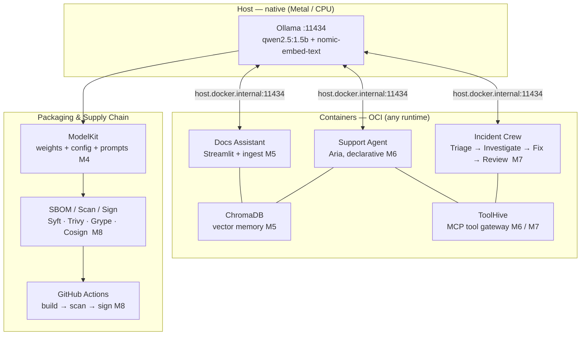

import Slides from '@site/src/components/Slides';

# Capstone: Ship the Acme AI Support Platform

> You have run eight modules, each a self-contained building block. This capstone snaps them together into one deployable product — the **Acme AI Support Platform** — and proves it ships unchanged on any OCI runtime.

---

## Module slides

Walk this short whiteboard deck for the big picture before the hands-on lab — or open it fullscreen.

<Slides src="decks/09-capstone.html" title="Capstone — Ship the Platform" />

## 1. The Platform at a Glance

**Analogy:** Think of the platform as a well-run emergency dispatch centre. The dispatcher — the native Ollama model — is the shared brain: one expert at the desk, fielding calls from every team simultaneously. Each team (the Docs Assistant, the Support Agent, the Incident Crew) has its own job description and its own phone line, but they all ring the same dispatcher. The dispatcher never moves. The filing cabinets behind the desk are ChromaDB — semantic memory organised by meaning, not alphabetical order. ToolHive is the secure key cabinet: every agent that needs an external tool must sign out a key; no rogue process reaches in unsupervised. When a release is ready, the package is sealed in a ModelKit (the tamper-evident courier box), inspected by the supply chain tools, and shipped by CI.

The container boundary is the defining architectural rule of this course: **the model stays native; everything else is a container.**



The single address that makes the whole wiring work: every container reaches the native model at `http://host.docker.internal:11434`. That address resolves on Colima, Rancher Desktop, OrbStack, and Podman — no modification required. It is part of the OCI runtime contract, not a Docker-specific trick.

---

## 2. Run It End-to-End

### Step 0 — Verify readiness

Before touching any module, run the platform readiness check from `labs/capstone/`:

```bash
./platform-check.sh
```

Expected output:

```
== 1. Container runtime ==
  ✔ docker CLI + engine reachable
== 2. Model serving (native Ollama, OpenAI-compatible) ==
  ✔ Ollama serving on :11434
  ✔ chat model present (qwen2.5)
  ✔ embedding model present (nomic-embed-text)
== 3. Container → native model wiring ==
  ✔ containers reach the model via host.docker.internal
== 4. Packaging + supply chain tooling ==
  ✔ kit (KitOps) installed
  ✔ thv (ToolHive) installed
  ✔ syft / trivy / grype / cosign installed

PLATFORM READY — serve → RAG → agent → crew → package → secure → ship.
```

Every green tick maps to something you built and validated in an earlier module. A red `✗` tells you exactly which layer is missing and which module covers it.

### Step 1 — Serve the model (M2 / M3)

The model server is already running — Ollama serves natively on the host:

```bash
ollama serve          # already running if you followed M2
curl http://localhost:11434/v1/models
```

For the CPU-vLLM path (SmolLM2 on a machine without Apple Silicon Metal), see the [M3 lab](../m3-vllm/lab). All downstream containers consume the model through the standard OpenAI-compatible `/v1` API — the wall-socket abstraction introduced in [M2](../m2-serving/lesson) that lets any container swap the model behind it without code changes.

### Step 2 — Start the platform (M5 + shared ChromaDB)

All persistent services — ChromaDB and the Docs Assistant — start from the single consolidated compose file in `labs/capstone/`. This avoids the per-module port conflict (each module's `compose.yaml` binds its own `chromadb` to port 8000; running them in sequence hits "container name already in use"). The capstone compose starts ONE shared ChromaDB that all three apps use.

```bash
cd labs/capstone
docker compose up -d chromadb genai-app
```

Expected output:

```
 Network capstone_default Created
 Volume capstone_chroma_data Created
 Container chromadb Started
 Container genai-app Started
```

On first run the ingest script embeds the Acme runbooks and writes them to the vector store. Visit `http://localhost:8501`, ask "How do I restart the payments service?" and you get a grounded answer with the exact `kubectl` command pulled from the runbook — not a hallucinated approximation.

See the [M5 lab](../m5-naive-rag/lab) for the step-by-step compose walkthrough.

### Step 3 — Run the Support Agent (M6)

With ChromaDB already running, run the M6 agent as a one-shot against the same shared vector store. Stay in `labs/capstone/`:

```bash
docker compose run --rm agent "How do I restart the payments service?"
```

Expected output (abbreviated):

```
[agent] Aria ready — ingested 5 runbook chunks. Persona from SOUL.md + AGENTS.md + SKILL.md.
USER: How do I restart the payments service?
  [decision: RETRIEVE (top dist=216.8)]
ARIA: Run `kubectl rollout restart deploy/payments -n prod`. The payments service depends on the
      Postgres primary in the `prod` namespace.
```

Aria — the declarative agent — reads the question, decides whether it needs to retrieve from ChromaDB at all, and returns a grounded, guardrailed answer. This is agentic RAG: the agent routes first, then acts.

:::note[Phrasing matters for a small model's routing]

`qwen2.5:1.5b`'s routing step is a single yes/no judgment call, and vaguer phrasing (e.g. "payments pod
keeps restarting, what do I do?") can miss and answer directly instead of retrieving — the model
hallucinates a plausible-looking command instead of the real runbook answer. Ask the same way M6's own
lab does — a direct "how do I restart X" question that mirrors the runbook's own language — and the
routing decision is reliable. If you ever see `ANSWER DIRECTLY` where you expected `RETRIEVE`, check the
`[decision: ...]` marker in the output before trusting the answer; that marker is exactly how you catch
an ungrounded response.

:::

See the [M6 lab](../m6-declarative-agent/lab).

### Step 4 — Fire the Incident Crew (M7)

Still in `labs/capstone/`, run the incident crew one-shot:

```bash
docker compose run --rm crew "P1: payments service down, pods in CrashLoopBackOff"
```

Expected output (abbreviated):

```
[crew] Acme Incident Crew: Triage -> Investigator -> Fixer -> Reviewer

[TRIAGE]      AREA: payments | SEV: 3 | ...   # numeric severity; exact scale/wording varies by run
[INVESTIGATOR] kubectl rollout restart deploy/payments -n prod ...
[FIXER]       kubectl rollout restart deploy/payments -n prod
[REVIEWER]    APPROVED — ready for a human to apply
```

Four specialised agents run in sequence: Triage classifies the incident, Investigator queries the runbook, Fixer proposes the exact remediation command, Reviewer approves or escalates. One native model endpoint serves all four.

See the [M7 lab](../m7-multi-agent/lab) for the full compose wiring and the approval-gate logic.

:::tip[Teardown]

When you are done with Steps 2–4, tear down all platform containers from `labs/capstone/`:

```bash
docker compose down
```

:::

### Step 5 — Package the model (M4)

This step packages the model weights you downloaded in the [M4 lab](../m4-packaging/lab)'s Step 2 —
if you skipped M4, run that download first.

```bash
export GITHUB_USER=your-github-username
cd labs/m4
kit pack . -t ghcr.io/${GITHUB_USER}/support-model:v1.0
kit push  ghcr.io/${GITHUB_USER}/support-model:v1.0
```

The model weights, system prompt, and quantization config are sealed into a single OCI artifact — a ModelKit. Any CI job or serving node pulls exactly that version with one command. No shared drives, no Slack links, no "also grab the prompt file from the other folder." See the [M4 lab](../m4-packaging/lab).

### Step 6 — Secure the crew image (M8)

Build the crew image locally first (or reuse the one from M7), then run the supply chain script against the **local** image tag. Syft, Trivy, and Grype scan the local image without pulling from a registry:

```bash
# Ensure the crew image is built locally
docker build -t acme-incident-crew:latest labs/m7/

cd labs/m8
./secure-image.sh acme-incident-crew:latest
```

Expected output:

```
==> [1/4] SBOM with syft  (local image — no registry pull)
    wrote sbom.spdx.json
==> [2/4] Vulnerability scan with trivy  (CRITICAL/HIGH — local image)
Total: ...
==> [3/4] Second opinion with grype  (local image)
Vulnerabilities by severity: Critical X, High X, ...
==> [4/4] Sign with cosign (key-based, via local registry)
The signatures were verified against the specified public key
Done. SBOM + scanned + signed acme-incident-crew:latest (signed ref: localhost:5001/acme-incident-crew:latest).
```

To push to your own GHCR namespace and sign the remote ref (requires `docker login ghcr.io` and a classic PAT with `write:packages`):

```bash
docker tag acme-incident-crew:latest ghcr.io/${GITHUB_USER}/incident-crew:v1.0
docker push ghcr.io/${GITHUB_USER}/incident-crew:v1.0
COSIGN_PASSWORD="" cosign sign --yes --key labs/m8/cosign.key \
  ghcr.io/${GITHUB_USER}/incident-crew:v1.0
```

See the [M8 lab](../m8-security/lab) for the full supply-chain walkthrough.

### Step 7 — Ship via CI (M8)

Push to `main` and the GitHub Actions pipeline in `labs/m8/security-pipeline.yml` runs automatically: build → scan → sign → push to GHCR. A failed scan blocks the push. A passing build produces a signed, attested image that any production host can pull and verify without trusting the sender's word.

:::tip[Full teardown]

The mid-lab `docker compose down` (after Step 4) only stops the compose-managed services
(`chromadb`, `genai-app`, plus any one-shot `agent`/`crew` runs). Step 6's `secure-image.sh` starts its
own `local-registry` container as a side effect, and Step 2 created a persistent `capstone_chroma_data`
volume. To leave a fully clean machine, also run:

```bash
docker stop local-registry && docker rm local-registry
cd labs/capstone && docker compose down -v   # -v also removes capstone_chroma_data
```

:::

---

## 3. Portability Proof

The platform runs on **Colima, Rancher Desktop, OrbStack, and Podman** without modification. Here is why nothing changes when you swap the runtime:

| Portability layer | What it buys you |
|---|---|
| **OCI image format** | Any compliant runtime can pull and run any image — the spec, not the vendor, defines the contract |
| **Compose Spec** | `compose.yaml` is an open standard; Podman Compose, Rancher Desktop, OrbStack, and Colima all parse the same file |
| **`host.docker.internal`** | Resolves to the host IP on all four runtimes — the native model is always reachable at the same address |
| **ModelKit (OCI artifact)** | `kit push` and `kit pull` work against any OCI-compliant registry — no registry vendor lock-in |
| **Cosign signatures** | Stored as OCI referrers — portable across registries, verifiable by any cosign client |

To verify portability yourself: stop Rancher Desktop, start Colima (or OrbStack), and re-run `./platform-check.sh`. The output is identical. Steps 1–7 run unchanged. This is the M1 principle — container-native, not runtime-native — applied at every layer of the stack.

:::tip[Switching runtimes on macOS]

`host.docker.internal` works out of the box on Rancher Desktop, OrbStack, and Colima. On Podman you may need to add `--add-host host.docker.internal:host-gateway` to your service definitions once. After that, all commands are identical.

:::

---

## 4. What You Built — and Where to Go Next

### The ladder

You started with a single container running a raw LLM call and ended with a signed, CI-shipped multi-agent platform. The rungs:

| Module | What you added |
|---|---|
| M1 | Container-native pattern — OCI image format, Compose Spec, `host.docker.internal` wiring |
| M2 | OpenAI-compatible serving — the wall socket that decouples every app from every model engine |
| M3 | vLLM CPU path — production-grade serving on hardware without a GPU or Metal |
| M4 | ModelKit — model weights + config + prompts as a single signed, versioned OCI artifact |
| M5 | Naive RAG — Docs Assistant over Acme runbooks, ChromaDB vector store, embedding pipeline |
| M6 | Declarative agent — routing judgment, guardrails, MCP tools delivered through ToolHive |
| M7 | Multi-agent crew — specialisation, separation of concerns, Reviewer approval gate |
| M8 | Supply chain — SBOM, vulnerability scan, image signing, CI pipeline |

### The arc of intelligence

The three use cases tell a coherent story about how AI systems mature:

**Naive RAG → Agentic RAG → Crew.** The Docs Assistant (M5) always retrieves — useful, but wasteful on questions with known answers and fragile on multi-step problems. The Support Agent (M6) decides *when* to retrieve — more efficient and more reliable because the model routes before it acts. The Incident Crew (M7) decomposes the problem across specialised roles — the only approach that scales to multi-step tasks where each step carries risk that a single agent cannot self-audit.

### Take-home: a second use case

The platform is not tied to IT operations. The same architecture — native Ollama, ChromaDB, declarative agent, ToolHive MCP gateway, ModelKit packaging, M8 supply chain — applies to any domain with a knowledge base and a need for reliable, auditable answers. A **code review assistant**, a **compliance checker**, or a **customer onboarding guide** are structurally identical: swap the Acme runbooks for your documents, rename the agents, adjust the guardrails. The container wiring does not change.

### Extension: fine-tuned models with LoRA / QLoRA (M3B)

This course uses `qwen2.5:1.5b` from the public Ollama library. If your use case demands a model trained on proprietary data, the M3B extension covers LoRA and QLoRA fine-tuning workflows that produce a new GGUF file. That file is packaged immediately into a ModelKit (M4) and secured through the M8 pipeline. The container architecture is unchanged — only the model artifact is different. The wall socket stays the same; you swapped the power station behind it.
