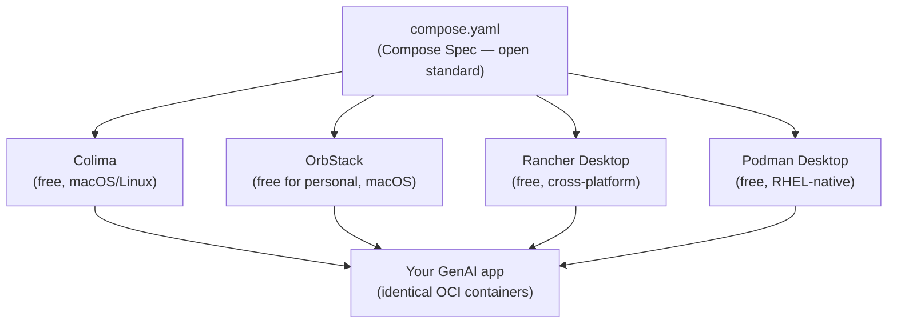
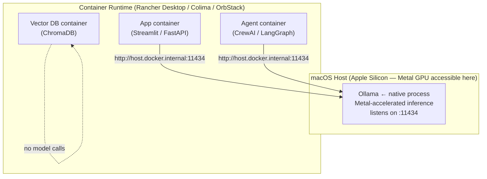

import Slides from '@site/src/components/Slides';

# Lesson: Container-Native GenAI

> **Module goal:** Understand *why* the container-native pattern exists, what it gives your AI stack, and how to wire a natively-served model to containerized apps on Apple Silicon. By the end of the lab you will have proved this wiring yourself.

---

## Module slides

Walk this short whiteboard deck for the big picture before the hands-on lab — or open it fullscreen.

<Slides src="decks/01-container-native.html" title="Module 1 — Container-Native GenAI" />

## 1. Container-Native, Not Docker-Native

**Analogy:** An OCI image is a shipping container — the same steel box loads onto any truck, any ship, any crane. The shipper doesn't care which carrier shows up. Your application code is the cargo; the container spec is the box; Docker, Colima, OrbStack, and Rancher Desktop are the carriers.

Docker Desktop is now **paid for organizations with more than 250 employees or $10 M revenue**. That one pricing change broke the assumption that "container = Docker Desktop" across the industry. But the *standard* underneath Docker — the **OCI image format + the Compose Spec** — is fully open, and every serious runtime implements it. Colima, OrbStack, Rancher Desktop, and Podman all run the same `compose.yaml` without modification.

This course is built on the open standard, not on a specific vendor. You learn **container-native**, and the carrier you choose is your business.



*One `compose.yaml` — four runtimes — same result.* Rancher Desktop is the validation runtime for this course, but every lab command works unchanged on the others.

---

## 2. What Containers Buy an AI Stack

Think of a container as a **hermetically sealed shipment**: the model server, the embedding pipeline, the vector database, and the agent all travel in separate sealed boxes that can be opened on *any* machine.

Concretely, containers give an AI system four things:

| Role | What it means in practice |
|------|--------------------------|
| **Package** | Lock your Python version, CUDA driver, and library versions so "works on my machine" becomes "works on every machine" |
| **Serve** | Run the embedding service, vector DB, and API gateway behind predictable ports — no host pollution |
| **Isolate** | Two different LLM frameworks with conflicting dependencies? Each lives in its own container; no virtualenv juggling |
| **Ship** | Push to any OCI registry (GHCR, Docker Hub, Quay); pull and run on any machine or cloud VM |

Every module in this course adds one more service to a growing `compose.yaml`. By the Capstone you'll have authored the entire AI stack line by line — and fully understand every block.

---

## 3. The Apple Silicon GPU Reality

> This is the most important practical lesson in the course. Get it wrong and every lab runs 3–6x slower than it should.

**Analogy:** macOS containers are like an office building with no power outlets in the guest rooms. The building's electrical system (Apple Silicon's unified memory + Metal GPU) is right there — but the hypervisor (the building manager) doesn't wire the guest rooms into it. Guests (containers) fall back to battery power (CPU).

Here is the technical reality:

- **Hypervisor.framework — Apple's macOS virtualization layer — exposes no virtual GPU.** A container on Mac runs inside a Linux VM; that VM has no access to the Metal GPU or the Apple Neural Engine.
- **A model running *inside* a container on Mac therefore falls back to CPU.** Inference is 3–6x slower than native.
- **The universal Mac pattern:** run the model server **natively** (Ollama uses Metal + unified memory directly), containerize *everything else*, and wire them together via `http://host.docker.internal:11434`.
- **On Windows + WSL2 + NVIDIA**, the NVIDIA Container Toolkit *does* pass the GPU into containers, so the model server *can* run containerized there.



`host.docker.internal` is a magic hostname that every major container runtime resolves to the host machine's IP — the bridge between the containerized world and the native model server.

:::tip[Why not just put Ollama in a container anyway?]

You can — it just runs on CPU. For development with a 1.5B model the slowdown is tolerable. For anything larger, or for production throughput, native is the only correct answer on Mac.
:::

---

## 4. The 2026 Map: Declarative Agents vs Orchestration Frameworks

A brief signpost for what you'll build in Modules 5–7:

**Declarative agents** (M6) define *who* the agent is and *what tools it has* in plain files — `AGENTS.md` / `SOUL.md` + `SKILL.md` + MCP tool connections. The runtime executes them. This is the lightest, most maintainable approach: change a markdown file to change agent behaviour.

**Orchestration frameworks** (M7) — LangGraph being the current standard — add *deterministic control flow*: explicit state machines, branching, retries, human-in-the-loop checkpoints. Reach for them when a task requires guaranteed sequencing that a declarative agent can't reliably self-determine.

The practical rule: **start declarative, add orchestration only when the task has hard sequencing requirements you can't express in tool descriptions alone.** M6 and M7 build both so you can feel the trade-off yourself.

---

## 5. The Acme Use Case + The Build Ladder

Across this course you build one real system for a fictional company called **Acme Engineering**. The team has runbooks, post-mortems, and architecture docs piling up in a shared drive. Nobody reads them. Two connected AI tools will fix that:

- **Use Case A — the Docs Assistant** (Day 1): retrieval-augmented question answering over Acme's runbooks. A question in → relevant docs retrieved → answer generated.
- **Use Case B — the Support Agent → Incident Crew** (Day 2): an agentic system that *uses* the Docs Assistant as one of its tools, growing from a single agent to a full multi-agent incident-response crew.

Every module adds exactly one step to this system:

| Step | Module | What you build | Pattern |
|------|--------|---------------|---------|
| 0 | **M1** | Runtime + model responding to a call | Container-native serving |
| 1 | M2 | OpenAI-compatible model endpoint | Model serving, engine swap |
| 2 | M3 | Endpoint scaled for throughput | vLLM, batching, quantization |
| 3 | M4 | Model versioned as an OCI artifact | Model packaging (KitOps/ModelKit) |
| 4 | M5 | Docs Assistant — Naive RAG | Ingest → embed → retrieve → generate |
| 5 | M6 | Support Agent — Agentic RAG | AGENTS.md + Skills + MCP tools |
| 6 | M7 | Incident Crew — multi-agent | Declarative profiles + LangGraph |
| 7 | M8 | Platform hardened | Guardrails, SBOM, scan, sign, eval |
| 8 | Capstone | Platform shipped | End-to-end CI + portability |

You hand-author the `compose.yaml` one service block at a time. By the Capstone it is the full production stack, and you wrote every line.

---

## 6. The OpenAI-Compatible Endpoint: the Universal Contract

**Analogy:** The OpenAI API is a wall socket. Different countries wire their power plants differently, but if the socket shape is standard, your appliance works everywhere. Ollama, vLLM, LocalAI, and llama.cpp all expose the same `/v1/chat/completions` interface. Your application code never changes when you swap the engine.

```json
POST /v1/chat/completions
{
  "model": "qwen2.5:1.5b",
  "messages": [{"role": "user", "content": "Summarise this runbook."}]
}
```

This call works identically against:

- `http://localhost:11434` (Ollama, dev laptop)
- `http://vllm-service:8000` (vLLM, production GPU VM)
- `https://api.openai.com` (OpenAI, if you ever need it)

The contract abstraction is what lets you swap from a 1.5B dev model to a production-grade engine without touching application code. Every lab in this course speaks this language — the same request format from M1 to Capstone.

---

## Summary

| Concept | The short version |
|---------|-----------------|
| Container-native | OCI + Compose Spec work on any runtime; Docker Desktop is optional |
| Containers for AI | Package, serve, isolate, and ship every component except the model server on Mac |
| Apple Silicon reality | Model server is native (Ollama + Metal); everything else is containerised; bridge = `host.docker.internal:11434` |
| Declarative vs orchestration | Start with AGENTS.md + MCP; add LangGraph only for hard sequencing |
| Build ladder | One service per module, one growing `compose.yaml` |
| OpenAI-compatible endpoint | Universal contract — swap engines without touching app code |

---

In the lab, you will prove the container→native-model wiring yourself: a throwaway container will call the natively-served Ollama and get a real response back.
