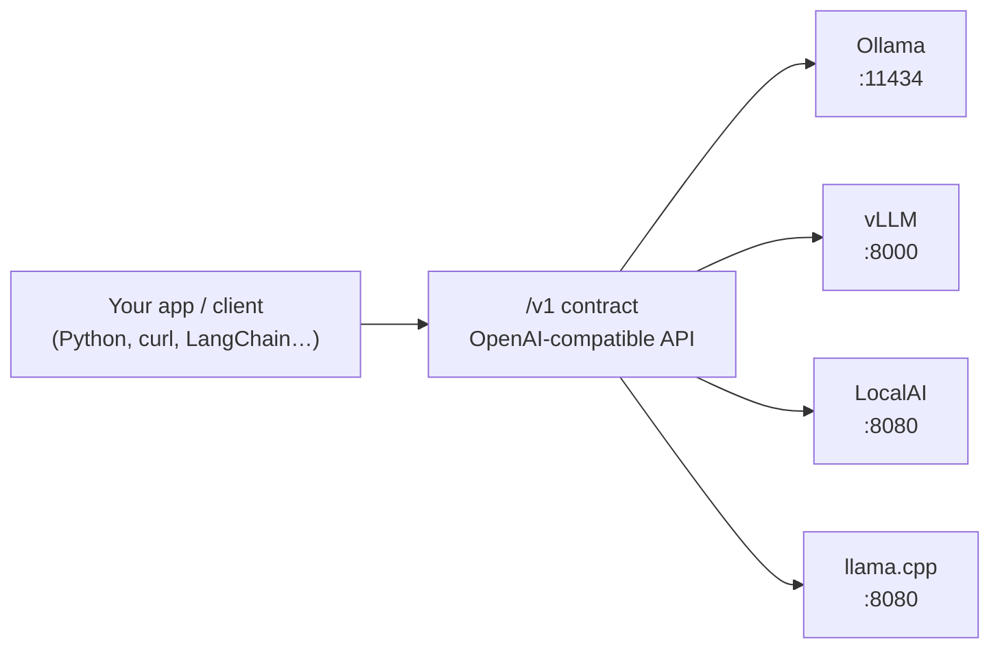
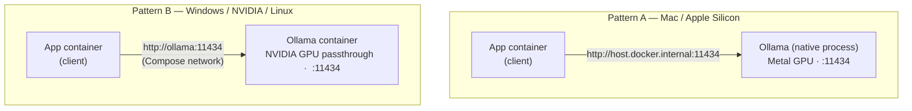

# Lesson: Serving Local Models

> **Module goal:** Understand the landscape of open model-serving engines, the OpenAI-compatible API contract that ties them all together, and the two wiring patterns that connect your containerized app to a local model — whether the model runs natively on the host or inside a container.

---

## 1. Demo First: Docker Model Runner

Docker 4.40+ ships a built-in model runner. One command and you have a served model:

```bash
docker model run ai/gpt-oss
```

Docker downloads the quantized weights, serves them, and exposes the standard `/v1` API — no Ollama, no separate process, nothing extra on the host. It's fully open-source and available in Docker CE. For a quick demo or a team that lives entirely in Docker's toolchain, it is the slickest on-ramp.

This course takes a different path: *runtime-agnostic* open engines. Docker Model Runner is good to know, but the patterns ahead work identically on Docker, Rancher Desktop, Podman, bare Linux, and Windows + WSL2 — no Docker tooling required. The principles apply to Docker Model Runner too; the engines below are what you'll wire in the labs.

---

## 2. The Open Engines: Ollama, llama.cpp, LocalAI

**Analogy:** Think of these engines as different *brands of espresso machine* — La Marzocco, Breville, DeLonghi. Each has different internals: thermoblock vs boiler, different pressure profiles, different PID controllers. But they all pour into the *same standard cup*. The cup is the OpenAI API. You can swap the machine under the counter and no barista needs retraining.

The three engines you'll encounter in this course:

| Engine | Best for | Container-ready? | Notes |
|--------|----------|-----------------|-------|
| **Ollama** | Local dev, one-command setup | Yes (with caveats on Mac) | The de-facto dev standard; Metal-accelerated natively on Apple Silicon |
| **llama.cpp** | Minimal footprint, CPU or Metal | Yes | The inference core inside Ollama; use directly for maximum control |
| **LocalAI** | Multi-backend OpenAI hub | Yes | One container routing to multiple backends — llama.cpp, Whisper, Stable Diffusion |

**Ollama** is the engine you already have running from M1 — serving `qwen2.5:1.5b` on Metal at `:11434`. The lab builds a containerized client that calls it.

**llama.cpp** is the inference engine *inside* Ollama. It handles GGUF-format models, quantization, and hardware acceleration. You can run llama.cpp in its own container when you need something leaner than the full Ollama stack.

**LocalAI** is the right choice when you need *one* container that looks like OpenAI to every caller and routes to whatever backend or hardware is available underneath. It is popular on Linux servers with mixed hardware.

M3 adds a fourth engine — **vLLM** — for high-throughput batched inference on a GPU VM. That's coming. For development, Ollama is the standard.

---

## 3. The OpenAI-Compatible Endpoint: The Universal Contract

**Extending the wall-socket analogy from M1:** Different countries wire their power plants differently, but a standard wall socket always delivers power the same way. You saw in M1 that Ollama exposes `/v1/chat/completions`. What makes this powerful is that *every engine in the table above* exposes the identical interface.

Two endpoints. That's the entire contract:

| Endpoint | What it does |
|----------|-------------|
| `POST /v1/chat/completions` | Generate a response from a list of messages |
| `GET /v1/models` | List available models |

Your application code calls one URL. That URL is an environment variable. Swap the engine, change the variable:

```bash
# Dev — Ollama, native Mac, reached from inside a container:
OPENAI_BASE_URL=http://host.docker.internal:11434/v1

# Staging — LocalAI, Compose service:
OPENAI_BASE_URL=http://localai:8080/v1

# Production — vLLM, GPU VM:
OPENAI_BASE_URL=http://vllm-service:8000/v1
```

No code change. One variable.



*The app talks to the contract. Which engine sits behind it is a deployment decision — not a code decision.*

This is the architectural insight that makes the rest of the course compressible. The Acme Docs Assistant (M5), the Support Agent (M6), and the Incident Crew (M7) all speak this contract. When the team decides to move from a 1.5B dev model to a 13B production model, the application does not notice.

---

## 4. GGUF and Model Selection for Laptops

**Analogy:** Quantization is like compressing a photo. A camera RAW file is huge and mathematically perfect. A JPEG at 80% quality is a fraction of the size, visually indistinguishable for most purposes, and loads instantly. GGUF is the JPEG equivalent for LLM weights — a compact, quantized format that llama.cpp (and therefore Ollama) loads and runs efficiently on CPU and Metal without requiring CUDA.

When you run `ollama pull qwen2.5:1.5b`, Ollama fetches a GGUF file at roughly `Q4_K_M` quantization — not the original float16 weights. The `1.5b` is the parameter count; the quantization level is the compression setting.

**Practical sizing rule:** parameter count × 0.6 ≈ RAM usage at Q4 quantization. A 7B model costs roughly 4 GB. On 16 GB unified memory with 8 GB reserved for the OS and app containers, you have 4–5 GB for the model.

**Model options at that budget:**

| Model | Approx size (Q4) | Strength | Course use |
|-------|-----------------|----------|-----------|
| `qwen2.5:1.5b` | ~1 GB | Fast iteration | Labs (already pulled) |
| `qwen2.5:3b` | ~2 GB | Better reasoning, still fast | Optional upgrade |
| **Qwen3** 4B–8B | 2–5 GB | Latest reasoning series, strong tool use | Recommended beyond labs |
| **Llama 3.2** 3B | ~2 GB | Meta's compact instruction model | Good general tasks |
| **Mistral 7B** | ~4 GB | Strong instruction following | Popular production baseline |

Stay with `qwen2.5:1.5b` for all course labs. It keeps iteration fast and the machine responsive. The model-selection decision becomes interesting in M3, when you learn to serve a model with vLLM and actually need to reason about throughput vs size trade-offs.

---

## 5. Two Wiring Patterns, One App

From M1 you know the Apple Silicon constraint: the hypervisor exposes no virtual GPU, so a container on Mac falls back to CPU. The model server must run natively to get Metal acceleration. That fact forces Pattern A on Mac. Pattern B is what the same `compose.yaml` looks like on Windows + WSL2 + NVIDIA, or a Linux GPU VM.



The app code in both patterns is **identical**. A single environment variable — `OPENAI_BASE_URL` — switches the target:

- **Pattern A (Mac):** `OPENAI_BASE_URL=http://host.docker.internal:11434/v1`
- **Pattern B (GPU host):** `OPENAI_BASE_URL=http://ollama:11434/v1`

The `compose.yaml` handles the difference via an env file or a Compose override. Your Python client never sees it. You build once on your laptop; the same image drops onto a Linux GPU VM with one config change.

This portability is the payoff of the universal contract. The app treats the engine as an addressable service. Where that service runs — native process, same-host container, or remote VM — is entirely outside the application's concern.

---

## Summary

| Concept | The short version |
|---------|-----------------|
| Docker Model Runner | Docker-native OSS option (`docker model run`); same `/v1` API underneath |
| Open engines | Ollama (dev standard), llama.cpp (core, minimal), LocalAI (multi-backend hub) |
| The `/v1` contract | Two endpoints, one URL — swap engines by changing an env var, never code |
| GGUF + quantization | Compressed weights that fit laptop RAM; Q4 ≈ 0.6 × parameter count in GB |
| Model selection | `qwen2.5:1.5b` for labs; Qwen3, Llama 3.x, Mistral 7B for heavier tasks |
| Two wiring patterns | Mac → native model via `host.docker.internal`; Windows/Linux → model container via Compose hostname |

---

In the lab you'll containerize a client that speaks this contract.
