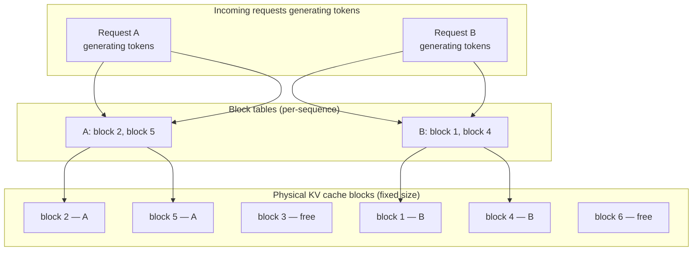
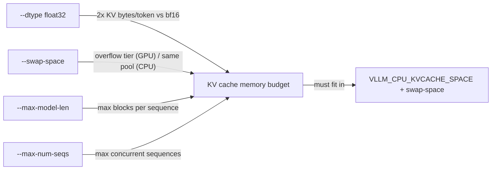
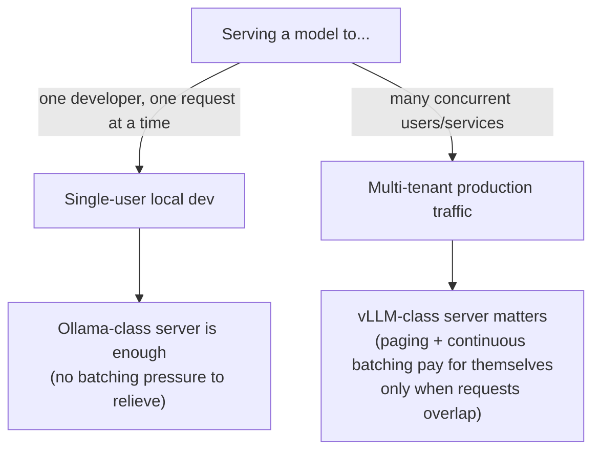

# Deep Dive: vLLM Internals Under the Hood

The lab built a patched CPU vLLM image, served SmolLM2 behind `/v1`, and pointed your M2 client
at it with a two-variable swap. That proved the contract holds. This page opens the machinery
that made the swap worth doing in the first place: what PagedAttention actually pages, why
continuous batching changes throughput instead of just latency, and what your `.env` flags
(`--dtype`, `--swap-space`, `--max-model-len`, `--max-num-seqs`) are really buying you against
that machinery. It closes with a small, honest experiment — vLLM-CPU against native Ollama on
the same prompts — that shows the *shape* of the difference PagedAttention and continuous
batching make, even at CPU/toy scale.

:::info[Where this picks up]

You need the m3 vLLM container up. This works whether it's currently running or was torn down
after the lab — the check below is idempotent, so re-running it is safe.

```bash
cd labs/m3
bash up.sh
```

**Machine budget:** native Ollama (`qwen2.5:1.5b`, ~1 GB resident) and the m3 vLLM container
(SmolLM2-135M, capped at 4 CPU / 5 GB in `compose.yaml`) **coexist** on the same 4 CPU / 6 GB VM
this course targets — you do not need to stop one to run the other. Confirm both are reachable
before the experiment in §6:

```bash
curl -sf http://localhost:11434/api/tags >/dev/null && echo "ollama: up"
curl -sf http://localhost:${VLLM_PORT:-8009}/v1/models >/dev/null && echo "vllm: up"
```

**Expected output**

```text
<expected output — folded in during live lab validation>
```

:::

---

## 1 — PagedAttention: the KV cache as paged memory

The lesson told you PagedAttention pages the KV cache instead of reserving one contiguous slab
per request, and that this is what lets far more sequences fit in the same memory. This section
opens what a "page" actually is and what the allocator is doing underneath that sentence.

**Analogy:** think of the KV cache as a **hotel**. A naive server books a guest (a request) into
a whole floor reserved for the longest stay anyone could possibly have — even if they check out
after one night, that floor sits reserved and empty for everyone else. PagedAttention instead
runs the hotel like it's actually run: guests get **one room at a time**, checked in as they need
them, and a front desk (the block table) that tracks which guest is in which room. A short stay
uses one room and frees it on checkout. A long stay just gets handed the next free room when it
needs more space — never a whole floor up front. Every room is a fixed size, so none of them sit
half-empty the way a floor reserved for a phantom worst case does.

Concretely: vLLM divides the KV cache into fixed-size **blocks** (a block holds the key/value
vectors for a fixed number of tokens, commonly 16). As a sequence generates tokens, it's handed
blocks on demand — not a contiguous span sized for `--max-model-len` up front. A **block table**
(one per sequence) maps logical token positions to physical block locations, exactly the way a
page table maps virtual addresses to physical memory frames in an OS. When a sequence finishes,
its blocks return to a free pool other sequences draw from immediately.

This is why naive contiguous allocation wastes memory: a server that reserves `max_model_len`
tokens' worth of contiguous KV cache per request pays for the worst case on every request,
whether or not it happens. A 20-token answer inside a 1024-token reservation leaves roughly 98%
of that reservation sitting unused but unavailable to anyone else — and because it must be
*contiguous*, memory fragments even when the total free space would technically fit another
request: you can have 40% of your KV cache free in aggregate and still be unable to admit a new
long request because no single free span is big enough. Paging removes the contiguity
requirement entirely — free blocks can be scattered anywhere and still get handed out.



*Two requests' logical token sequences map through per-sequence block tables to scattered
physical blocks — no request needs a contiguous span, and free blocks (3, 6) are immediately
available to a third request or to A/B growing further.*

---

## 2 — Continuous batching: why requests join and leave mid-flight

**Analogy:** a **static-batch server is a restaurant that only reseats once the whole dining room
has finished and left.** If one table lingers over dessert, every other table that finished
twenty minutes ago is still stuck waiting for a totally unrelated party to be done, and the door
stays closed to new customers the entire time. vLLM runs the restaurant the way a busy one
actually works: **the moment a table finishes, it's cleared and reseated immediately** — no
correlation between when one party leaves and when the next is admitted. The dining room is
never blocked by the slowest table.

Mechanically: vLLM schedules at the granularity of a single decoding step, not a whole batch
lifecycle. On every iteration of the scheduler loop it checks which sequences in the running
batch just emitted a stop token (finished) and frees their slot and KV blocks immediately; in the
same iteration it can admit a new waiting request into that now-free slot, as long as there's KV
cache budget for it. A request that arrives while nine others are mid-generation does not wait
for a "batch boundary" that doesn't exist — it waits, at most, for one scheduling iteration.

The throughput effect: static batching pads the whole batch to the length of its longest member
and holds finished slots idle until every member completes, so aggregate throughput is bounded by
the batch's slowest sequence. Continuous batching keeps every slot doing useful work continuously
— GPU/CPU cycles are never spent on an already-finished sequence's empty slot. The tail-latency
effect cuts the other way for short requests: under static batching a one-token answer queued
behind nine 500-token generations waits for all ten to finish before any result returns; under
continuous batching that short request finishes and returns the moment it's done, independent of
what the other nine are still doing.

This is also why PagedAttention and continuous batching are not two separate features that
happen to ship together — continuous batching's whole value proposition (constantly admitting
new requests) depends on being able to *cheaply* allocate KV cache for each newly admitted
request without recomputing a memory layout. Paging is what makes admission cheap enough to do
every iteration instead of every few seconds.

---

## 3 — What the lab's flags actually did

The lab's `compose.yaml` set four flags without dwelling on the "why." Each maps directly to the
paging/batching story above.

**`--dtype float32`** — bf16 has no CPU compute kernel on this arm64 path (that's the
`rms_norm_impl not implemented for 'BFloat16'` crash from the lab's Troubleshooting). But there's
a memory-side cost worth naming here: float32 KV cache entries are **twice the size** of bf16
ones for the same token count. That means the same `VLLM_CPU_KVCACHE_SPACE` / `--swap-space`
budget holds half as many blocks on this CPU path as it would on a GPU running bf16 — one reason
the lab keeps `--max-model-len` and `--max-num-seqs` deliberately small.

**`--swap-space`** — on a GPU deployment, `swap-space` is CPU RAM used as an overflow tier when
GPU VRAM's KV cache blocks run out (a sequence's blocks can be swapped to host RAM and back,
rather than aborting the request). On this CPU-only path there's no GPU tier to overflow *from*
— `swap-space` still reserves the same host RAM, but it's reserving from the same pool everything
else draws from, not a separate overflow behind a faster tier. That's why the lab pins it to `1`
(GiB): the default `4` GiB assumes a GPU box with RAM to spare as a swap tier, and on a
4 CPU / 6 GB VM that default alone can exceed total container memory (the
`Too large swap space` failure documented in the lab).

**`MAX_MODEL_LEN`** — this is a direct KV-cache budget line, not just a context-window UX limit.
Every block reserved by `--max-model-len` × `--max-num-seqs` (worst case, all sequences at max
length) has to fit inside `VLLM_CPU_KVCACHE_SPACE` + `--swap-space`. The lab's default (`1024`)
was chosen by working that arithmetic backward from the container's 5 GB cap, not picked for
context-length UX — the lab-tests evidence recorded a 360M-model / longer-context combination
crash-looping for exactly this reason before the defaults were tuned down.

**`MAX_NUM_SEQS`** — this is the continuous-batching concurrency cap from §2, made concrete: it's
the maximum number of sequences the scheduler will admit into the running batch at once,
regardless of how many are waiting. Raise it and more requests get to share the "never idle"
benefit of continuous batching simultaneously — but each admitted sequence needs its own KV
blocks, so raising `MAX_NUM_SEQS` without raising the KV cache budget just means requests get
admitted and then immediately queue on KV cache space instead of on batch-slot availability.



*All four flags feed the same arithmetic: sequences × per-sequence blocks must fit the reserved
KV cache budget. Every flag in the lab's `.env` is a lever on one side of that inequality.*

---

## 4 — Reading the server instead of guessing at it

vLLM exposes a Prometheus-format `/metrics` endpoint. This is the deeper-observation layer the
lab didn't need (a single request at a time doesn't require it) but that matters the moment more
than one request is in flight.

```bash
curl -s http://localhost:${VLLM_PORT:-8009}/metrics | grep -E 'vllm:num_requests_running|vllm:num_requests_waiting|vllm:gpu_cache_usage_perc'
```

**Expected output**

```text
<expected output — folded in during live lab validation>
```

Three gauges matter most for the story above:

- **`vllm:num_requests_running`** — sequences currently occupying a batch slot this iteration.
  This is continuous batching made observable: watch it during a burst of concurrent requests and
  it should track admissions/completions in near real time, not jump in fixed-size batch chunks.
- **`vllm:num_requests_waiting`** — sequences that arrived but haven't been admitted yet, because
  `MAX_NUM_SEQS` or the KV cache budget is currently full. A queue that never drains under
  sustained load is your signal to raise `MAX_NUM_SEQS` or the KV cache budget from §3 — not to
  add more replicas blindly.
- **`vllm:gpu_cache_usage_perc`** (named for the GPU path historically; on this CPU build it
  reflects the CPU KV cache pool) — how full the paged block pool is. Near 100% under load is
  expected and healthy — that's PagedAttention doing its job of using nearly all reserved memory
  instead of leaving slabs empty. Consistently near 0% under real traffic usually means your
  budget is oversized for the load you're actually serving.

Reading these three together tells you *which* of §3's flags to move: waiting-queue pressure with
low cache usage means raise `MAX_NUM_SEQS`; waiting-queue pressure with cache usage pinned at
100% means raise the KV cache budget (`VLLM_CPU_KVCACHE_SPACE` / `--swap-space`) or lower
`--max-model-len` per sequence — not the same fix for two different symptoms.

---

## 5 — When PagedAttention-class serving matters, and when it's overkill



PagedAttention and continuous batching exist to solve a problem that only shows up when requests
**overlap in time and compete for the same memory**. A single developer sending one prompt,
waiting for the answer, then sending the next never creates that competition — there's nothing
to page around and nothing to batch continuously, because there's only ever one sequence alive.
That's why Ollama (M1/M2's server) is a completely reasonable production choice for a single-user
tool or a low-concurrency internal script: the machinery vLLM adds has a real engineering cost
(the extra memory bookkeeping, the scheduler complexity) that only pays for itself once you have
enough simultaneous requests for idle slots and wasted contiguous memory to actually be a
problem. Reach for vLLM-class serving when you're fielding concurrent requests from more than a
handful of callers at once — that's the regime this deep dive's entire mechanism was built for.

---

## 6 — Experiment: vLLM-CPU vs native Ollama, same prompts

This is a small, honest comparison — not a benchmark. At CPU scale with a tiny model and N ≤ 8
requests, the numbers you get are noisy and specific to this laptop. What's worth learning here
is the **shape**: whether requests fired one after another behave differently from requests fired
back to back with overlap, and whether that shape differs between the two servers. Treat every
number below as "folded in during live validation," not as a claim about production hardware.

Confirm both servers coexist within the machine budget stated at the top of this page:

```bash
docker stats vllm-smollm2 --no-stream
```

**Expected output**

```text
<expected output — folded in during live lab validation>
```

Set up a small fixed prompt set — mixed short/long — and a results file:

```bash
mkdir -p ~/vllm-deepdive-lab && cd ~/vllm-deepdive-lab
cat > prompts.txt << 'EOF'
Say OK.
In one sentence, what is a container?
List three benefits of running AI models in containers.
Explain the difference between a VM and a container in two sentences.
EOF
```

**Sequential requests, one server at a time.** Send all four prompts to vLLM-CPU one after
another, timing the whole run:

```bash
time (while read -r p; do
  curl -s http://localhost:${VLLM_PORT:-8009}/v1/chat/completions \
    -H "Content-Type: application/json" \
    -d "{\"model\":\"HuggingFaceTB/SmolLM2-135M-Instruct\",\"messages\":[{\"role\":\"user\",\"content\":\"$p\"}],\"max_tokens\":48}" \
    -o /dev/null -w "%{http_code} %{time_total}s\n"
done < prompts.txt)
```

**Expected output**

```text
<expected output — folded in during live lab validation>
```

Now the same four prompts against native Ollama, same shape, same `max_tokens`:

```bash
time (while read -r p; do
  curl -s http://localhost:11434/v1/chat/completions \
    -H "Content-Type: application/json" \
    -d "{\"model\":\"qwen2.5:1.5b\",\"messages\":[{\"role\":\"user\",\"content\":\"$p\"}],\"max_tokens\":48}" \
    -o /dev/null -w "%{http_code} %{time_total}s\n"
done < prompts.txt)
```

**Expected output**

```text
<expected output — folded in during live lab validation>
```

**Concurrent requests, two or three fired back to back.** This is the case §2 and §5 are actually
about — this course's CPU/RAM budget rules out real load testing, so fire just 2-3 requests
without waiting for each to finish, against vLLM-CPU first:

```bash
for p in "Say OK." "In one sentence, what is a container?" "Name two container runtimes."; do
  curl -s http://localhost:${VLLM_PORT:-8009}/v1/chat/completions \
    -H "Content-Type: application/json" \
    -d "{\"model\":\"HuggingFaceTB/SmolLM2-135M-Instruct\",\"messages\":[{\"role\":\"user\",\"content\":\"$p\"}],\"max_tokens\":48}" \
    -o /dev/null -w "%{http_code} %{time_total}s\n" &
done
wait
```

**Expected output**

```text
<expected output — folded in during live lab validation>
```

Then the same three fired concurrently at native Ollama:

```bash
for p in "Say OK." "In one sentence, what is a container?" "Name two container runtimes."; do
  curl -s http://localhost:11434/v1/chat/completions \
    -H "Content-Type: application/json" \
    -d "{\"model\":\"qwen2.5:1.5b\",\"messages\":[{\"role\":\"user\",\"content\":\"$p\"}],\"max_tokens\":48}" \
    -o /dev/null -w "%{http_code} %{time_total}s\n" &
done
wait
```

**Expected output**

```text
<expected output — folded in during live lab validation>
```

Fold the wall-clock numbers into a comparison table, and save it to the results file the checks
verify:

```text
| Engine | Mode | Wall time (4 seq. / 3 concurrent) | tokens/sec (approx) | Notes |
|---|---|---|---|---|
| vLLM-CPU | Sequential | <folded in> | <folded in> | <folded in> |
| vLLM-CPU | Concurrent (3) | <folded in> | <folded in> | <folded in> |
| Ollama (native) | Sequential | <folded in> | <folded in> | <folded in> |
| Ollama (native) | Concurrent (3) | <folded in> | <folded in> | <folded in> |
```

```bash
cat > ~/vllm-deepdive-lab/comparison-results.txt << 'EOF'
<expected output — folded in during live lab validation>
EOF
```

At this N (≤ 8 requests, tiny models, one CPU) don't expect vLLM to visibly "win" on raw
tokens/sec — a single-digit request count on a 135M-parameter model rarely saturates either
engine's batching machinery enough to show the 3x GPU story from the lesson. What's worth reading
in your own captured numbers instead: does vLLM-CPU's concurrent wall time grow **sub-linearly**
relative to its sequential wall time (a hint of overlap/batching happening even at this scale),
while Ollama's concurrent time grows closer to linear (each request effectively still waiting its
turn)? That directional shape — not the absolute tokens/sec — is the teaching point; the 3x number
from the lesson is real, but it needs GPU-scale concurrent load to show up, not this laptop.

---

## Teardown

Page-scoped only. Take down the vLLM container; leave native Ollama running (other modules and
this page's own re-runs depend on it staying up):

```bash
cd labs/m3 && bash down.sh
```

**Expected output**

```text
<expected output — folded in during live lab validation>
```

The results file and prompt list in `~/vllm-deepdive-lab/` are cheap to keep or remove — they're
not shared state any later module depends on:

```bash
rm -rf ~/vllm-deepdive-lab
```

:::tip[Where you will use this]

- **The KV cache is paged into fixed-size blocks tracked by a per-sequence block table, not
  reserved as one contiguous span per request.** **Use it when:** you're sizing
  `--max-model-len` / `gpu-memory-utilization` for a real GPU deployment — the arithmetic is
  blocks-per-sequence × concurrent-sequences against the reserved cache pool, not "how long is my
  prompt."
- **Continuous batching admits and evicts requests every scheduling iteration, not at batch
  boundaries.** **Use it when:** you're explaining to a capacity-planning discussion why a
  latency-sensitive short request doesn't need its own dedicated server — it won't queue behind
  long-running sequences the way it would on a static-batch engine.
- **`/metrics`' running/waiting gauges and cache-usage percentage tell you which lever to pull.**
  **Use it when:** you're deciding whether to raise `MAX_NUM_SEQS` or raise the KV cache budget
  before scaling out replicas — read the gauges first; a growing waiting queue with cache usage
  already near 100% needs more memory, not a higher concurrency cap.
- **`--dtype`, `--swap-space`, `--max-model-len`, and `--max-num-seqs` all feed one shared memory
  inequality.** **Use it when:** a CPU or memory-constrained deployment crash-loops on startup —
  work the arithmetic backward from the container's memory cap the way the lab's defaults were
  tuned, instead of guessing at each flag independently.
- **PagedAttention/continuous-batching machinery only pays for itself under concurrent, competing
  requests.** **Use it when:** someone proposes vLLM for a single-user internal tool — ask
  whether requests actually overlap in time; if not, the simpler Ollama-class server is the right
  call, not the "more advanced" one.

:::
