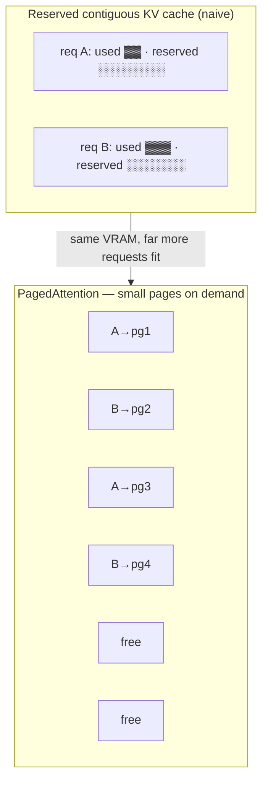
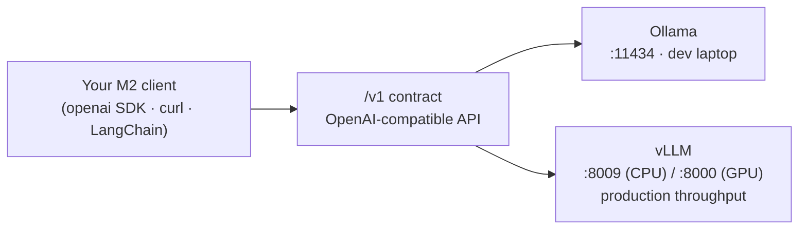

# Lesson: Production Serving with vLLM

> **Module goal:** Understand why vLLM is the production workhorse for model serving, how PagedAttention and continuous batching win ~3× throughput, and how it drops behind the *same* OpenAI-compatible `/v1` contract you met in M2 — so your client never notices the engine swap. You'll learn the CPU track (what you run this module), the GPU track (documented), and where quantization fits.

---

## 1. Why vLLM: from one cup at a time to a busy café

**Analogy:** Ollama (M1/M2) is a **home espresso machine**. It pulls one excellent shot at a time. Ask for a second while the first is brewing and you wait your turn. That's perfect for a developer at a laptop — one request, one answer.

vLLM is the **commercial machine behind the counter at a busy café**. It has a queue system and multiple group heads, and — critically — it never lets a group head sit idle. The moment one shot finishes, the next order slides in *without waiting for the whole batch to complete*. Under a crowd, the café serves far more coffees per hour than a row of home machines, even though each individual shot takes the same time. That "never idle, keep the heads full" trick is **continuous batching**, and it's the single biggest reason vLLM outperforms simpler engines under load.

Two innovations give vLLM roughly **3× the throughput** of a naive server on the same GPU:

- **Continuous batching** — Traditional servers batch requests, run them to completion together, then start the next batch. The slowest request in the batch holds everyone up, and finished slots sit idle. vLLM instead schedules at the *token* level: as soon as one sequence emits its final token and leaves, a waiting request takes its place mid-flight. No idle slots, no waiting for the laggard.
- **PagedAttention** — the memory trick that makes the above possible. Explained next.

### PagedAttention = virtual memory for the KV cache

**Analogy:** PagedAttention is **virtual memory paging, applied to the KV cache.** Your operating system doesn't demand one giant contiguous block of RAM per program — it hands out small fixed-size *pages* and maps them wherever there's room, so memory never fragments into unusable gaps. PagedAttention does exactly this for the model's **KV cache** (the per-token attention memory that grows as a response gets longer).

Older servers reserved one big contiguous slab of GPU memory per request, sized for the *maximum possible* length. A 20-token answer in a 2048-token reservation wastes 99% of that slab. Multiply across concurrent users and most of your VRAM is reserved-but-empty — so you can't fit more requests, and throughput stalls. PagedAttention allocates the KV cache in small pages on demand and maps them with a lookup table. Memory waste drops from ~60–80% to under 4%, so far more sequences fit at once — which is what feeds continuous batching enough concurrent work to stay busy.



*Naive serving reserves for the worst case and wastes most of it. PagedAttention pages the KV cache like an OS pages RAM — near-zero waste, many more concurrent sequences.*

---

## 2. Same contract, bigger engine

Here's the payoff of M2's universal-contract idea: **vLLM exposes the identical OpenAI-compatible `/v1` API as Ollama.** Same `GET /v1/models`, same `POST /v1/chat/completions`, same response shape (`choices[0].message.content`). Swapping Ollama for vLLM is a **one-line change** — point `OPENAI_BASE_URL` at the new address. No code, no SDK, no image change.



*The wall socket from M2, again: the client speaks to the contract. Which engine sits behind it — dev Ollama or production vLLM — is a deployment decision, not a code decision.*

This is why the course can teach one client and reuse it everywhere. Your M2 client, unchanged, will talk to the vLLM server you build in this lab.

---

## 3. The CPU track (what you'll run)

Apple Silicon exposes no virtual GPU to containers (the defining constraint from Setup/M1), so a containerized vLLM on this Mac runs on **CPU**. That's fine — a CPU image exists precisely so you can learn the OpenAI server, the batcher, and quantization mechanics on *any* laptop. **It's slow on purpose. Throughput isn't the lesson here — understanding the machinery is.** The 3× throughput story is real, but it lands on a GPU; on CPU you're studying the same engine at a walking pace.

The image is `openeuler/vllm-cpu:0.9.1-oe2403lts` — a prebuilt CPU vLLM, multi-arch (includes arm64, so it runs natively on this Mac). But it needs one patch to survive inside a container.

### Why containers report 0 NUMA nodes — and why that crashes vLLM

**Analogy:** NUMA (Non-Uniform Memory Access) is the floor plan of a physical server — which bank of RAM sits closest to which cluster of CPU cores, so software can keep data near the core using it. A **container is a furnished apartment inside that building**: it sees its rooms, but the building's floor plan is abstracted away. So inside a container the kernel typically reports **0 NUMA nodes**.

vLLM's CPU worker computes `cpu_count_per_numa = cpu_count // numa_size` to spread threads across NUMA nodes. When `numa_size` is `0`, that's a **division by zero** — the worker crashes on startup before serving a single token. The fix is one line, and it's the signature teaching point of this module:

```dockerfile
RUN sed -i 's/cpu_count_per_numa = cpu_count \/\/ numa_size/cpu_count_per_numa = cpu_count \/\/ numa_size if numa_size > 0 else cpu_count/g' \
    /workspace/vllm/vllm/worker/cpu_worker.py
```

It guards the division: if there are no NUMA nodes, just use the full CPU count. This is a perfect example of *why we build a small custom image* rather than run a base image as-is — one surgical patch makes an upstream image behave in a containerized world.

### CPU tuning knobs that keep the laptop usable

Two environment settings do most of the work:

- **`OMP_NUM_THREADS`** — the main dial. It caps the OpenMP threads vLLM uses for compute. Set it to *part* of your cores (2–4), not all of them, so the OS and your other apps stay responsive and the machine doesn't thermally throttle. On Apple Silicon, keeping it at ~50–75% of the performance cores avoids the slow efficiency cores stealing the work.
- **`VLLM_CPU_KVCACHE_SPACE`** — how many GB to reserve for the KV cache. Small (1 GB) keeps memory tight on a laptop; raise it only if you need longer contexts or more concurrency.

Keep BLAS single-threaded (`OPENBLAS_NUM_THREADS=1`, `MKL_NUM_THREADS=1`) so those libraries don't fight the OpenMP threads for cores — multi-threaded BLAS *and* multi-threaded OpenMP thrash the cache and slow everything down.

---

## 4. The GPU track (throughput — documented, not run here)

On an NVIDIA box the story changes: vLLM's 3× throughput is the whole point. You use the official CUDA image and pass the GPU through.

| | **CPU track (this module)** | **GPU track (production)** |
|---|---|---|
| Image | `openeuler/vllm-cpu:0.9.1-oe2403lts` | `vllm/vllm-openai:latest` |
| Hardware | any laptop CPU | NVIDIA GPU |
| Enable GPU | n/a | NVIDIA Container Toolkit + `--gpus all` |
| Shared memory | default | `--ipc=host` (multi-process attention needs it) |
| Goal | learn the engine | serve at scale (~3× throughput) |

A representative GPU launch (covered read-only in the lab):

```bash
docker run --gpus all --ipc=host -p 8000:8000 \
  vllm/vllm-openai:latest --model mistralai/Mistral-7B-Instruct-v0.3
```

- **NVIDIA Container Toolkit** is what makes `--gpus all` work — it exposes the host GPU and drivers to the container. Without it the container falls back to CPU.
- **`--ipc=host`** shares the host's `/dev/shm`. vLLM uses shared memory for multi-process attention; the tiny default shm size otherwise causes cryptic crashes under load.
- **VRAM sizing:** at 16-bit, a 7B model needs ~14 GB of weights plus KV-cache headroom — plan for a 24 GB card, or **quantize** (next section) to fit a smaller GPU. TGI (Text Generation Inference) is a reasonable alternative engine that also speaks the `/v1` contract.

Apple GPU reality (from Setup) is why we don't run this track here — but the commands above are exactly what you'd run on a Linux GPU VM, and your M2 client wouldn't change.

---

## 5. Quantization in practice

**Analogy:** same as M2's JPEG idea — quantization compresses model weights from 16-bit floats to 4- or 8-bit integers. A little precision is lost; the file shrinks dramatically and loads/runs faster. On a GPU it's often the difference between fitting on the card and not.

| Format | Bits | Best for | Trade-off |
|--------|------|----------|-----------|
| **AWQ** | 4-bit | GPU inference, best accuracy at 4-bit | Activation-aware; strong quality retention, widely supported in vLLM |
| **GPTQ** | 4-bit (3/8 too) | Mature, lots of pre-quantized checkpoints on the Hub | Slightly more accuracy loss than AWQ on some models |
| **FP8** | 8-bit float | Newer GPUs (Hopper/Ada) | Near-lossless, needs hardware FP8 support |

Rule of thumb: **4-bit AWQ** roughly quarters VRAM versus FP16 for a small accuracy cost — often how a 7B model fits a consumer 8 GB card. Pass a pre-quantized checkpoint and vLLM detects the method; larger deployments choose FP8 on capable hardware for near-lossless speed.

---

## 6. Operational gotchas

- **`--ipc=host` / shared memory (GPU):** vLLM's multi-process attention needs a large `/dev/shm`. Omit `--ipc=host` and you'll hit obscure crashes under concurrency.
- **`--max-model-len`:** caps the context window and therefore per-request KV-cache size. Lower it to fit memory; raise it only when you truly need long context.
- **`--max-num-seqs`:** how many sequences the batcher packs concurrently. Higher = more throughput but more memory; the sweet spot depends on your VRAM/RAM.
- **VRAM/RAM sizing:** weights + KV cache + working memory. On CPU, an over-large `--max-model-len` × `--max-num-seqs` is the usual cause of an out-of-memory kill — drop either one.
- **The NUMA patch (CPU):** without it the worker dies with a division-by-zero on startup in any container. It's not optional on containerized CPU hosts.
- **First run is slow:** the image is multi-GB and the model downloads on first launch (both cached afterward), and CPU inference itself is slow. Expect a wait; it's the machine, not a hang.

---

## Summary

| Concept | The short version |
|---------|-----------------|
| Why vLLM | Continuous batching + PagedAttention → ~3× throughput under load |
| PagedAttention | Virtual-memory paging for the KV cache — near-zero waste, many more concurrent sequences |
| Continuous batching | Token-level scheduling — a finished slot is refilled mid-flight, no idle heads |
| Same `/v1` contract | Drops behind M2's OpenAI API; swap the engine with one env var, never code |
| CPU track | `openeuler/vllm-cpu` + NUMA patch; slow on purpose, for learning the mechanics |
| The NUMA patch | Containers report 0 NUMA nodes → guard the `// numa_size` division-by-zero |
| GPU track | `vllm/vllm-openai` + NVIDIA toolkit + `--gpus all --ipc=host`; the throughput payoff |
| Quantization | AWQ / GPTQ (4-bit) / FP8 (8-bit) — shrink VRAM for a small accuracy cost |

---

In the lab you'll serve SmolLM2 on CPU vLLM and hit the same `/v1` your M2 client already speaks.
