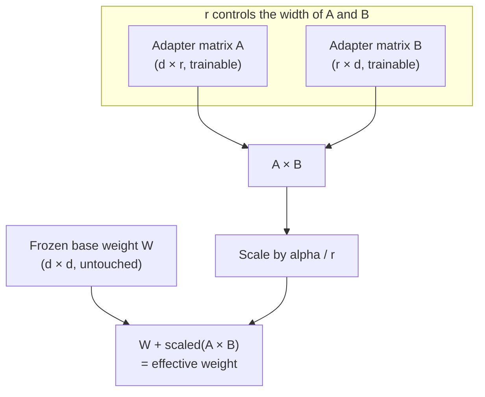
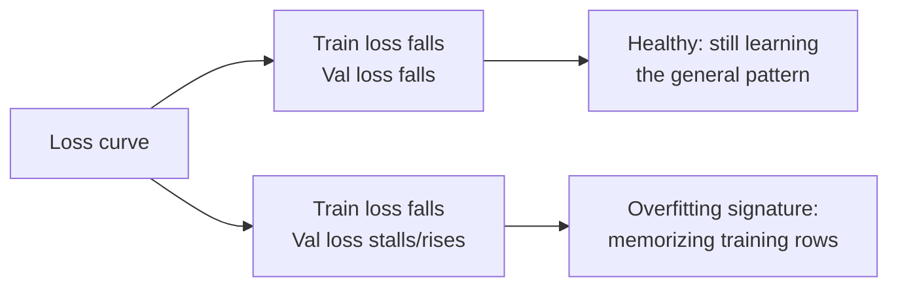
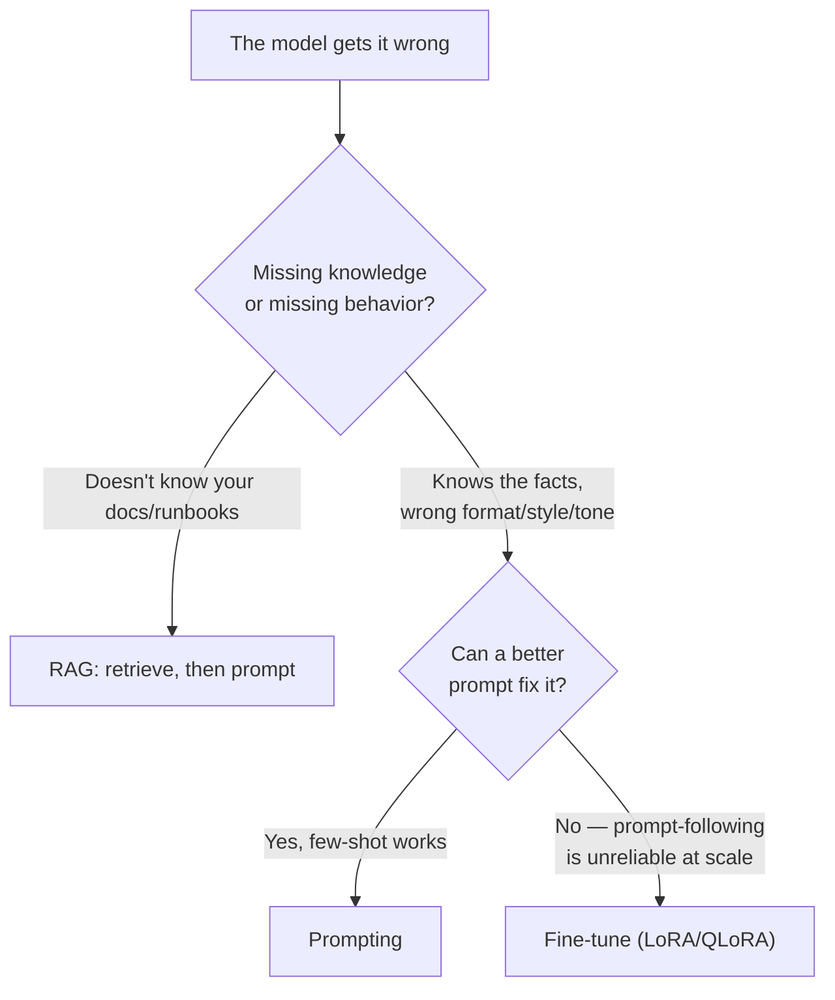

# Deep Dive: Fine-Tuning Parameters Under the Hood

The lab ran `mlx_lm.lora --iters 50` and you watched loss drop from a training run whose flags
you copied without touching. This page opens the flags you didn't touch: what `r` and `alpha`
actually control in the adapter math, why 4-bit quantization doesn't wreck a model, how to read
a loss curve instead of just watching it fall, and where a data-format mismatch quietly ruins a
run before training even starts. Then you run the same lab's training loop three times with
different knobs and put the results side by side — the comparison a platform engineer actually
needs before recommending a rank/learning-rate pair for a real corporate-docs adapter.

:::info[Where this picks up]

You need a working `mlx-lm` install and the training data from the lab. This works whether
the lab's teardown already ran or not — the seed step below is idempotent, so re-running it is
safe.

```bash
mkdir -p ~/mlx-lora-lab && cd ~/mlx-lora-lab
[ -f train.jsonl ] || cat > train.jsonl << 'EOF'
{"messages": [{"role": "user", "content": "Summarise this alert: CPU above 90% for 5 minutes on web-01."}, {"role": "assistant", "content": "{\"severity\": \"high\", \"host\": \"web-01\", \"metric\": \"cpu\", \"threshold\": \"90%\", \"duration\": \"5m\", \"action\": \"page-oncall\"}"}]}
{"messages": [{"role": "user", "content": "Summarise this alert: Disk usage at 95% on db-02."}, {"role": "assistant", "content": "{\"severity\": \"critical\", \"host\": \"db-02\", \"metric\": \"disk\", \"threshold\": \"95%\", \"duration\": \"now\", \"action\": \"escalate\"}"}]}
{"messages": [{"role": "user", "content": "Summarise this alert: Memory usage at 80% on cache-01 for 10 minutes."}, {"role": "assistant", "content": "{\"severity\": \"medium\", \"host\": \"cache-01\", \"metric\": \"memory\", \"threshold\": \"80%\", \"duration\": \"10m\", \"action\": \"monitor\"}"}]}
{"messages": [{"role": "user", "content": "Summarise this alert: Network packet loss 15% on edge-03."}, {"role": "assistant", "content": "{\"severity\": \"high\", \"host\": \"edge-03\", \"metric\": \"network\", \"threshold\": \"15%\", \"duration\": \"now\", \"action\": \"page-oncall\"}"}]}
{"messages": [{"role": "user", "content": "Summarise this alert: Pod crash-looping in namespace prod, deployment api-gateway."}, {"role": "assistant", "content": "{\"severity\": \"critical\", \"host\": \"prod/api-gateway\", \"metric\": \"pod-health\", \"threshold\": \"crash-loop\", \"duration\": \"now\", \"action\": \"escalate\"}"}]}
{"messages": [{"role": "user", "content": "Summarise this alert: Response latency above 2s on checkout service for 3 minutes."}, {"role": "assistant", "content": "{\"severity\": \"high\", \"host\": \"checkout\", \"metric\": \"latency\", \"threshold\": \"2s\", \"duration\": \"3m\", \"action\": \"page-oncall\"}"}]}
{"messages": [{"role": "user", "content": "Summarise this alert: SSL certificate expires in 7 days on api.example.com."}, {"role": "assistant", "content": "{\"severity\": \"medium\", \"host\": \"api.example.com\", \"metric\": \"ssl-expiry\", \"threshold\": \"7d\", \"duration\": \"now\", \"action\": \"renew-cert\"}"}]}
{"messages": [{"role": "user", "content": "Summarise this alert: Queue depth above 10000 on rabbitmq-01 for 15 minutes."}, {"role": "assistant", "content": "{\"severity\": \"high\", \"host\": \"rabbitmq-01\", \"metric\": \"queue-depth\", \"threshold\": \"10000\", \"duration\": \"15m\", \"action\": \"page-oncall\"}"}]}
EOF
cp -n train.jsonl valid.jsonl
source ~/mlx-lora-env/bin/activate
```

**Machine budget:** everything below fits Apple Silicon with 16 GB unified memory, one training
run at a time, `--iters` in the 50-ish range, the same `Qwen/Qwen2.5-0.5B-Instruct` model the
lab used. Don't scale these up on this hardware — that's the point of the constraint, not a
limitation to work around.

:::

---

## 1 — What `r` and `alpha` actually control

The lesson told you LoRA freezes the base weights and trains two small matrices per layer. It
didn't tell you what the *size* of those matrices means, and that size is the first knob you'll
be asked to justify.

**Analogy:** think of the frozen base model as a printed textbook, and the LoRA adapter as a
notepad clipped to each page for corrections. The rank `r` is **how wide that notepad is** — a
notepad with `r=4` gives you four lines to scribble a correction in; `r=64` gives you sixty-four.
A wider notepad can capture more complex, varied corrections, but it's also more paper to carry
(more trainable parameters, larger adapter file, more room to overfit eight sticky notes' worth
of examples). A narrow notepad forces terser, more general corrections.

Concretely: LoRA replaces a weight update to a matrix `W` (shape `d × d`) with two small
matrices `A` (`d × r`) and `B` (`r × d`), so the trained parameter count scales with `r`, not
with `d²`. Going from `r=4` to `r=64` is a 16x increase in that layer's trainable parameters —
this is why rank is the primary memory/capacity dial, not a minor tuning knob.

`alpha` is a scaling factor applied to the adapter's contribution: the effective update is
`(alpha / r) × (A × B)`, not just `A × B`. Practically, `alpha` and `r` are not independent —
what matters is the *ratio* `alpha/r`. Doubling both together roughly cancels out. When you see
example configs with `r=8, alpha=16` or `r=16, alpha=32`, that's the same `alpha/r = 2` ratio
carried at two different notepad widths. If you only change `r` without touching `alpha`, you
are also changing the effective step size of every adapted layer — that's a common source of
"I bumped the rank and now training is unstable" surprises.

`target_modules` controls *which* weight matrices get a notepad at all. A transformer layer has
several: query/value/key projections (`q_proj`, `v_proj`, `k_proj`), the output projection, and
the feed-forward layers. Attention's query and value projections (`q_proj`, `v_proj`) are the
default starting point — they're what most published LoRA configs target first — because they
have the most direct effect on *what the model attends to and retrieves*, which is where
behavior changes (style, format, tone) tend to live. Adding more target modules (key
projections, feed-forward) increases capacity and cost with diminishing returns for most
behavior-shaping tasks; reach for that only after `q_proj`/`v_proj` alone plateaus.

`dropout` on the LoRA path works the same as dropout anywhere in a neural net: during training,
it randomly zeroes out a fraction of the adapter's activations on each step, so the adapter
can't over-rely on any one path. On an eight-example toy dataset like the lab's, dropout matters
less than it will on your real 500–2000-example corporate-docs run — with more data pushing more
gradient signal through a small number of parameters, dropout is what keeps the adapter from
memorizing example order instead of learning the pattern.



*Wider `r` (more columns in A, more rows in B) means more trainable capacity through the same
frozen base weight — and `alpha` rescales how hard that capacity pushes on the final result.*

---

## 2 — QLoRA: why 4 bits doesn't wreck the model

The lesson mentioned QLoRA quantizes the frozen base to 4-bit to halve memory. The part it
didn't explain: why does chopping every weight down to 16 possible values not destroy the
model's behavior?

**Analogy:** picture a warehouse of parts sorted by size, and you're replacing exact
measurements with a fixed set of 16 size buckets. If parts were uniformly spread from tiny to
huge, 16 buckets would lose a lot of precision. But if almost all your parts cluster around a
handful of common sizes — with a long, sparse tail on either side — you can place your 16
buckets exactly where the parts actually are (dense near the middle, sparse at the extremes) and
barely lose anything, because you never wasted a bucket on a size nobody has.

Neural network weights, empirically, are **normally distributed** — clustered near zero, thin
tails. **NF4 (4-bit NormalFloat)** is a quantization scheme whose 16 representable values are
placed to match that bell-curve distribution, rather than spread evenly across the weight range
the way naive integer quantization would. That's why 4-bit survives here where you'd expect
catastrophic precision loss: the bucket placement matches where the data actually lives.

**Double quantization** takes this one step further: quantization itself needs small per-block
scaling constants (to map each block of weights into its 4-bit buckets), and those constants
add up to real memory across a whole model. Double quantization quantizes *those constants too*
(down to 8-bit), squeezing out roughly another 0.4 bits per parameter — small per-weight, but it
adds up at 7B+ parameter scale.

The other detail worth having straight: **storage dtype vs. compute dtype are different
things**. The frozen base weights sit in 4-bit NF4 *in memory* — that's the storage format that
gets you the memory savings. But matrix multiplication doesn't happen in 4-bit; weights are
dequantized on the fly to a compute dtype (typically bf16/fp16) for the actual forward/backward
pass, then the higher-precision result is what flows through. The LoRA adapter matrices
themselves (`A` and `B`) are never quantized — they stay in fp16/bf16 throughout, because they're
small (the notepad, not the textbook) and they're the part actually accumulating gradients. This
combination — frozen 4-bit base, fp16 adapter, on-the-fly dequant for compute — is exactly why
QLoRA trains stably instead of collapsing into quantization noise: the part that needs gradient
precision never touches 4-bit.

:::note[Where this applies on your hardware]

MLX-LM on Apple Silicon (what the lab used) does not go through bitsandbytes/NF4 — it uses
Apple's own quantization path. The NF4/double-quantization mechanism above is what Track B's
Axolotl QLoRA config (`load_in_4bit: true` in the lab's `config.yaml`) invokes on NVIDIA
hardware. Know both: you'll hit NF4 directly if you ever run Track B, and the "storage vs.
compute dtype" distinction applies to any quantized training path, MLX included.

:::

---

## 3 — Reading training dynamics instead of just watching them

The lab told you "loss dropping means the model is learning" and left it there. Here's what the
number is actually telling you, and where it lies to you.

**Learning rate** sets how big a step the optimizer takes on each gradient update. Too high and
loss oscillates or diverges instead of falling; too low and 50 iterations won't move the needle
at all. `mlx_lm.lora`'s default (order of `1e-5`) is deliberately conservative for a small model
on a small run — production configs often run higher (`1e-4`–`3e-4`) precisely because they can
afford a `lr_scheduler: cosine` decay (as the lab's Track B Axolotl config uses) to start fast
and settle gently.

**Epochs/iters vs. overfitting** — the eight-example dataset in the lab is small enough that 50
iterations already walks over it several times. Watch what the loss curve looks like as you push
iterations further: a *healthy* curve keeps falling on both train and validation loss together.
The **memorization signature** is train loss continuing to fall while the model's actual
generations on a prompt *not* in the training set stop improving, or validation loss stalls or
rises while train loss keeps dropping. Concretely: if you feed it a fixed test prompt after 50
iterations and after 200, and the 200-iteration adapter just parrots training examples verbatim
regardless of what you asked, that's overfitting — the adapter memorized the eight rows instead
of learning the underlying pattern. On a real 500+ example corpus this shows up as validation
loss plateauing or ticking upward while train loss keeps sliding.

**Batch size vs. gradient accumulation** is the memory/statistics trade-off you'll hit
immediately on a 16 GB machine. A larger batch size gives the optimizer a more stable gradient
estimate per step (averaged over more examples) but costs proportionally more memory to hold
activations for. Gradient accumulation lets you simulate a larger batch without the memory cost:
run several small forward/backward passes, accumulate their gradients, then take one optimizer
step as if it were one big batch. The lab's `--batch-size 1` is already at the memory floor —
on a bigger real dataset on the same 16 GB machine, reach for gradient accumulation (accumulate
4–8 micro-batches) before reaching for a bigger `--batch-size`, which is what will actually blow
your memory budget.



---

## 4 — Data format: the silent failure mode

The lab's `train.jsonl` used the `{"messages": [{"role": ..., "content": ...}]}` chat format —
you copied it without being told why that exact shape matters. Here's why it does.

Every instruct-tuned model has a **chat template** baked into its tokenizer config — the exact
sequence of special tokens (like `<|im_start|>user`, `<|im_start|>assistant`) it was trained to
expect around each turn. When you fine-tune with `mlx_lm.lora --data .`, the trainer applies
the model's own chat template to your `messages` array before tokenizing. If your training data
uses a *different* shape — raw `prompt`/`completion` strings, a different role vocabulary, or a
hand-rolled template that doesn't match what the base model's tokenizer expects at inference —
training will still run and loss will still fall. That's the trap: **a format mismatch doesn't
error, it silently trains the adapter on the wrong signal.** The adapter learns to associate
your content with token boundaries that don't match how you'll actually prompt it at inference
time, so it "worked" in training and underperforms or behaves erratically in the field.

This is the number one reason a fine-tune "doesn't seem to have learned anything" despite a
clean-looking loss curve: the training format and the inference format silently diverged.
Always verify by doing exactly what Step A-4 in the lab does — generate with the adapter using
the same prompting shape you intend to use in production, not just eyeball the loss number.

---

## 5 — Evaluating the adapter, and the fine-tune vs. RAG vs. prompt call

The lab's before/after comparison (base model vs. adapter, same prompt) is the whole evaluation
methodology worth remembering: **fixed held-out prompts, side by side, every time you change a
knob.** Not a vibe check on one generation — a small fixed prompt set you reuse across every
variant, so you're comparing behavior change, not run-to-run noise (generation is stochastic;
one good-looking output proves nothing).

The lesson's when-to-fine-tune table is the front door to this decision. Here's the fuller
version once you've actually run a fine-tune and felt the cost:



The column you now have that you didn't before this page: **cost of being wrong.** A bad prompt
costs you an edit. A bad fine-tune costs you a training run, a rank/lr choice that may not
transfer, and a re-evaluation against held-out prompts. Reach for fine-tuning only after
prompting and RAG are genuinely exhausted — this deep dive's whole point is that the fine-tune
path has real knobs with real failure modes, not that it's free once you know the flags.

---

## 6 — Experiment: comparing rank and learning-rate variants

Now run the lab's training loop three times, writing each to a **distinct adapter directory**
so you can compare them side by side instead of overwriting one adapter with the next.

:::note[Flags pinned during validation]

Pinned live against **mlx-lm 0.31.3**. `mlx_lm.lora --help` on this version has **no dedicated
rank flag** — `--lora-rank` does not exist. Rank (and `alpha`, exposed here as `scale`) live only
in `lora_parameters` inside a YAML file passed via `-c/--config`; the CLI default is
`lora_parameters: {rank: 8, dropout: 0.0, scale: 20.0}`. `--learning-rate` **is** a real CLI flag
in this version and needs no config file. `--num-layers` is also a direct CLI flag (default 16;
the lab and this page both override it to 4). If your installed version differs, run
`mlx_lm.lora --help` first and adjust — Variant A below may need updating back to a `--lora-rank`
flag on older/newer releases that expose one directly.

:::

**Baseline** — this is the lab's own Step A-3 run, unchanged, just renamed to a variant dir so it
sits alongside the others:

```bash
mlx_lm.lora \
  --model Qwen/Qwen2.5-0.5B-Instruct \
  --train \
  --data . \
  --iters 50 \
  --batch-size 1 \
  --num-layers 4 \
  --save-every 25 \
  --adapter-path ./adapters-baseline
```

**Expected output**

```text
Loading pretrained model
Fetching 7 files: 100%|██████████| 7/7 [00:00<00:00]
Loading datasets
Training
Trainable parameters: 0.148% (0.733M/494.033M)
Starting training..., iters: 50
Iter 1: Val loss 3.721, Val took 0.726s
Iter 10: Train loss 2.670, Learning Rate 1.000e-05, It/sec 13.980, Tokens/sec 1326.746, Trained Tokens 949, Peak mem 1.290 GB
Iter 20: Train loss 1.056, Learning Rate 1.000e-05, It/sec 14.787, Tokens/sec 1418.100, Trained Tokens 1908, Peak mem 1.290 GB
Iter 25: Saved adapter weights to adapters-baseline/adapters.safetensors and adapters-baseline/0000025_adapters.safetensors.
Iter 30: Train loss 0.568, Learning Rate 1.000e-05, It/sec 15.192, Tokens/sec 1411.343, Trained Tokens 2837, Peak mem 1.293 GB
Iter 40: Train loss 0.305, Learning Rate 1.000e-05, It/sec 14.860, Tokens/sec 1431.051, Trained Tokens 3800, Peak mem 1.293 GB
Iter 50: Val loss 0.148, Val took 0.381s
Iter 50: Train loss 0.200, Learning Rate 1.000e-05, It/sec 14.987, Tokens/sec 1413.245, Trained Tokens 4743, Peak mem 1.293 GB
Iter 50: Saved adapter weights to adapters-baseline/adapters.safetensors and adapters-baseline/0000050_adapters.safetensors.
Saved final weights to adapters-baseline/adapters.safetensors.
```

Real run, ~7.5s wall-clock (model was already cached from the core lab; a cold download adds
several minutes). Trainable parameters: 0.733M of 494.033M (0.148%) — the notepad next to a
494M-parameter textbook.

**Variant A — smaller rank** (narrower notepad; fewer trainable parameters per adapted layer).
On mlx-lm 0.31.3 there is no `--lora-rank` CLI flag — rank only exists inside `lora_parameters`
in a YAML config passed via `-c`. Write a 4-line config, then pass it alongside the same CLI
flags used for the baseline:

```bash
cat > rank4.yaml << 'EOF'
lora_parameters:
  rank: 4
  dropout: 0.0
  scale: 20.0
EOF

mlx_lm.lora \
  --model Qwen/Qwen2.5-0.5B-Instruct \
  --train \
  --data . \
  --iters 50 \
  --batch-size 1 \
  --num-layers 4 \
  --save-every 25 \
  --adapter-path ./adapters-variant-a \
  -c rank4.yaml
```

**Expected output**

```text
Loading configuration file rank4.yaml
Loading pretrained model
Fetching 7 files: 100%|██████████| 7/7 [00:00<00:00]
Loading datasets
Training
Trainable parameters: 0.074% (0.367M/494.033M)
Starting training..., iters: 50
Iter 1: Val loss 3.721, Val took 0.704s
Iter 10: Train loss 3.107, Learning Rate 1.000e-05, It/sec 13.953, Tokens/sec 1324.154, Trained Tokens 949, Peak mem 1.278 GB
Iter 20: Train loss 1.670, Learning Rate 1.000e-05, It/sec 14.831, Tokens/sec 1422.322, Trained Tokens 1908, Peak mem 1.278 GB
Iter 25: Saved adapter weights to adapters-variant-a/adapters.safetensors and adapters-variant-a/0000025_adapters.safetensors.
Iter 30: Train loss 0.977, Learning Rate 1.000e-05, It/sec 15.226, Tokens/sec 1414.482, Trained Tokens 2837, Peak mem 1.280 GB
Iter 40: Train loss 0.607, Learning Rate 1.000e-05, It/sec 14.909, Tokens/sec 1435.749, Trained Tokens 3800, Peak mem 1.280 GB
Iter 50: Val loss 0.374, Val took 0.382s
Iter 50: Train loss 0.449, Learning Rate 1.000e-05, It/sec 15.138, Tokens/sec 1427.513, Trained Tokens 4743, Peak mem 1.280 GB
Iter 50: Saved adapter weights to adapters-variant-a/adapters.safetensors and adapters-variant-a/0000050_adapters.safetensors.
Saved final weights to adapters-variant-a/adapters.safetensors.
```

Trainable parameters dropped from 0.733M (rank 8) to exactly half, 0.367M (rank 4) — confirms
the "16x from r=4 to r=64" scaling claim in §1: parameter count scales linearly with rank. Loss
at Iter 50 is measurably higher than the baseline (0.449 vs. 0.200 train, 0.374 vs. 0.148 val) —
the narrower notepad genuinely has less capacity, visible even on this trivial 8-example set.

**Variant B — higher learning rate** (10x the default, to see the oscillation/instability signal
discussed in §3):

```bash
mlx_lm.lora \
  --model Qwen/Qwen2.5-0.5B-Instruct \
  --train \
  --data . \
  --iters 50 \
  --batch-size 1 \
  --num-layers 4 \
  --learning-rate 1e-4 \
  --save-every 25 \
  --adapter-path ./adapters-variant-b
```

**Expected output**

```text
Loading pretrained model
Fetching 7 files: 100%|██████████| 7/7 [00:00<00:00]
Loading datasets
Training
Trainable parameters: 0.148% (0.733M/494.033M)
Starting training..., iters: 50
Iter 1: Val loss 3.721, Val took 0.632s
Iter 10: Train loss 1.353, Learning Rate 1.000e-04, It/sec 13.979, Tokens/sec 1326.580, Trained Tokens 949, Peak mem 1.290 GB
Iter 20: Train loss 0.226, Learning Rate 1.000e-04, It/sec 14.925, Tokens/sec 1431.295, Trained Tokens 1908, Peak mem 1.290 GB
Iter 25: Saved adapter weights to adapters-variant-b/adapters.safetensors and adapters-variant-b/0000025_adapters.safetensors.
Iter 30: Train loss 0.134, Learning Rate 1.000e-04, It/sec 14.829, Tokens/sec 1377.602, Trained Tokens 2837, Peak mem 1.293 GB
Iter 40: Train loss 0.069, Learning Rate 1.000e-04, It/sec 14.904, Tokens/sec 1435.236, Trained Tokens 3800, Peak mem 1.293 GB
Iter 50: Val loss 0.028, Val took 0.383s
Iter 50: Train loss 0.054, Learning Rate 1.000e-04, It/sec 15.020, Tokens/sec 1416.364, Trained Tokens 4743, Peak mem 1.293 GB
Iter 50: Saved adapter weights to adapters-variant-b/adapters.safetensors and adapters-variant-b/0000050_adapters.safetensors.
Saved final weights to adapters-variant-b/adapters.safetensors.
```

Real result, and it complicates the prediction above: on this eight-example toy set, 10x the
learning rate converged **faster and lower** (train loss 0.054 vs. baseline's 0.200), with no
visible oscillation — Val loss drops monotonically from 3.721 straight to 0.028. Read that
correctly: it does **not** mean "always crank the learning rate." It means eight examples over
50 iterations is too small and too easy a problem to expose instability — the loss surface here
is smooth enough that a bigger step still points the right way every time. The instability
signature from §3 shows up on harder, larger, noisier real datasets where a 10x learning rate
overshoots a much bumpier loss surface. Toy-scale results like this one are exactly why the
methodology in §5 insists on held-out prompts, not just a loss number: a suspiciously good loss
curve on a trivial dataset tells you about the dataset's easiness, not the learning rate's
safety at production scale.

Generate from all three adapters against the same two fixed prompts (one from the training
distribution, one novel):

```bash
for adapter in adapters-baseline adapters-variant-a adapters-variant-b; do
  echo "=== $adapter ==="
  mlx_lm.generate \
    --model Qwen/Qwen2.5-0.5B-Instruct \
    --adapter-path "./$adapter" \
    --prompt "Summarise this alert: CPU above 90% for 5 minutes on web-01." \
    --max-tokens 80
done
```

**Expected output**

```text
=== adapters-baseline ===
==========
{"severity": "high", "host": "web-01", "metric": "cpu", "threshold": "90%", "duration": "5m", "action": "page-oncall"}
==========
Prompt: 51 tokens, 157.434 tokens-per-sec
Generation: 44 tokens, 120.644 tokens-per-sec
Peak memory: 1.104 GB

=== adapters-variant-a ===
==========
{"severity": "high", "host": "web-01", "metric": "cpu", "threshold": "90%", "duration": "5m", "action": "page-oncall"}
==========
Prompt: 51 tokens, 510.298 tokens-per-sec
Generation: 44 tokens, 121.586 tokens-per-sec
Peak memory: 1.099 GB

=== adapters-variant-b ===
==========
{"severity": "high", "host": "web-01", "metric": "cpu", "threshold": "90%", "duration": "5m", "action": "page-oncall"}
==========
Prompt: 51 tokens, 684.600 tokens-per-sec
Generation: 44 tokens, 119.853 tokens-per-sec
Peak memory: 1.094 GB
```

All three reproduce the exact training example verbatim — expected, since this prompt is one of
the eight training rows, so this only proves memorization, not generalization. The real test is
a prompt none of the adapters ever saw:

```bash
for adapter in adapters-baseline adapters-variant-a adapters-variant-b; do
  echo "=== $adapter (held-out) ==="
  mlx_lm.generate \
    --model Qwen/Qwen2.5-0.5B-Instruct \
    --adapter-path "./$adapter" \
    --prompt "Summarise this alert: GPU temperature above 85C on ml-worker-07 for 2 minutes." \
    --max-tokens 80
done
```

**Expected output**

```text
=== adapters-baseline (held-out) ===
==========
{"severity": "high", "host": "ml-worker-07", "metric": "gpu", "threshold": "85", "duration": "2m", "action": "page-oncall"}
==========
Prompt: 53 tokens, 302.072 tokens-per-sec
Generation: 45 tokens, 120.082 tokens-per-sec
Peak memory: 1.103 GB

=== adapters-variant-a (held-out) ===
==========
{"severity": "high", "host": "ml-worker-07", "metric": "gpu", "threshold": "85", "duration": "2m", "action": "page-oncall"}
==========
Prompt: 53 tokens, 689.625 tokens-per-sec
Generation: 45 tokens, 121.385 tokens-per-sec
Peak memory: 1.096 GB

=== adapters-variant-b (held-out) ===
==========
{"severity": "high", "host": "ml-worker-07", "metric": "gpu", "threshold": "85", "duration": "2m", "action": "page-oncall"}
==========
Prompt: 53 tokens, 274.515 tokens-per-sec
Generation: 45 tokens, 120.128 tokens-per-sec
Peak memory: 1.108 GB
```

All three variants generalized correctly on a genuinely unseen alert — right JSON shape, right
field values inferred from a metric/host/duration combination none of them trained on. At this
toy scale, all three ranks and both learning rates cleared the bar; the differences that matter
show up in the loss numbers above, not in this one generation.

Fold the results into this comparison table:

| Variant | Rank | Learning rate | Final train loss | Loss trajectory | Generation (held-out prompt) |
|---|---|---|---|---|---|
| Baseline | 8 (default) | 1e-05 (default) | 0.200 (val 0.148) | 3.721 → 2.670 → 1.056 → 0.568 → 0.305 → 0.200, smooth monotonic drop | Correct JSON, right fields (gpu/85/2m/page-oncall) |
| Variant A — smaller rank | 4 | 1e-05 (default) | 0.449 (val 0.374) | 3.721 → 3.107 → 1.670 → 0.977 → 0.607 → 0.449, smooth but converges higher | Correct JSON, right fields — capacity cut didn't break generalization at this toy scale |
| Variant B — higher LR | 8 (default) | 1e-04 (10x) | 0.054 (val 0.028) | 3.721 → 1.353 → 0.226 → 0.134 → 0.069 → 0.054, smooth and *faster* than baseline, no oscillation | Correct JSON, right fields |

What the real numbers show: Variant A (rank 4) converges to a measurably **higher** final loss
than the rank-8 baseline (0.449 vs. 0.200) — the capacity cut is real and visible even on eight
examples, confirming §1's claim that rank is the primary capacity dial. Variant B (10x LR) did
**not** show the instability signature from §3 — it converged faster and lower, with a smooth
monotonic curve. That's a genuine result, not a failure to reproduce the theory: eight examples
over 50 iterations is too small and too easy a loss surface to expose learning-rate instability.
The instability signature is real, but you need a harder, larger, noisier dataset to see it — a
useful lesson in its own right about not over-generalizing from toy-scale experiments.

Teardown for this section only — remove the variant dirs, keep the venv and training data if you
plan to keep experimenting:

```bash
rm -rf ~/mlx-lora-lab/adapters-baseline ~/mlx-lora-lab/adapters-variant-a ~/mlx-lora-lab/adapters-variant-b ~/mlx-lora-lab/rank4.yaml
```

---

## Teardown

Remove only what this page added on top of the lab:

```bash
rm -rf ~/mlx-lora-lab/adapters-baseline ~/mlx-lora-lab/adapters-variant-a ~/mlx-lora-lab/adapters-variant-b ~/mlx-lora-lab/rank4.yaml
```

Keep `~/mlx-lora-lab/train.jsonl` / `valid.jsonl` and `~/mlx-lora-env` if you're continuing to
experiment — they're the same shared state the core lab left behind, and later modules don't
depend on this page's variant adapters existing. If you're fully done with the module, follow
the core lab's Step A-6 teardown (removes the venv and `~/mlx-lora-lab` entirely).

:::tip[Where you will use this]

- **`alpha/r` is a ratio, not two independent knobs.** **Use it when:** you're handed a config
  someone else tuned and asked to "just bump the rank for more capacity" — bump `alpha`
  proportionally or you've silently changed the adapter's effective step size too.
- **NF4's bucket placement matches the normal distribution of real weights, which is why 4-bit
  survives.** **Use it when:** you're deciding whether QLoRA is safe for a production adapter —
  it's not a lossy hack, it's a quantization scheme designed around how weights actually
  distribute, so the memory savings don't come with the precision cliff you'd expect.
- **Train loss falling while validation loss stalls is the memorization signature, not
  success.** **Use it when:** reviewing a colleague's "the fine-tune worked, loss went to
  near-zero" claim before it ships — ask for the validation curve and a held-out prompt
  generation, not just the train loss number.
- **A chat-template mismatch between training data and inference trains silently on the wrong
  signal — no error, just a worse adapter.** **Use it when:** debugging "the fine-tune barely
  changed anything" — check that your training JSONL's format matches the base model's tokenizer
  chat template before touching rank or learning rate.
- **Gradient accumulation, not a bigger `--batch-size`, is the first lever on a memory-constrained
  machine.** **Use it when:** you're scaling a toy fine-tune (like this lab's eight examples) up
  to a real 500–2000 example corporate-docs dataset on the same 16 GB laptop and start seeing
  memory pressure.

:::
