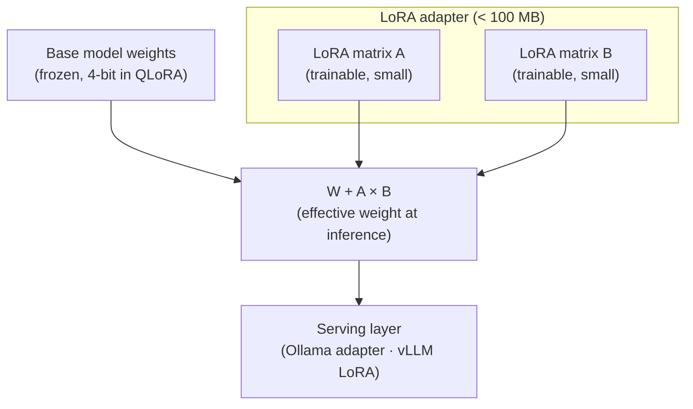
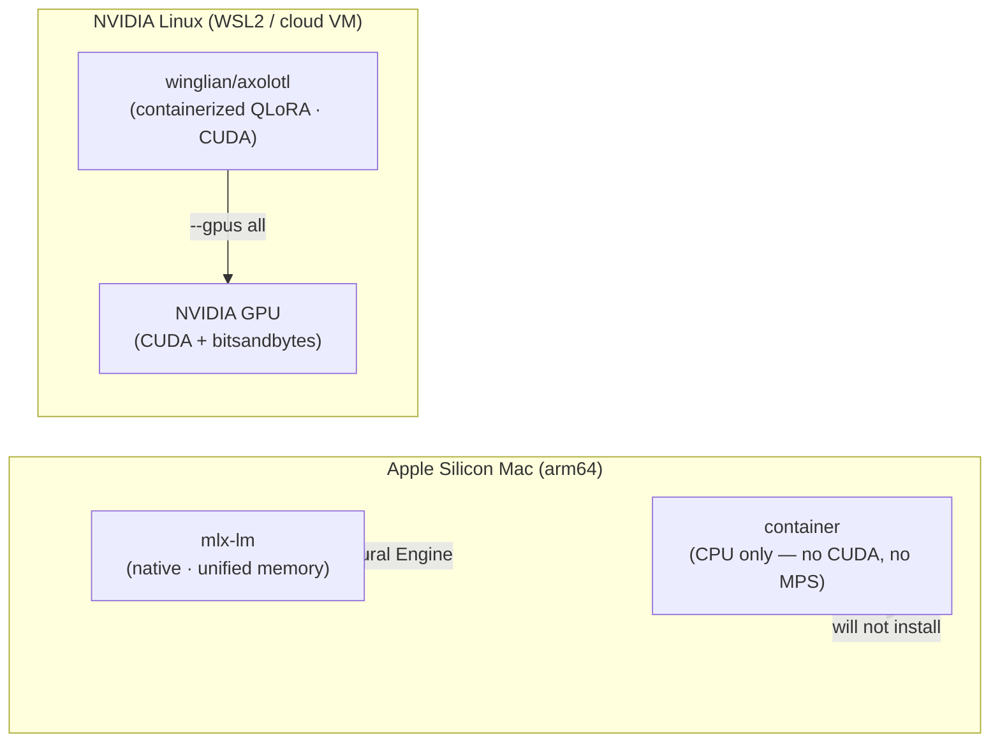

import Slides from '@site/src/components/Slides';

# Lesson: Customizing Models with LoRA/QLoRA in Containers

> **Module goal:** Understand when fine-tuning beats prompting or RAG, what LoRA and QLoRA actually do to a model's weights, which toolchain to reach for (Axolotl on NVIDIA, MLX-LM on Apple Silicon), and why the container is the reproducibility unit — not the script.

:::warning[Optional GPU-Gated Module]

This module is **optional** and intended for learners who need to produce custom model adapters. Track A (Apple Silicon, native MLX-LM) runs on any Mac with enough unified memory. Track B (NVIDIA QLoRA) requires an NVIDIA GPU — via WSL2, a cloud VM, or a bare-metal Linux box. Neither track runs GPU-accelerated inside a Mac container.

:::

---

## Module slides

Walk this short whiteboard deck for the big picture before the hands-on lab — or open it fullscreen.

<Slides src="decks/03b-finetuning.html" title="Module 3B — LoRA / QLoRA Fine-tuning" />

## 1. When to fine-tune — and when not to

Before reaching for a fine-tune, ask yourself three questions:

| Question | If yes → prefer |
|---|---|
| Can you solve it by writing a better system prompt? | **Prompting** |
| Do you need the model to reason over your private documents? | **RAG** (M5/M6) |
| Do you need the model to *behave differently* — new style, domain vocabulary, consistent output format — in a way no prompt reliably achieves? | **Fine-tuning** |

Fine-tuning makes sense when:
- You have **50–5 000 high-quality examples** of the exact behaviour you want.
- You need **reliable output structure** (always valid JSON, always a specific schema) that few-shot prompting still occasionally breaks.
- You're deploying to edge hardware and need a **smaller specialist model** instead of a big generalist.
- You want to teach the model a **domain dialect** — internal product names, an acronym set, a writing style — that is not in its training data.

Fine-tuning does **not** help when your problem is really a knowledge problem (the model doesn't know your runbooks → use RAG) or an inference problem (the model reasons incorrectly → improve your prompt or use a smarter base model).

---

## 2. LoRA — sticky notes on a textbook

**Analogy:** Imagine you have a thick, expensive textbook. You want to annotate it for a specialist audience — medical readers, say — but you cannot rewrite the book (too expensive, and you'd lose the general knowledge). So instead you stick **Post-it notes** in the margins: small, targeted additions that change how a reader interprets a section, without touching the original printed page. When you share the book with a general reader you just peel the notes off; the textbook underneath is unchanged.

**LoRA (Low-Rank Adaptation)** works exactly like that. A language model's behaviour is encoded in billions of weight matrices. Full fine-tuning updates *every element* of every matrix — enormously expensive in GPU memory and compute. LoRA instead freezes the original weight matrices (the textbook) and trains two small **low-rank matrices** (the sticky notes) alongside each layer. At inference time, the two small matrices are multiplied together and *added* to the frozen weights — a cheap operation. The trained adapter is typically **1–3% the size of the original model** and can be hot-swapped without reloading the base weights.

**QLoRA** extends LoRA by also **quantizing the frozen base model to 4-bit** during training, halving the GPU memory footprint again. The adapter itself stays in higher precision for gradient quality. This is what lets you fine-tune a 7B or 13B model on a single consumer GPU.



*The base model never changes. Only the two tiny adapter matrices are trained. At serving time, the adapter is merged on the fly or loaded hot.*

---

## 3. The toolchain

Three mature stacks cover 95% of fine-tuning use cases:

### Axolotl (NVIDIA — recommended for production)

Axolotl wraps Hugging Face **TRL/PEFT** behind a single YAML config file, adds dataset pre-processing, multi-GPU support, and checkpointing. You describe the run in YAML and Axolotl handles the rest.

```
axolotl.yaml → docker run winglian/axolotl → trained adapter
```

The Docker image (`winglian/axolotl`) ships with the right versions of bitsandbytes, CUDA, and PEFT pinned together. This is the reproducibility payoff: the image is the experiment record.

### Unsloth (NVIDIA — faster, memory-efficient)

Unsloth rewrites the key training kernels in Triton and achieves **2× the speed and 60% less VRAM** versus a standard PEFT run. It ships as a Docker image too, making it easy to drop into the same container-based workflow as Axolotl.

### MLX-LM (Apple Silicon — native only)

Apple's **MLX** framework runs directly on the Neural Engine and GPU cores of an M-series chip via **unified memory** — the same physical RAM is shared between the CPU, GPU, and Neural Engine without copying. This lets you fine-tune a 3B or 7B model on a MacBook Pro with 16–32 GB of RAM.

**Key constraint:** `bitsandbytes` and CUDA do not exist on macOS. There is no Mac container that accelerates fine-tuning. MLX-LM must run **natively** (`pip install mlx-lm`), exactly as Ollama runs natively in M1.

---

## 4. The GPU reality



On Apple Silicon, **containerized QLoRA will not accelerate** because:
1. `bitsandbytes` requires CUDA and will not install on macOS.
2. Docker containers on Mac have no path to the Metal GPU or Neural Engine.
3. MLX is the Apple-native alternative — it uses the same unified memory that makes Apple Silicon compelling for on-device inference.

On an NVIDIA machine (WSL2, cloud VM, bare-metal Linux), the Axolotl or Unsloth containers accelerate through `--gpus all` and the NVIDIA Container Toolkit, exactly as in the M3 GPU track.

---

## 5. Reproducibility — the frozen container is the experiment

When a fine-tuning run produces a good adapter, you need to be able to reproduce it six months later. Scripts rot: Python versions drift, PEFT releases change default behaviours, bitsandbytes updates alter quantization. An OCI image does not rot. The `winglian/axolotl:0.9.x` image has every dependency pinned. Tag and push it to your registry after a successful run and you have an immutable experiment record.

```
training run → git tag + docker image tag → push to GHCR → adapter artifact
```

The YAML config goes in git. The image tag goes alongside it. Anyone with a GPU can reproduce the run by pulling both.

---

## 6. What you produce — and where it fits

A LoRA fine-tune produces a **small adapter directory** (typically 50–200 MB) containing two files: `adapter_model.safetensors` and `adapter_config.json`. You can:

- **Merge** it into the base model weights for a single portable file (`mlx_lm.fuse` or `peft merge`).
- **Load it hot** into Ollama (`ollama create mymodel -f Modelfile`) or vLLM (`--lora-modules`), leaving the base model shared in memory and only swapping the adapter per request.
- **Package it** as a ModelKit artifact with the base model reference and adapter together — the subject of M4 — so a single `modelkit push` ships both.

This is the pipeline: fine-tune → adapter → serve (hot-swap or merge) → package → ship.

---

## Summary

| Concept | The short version |
|---|---|
| Fine-tune vs RAG | RAG = knowledge gap; fine-tune = behaviour gap |
| LoRA | Freeze the base weights; train two tiny matrices per layer; merge at inference |
| QLoRA | LoRA + 4-bit quantized base weights = fits a 7B on a consumer GPU |
| Axolotl / Unsloth | NVIDIA containers wrapping TRL/PEFT; YAML config → adapter |
| MLX-LM | Apple Silicon native only; unified memory; no CUDA required |
| The GPU reality | bitsandbytes + CUDA = Linux/NVIDIA only; Mac containers can't accelerate training |
| Reproducibility | Image tag + YAML config = immutable experiment record |
| Output | Small adapter directory; hot-loaded into Ollama or vLLM, or packaged via ModelKit |

---

In the lab you'll run Track A (MLX-LM native fine-tune on Apple Silicon) or follow Track B (Axolotl containerized QLoRA on NVIDIA) — two paths to the same destination: a working LoRA adapter.
