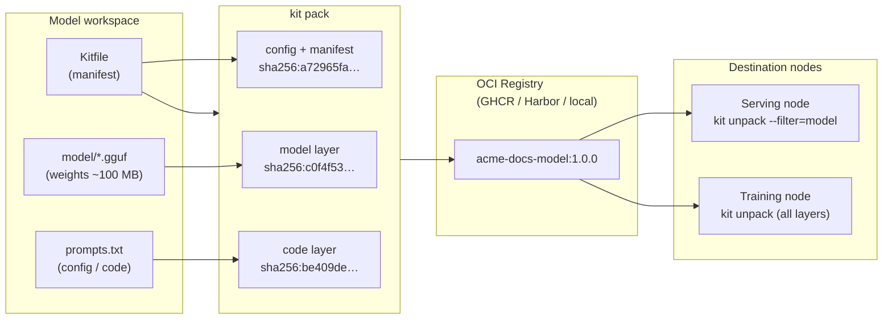

import Slides from '@site/src/components/Slides';

# Lesson: Packaging Models as OCI Artifacts

> **Module goal:** Understand why models belong in OCI registries, how KitOps ModelKit bundles weights + config + prompts into a single signed, versioned artifact, and how selective pull lets a serving node grab only the layers it needs — without ever checking in a multi-gigabyte GGUF file.

---

## Module slides

Walk this short whiteboard deck for the big picture before the hands-on lab — or open it fullscreen.

<Slides src="decks/04-packaging.html" title="Module 4 — Packaging as OCI Artifacts" />

## 1. The problem with loose model files

You have trained (or downloaded) a model. You have a system prompt, a quantization config, maybe a dataset for fine-tuning. How do you hand all of it to a colleague, a CI pipeline, or a Kubernetes Job running somewhere else?

The old answer is: a shared drive, a Slack message with a Hugging Face link, an `scp` to the GPU box, a README with "remember to also grab prompts-v3-final.txt." Every receiver re-assembles the right combination manually. Versions drift. Weights from one experiment accidentally pair with a prompt from another.

**Analogy:** this is like shipping physical goods by handing people a list of warehouse addresses and saying "go collect the parts yourself." Experienced logistics teams solved this problem decades ago with the **shipping manifest + labelled crates**: a single document that identifies every item, signed by the sender, sealed into a labelled container that any warehouse or customs office can handle without special instructions. Open the container, the contents are exactly what the manifest says.

A **ModelKit** is that sealed container for ML: one signed, versioned bundle — model weights + config + prompts + optional datasets — that any OCI registry (Docker Hub, GHCR, Quay, Harbor) can store, replicate, and serve. Receivers do one command to get everything, at the exact version the sender packed.

---

## 2. What is an OCI artifact (and why models fit perfectly)

OCI — the Open Container Initiative — originally standardised container images. But the OCI image spec is really a **layered blob store with a manifest**. A layer is any byte stream + a SHA-256 digest. The manifest declares what layers exist, what type each is, and signs the whole thing. Registries understand this natively.

A container image happens to use layers for OS, app, and config. An OCI *artifact* uses that same mechanism for arbitrary content: a Helm chart, a WASM module, a software bill of materials — or a model checkpoint.

**Why models are a natural fit:**

| Container image layer | ModelKit equivalent |
|---|---|
| Base OS layer | Model weights (the heavy base) |
| App layer | Code / inference scripts |
| Config layer | Kitfile (manifest) + prompts + dataset refs |

The layer structure means registries can **deduplicate** across versions: if you retrain with only a new prompt config, the weights layer is already in the registry and only the config layer is pushed. Pull is symmetric — grab only what changed.

---

## 3. KitOps and ModelKit (CNCF + ORAS)

**KitOps** is the CNCF project that defines the **ModelKit** format and the `kit` CLI. A ModelKit is an OCI artifact whose layers are typed:

- **model** — the weights file(s) (`.gguf`, `.safetensors`, etc.)
- **code** — inference scripts, prompt files, adapters
- **datasets** — training / eval data (optional)
- **docs** — README, cards, licences (optional)

The **Kitfile** (a YAML file, think of it as the shipping manifest) describes the package: name, version, authors, and which local files map to which layer types.

Under the hood, `kit` uses **ORAS** (OCI Registry as Storage) — a CNCF library that lets any language push/pull typed OCI artifacts to any compliant registry. This is why a ModelKit works on Docker Hub, GHCR, Quay, Harbor, and a bare `registry:2` container equally: they all speak the same OCI distribution API.

This contrasts with **`docker model package`** (Docker Desktop 4.40+), which also packs a GGUF into an OCI artifact. The difference is ecosystem scope:

| | **KitOps ModelKit** | **`docker model package`** |
|---|---|---|
| Standard | OCI artifact (CNCF) | OCI artifact (Docker-specific) |
| CLI | `kit` — works anywhere | `docker model` — requires Docker Desktop |
| Registries | Any OCI registry | Docker Hub primary |
| Layer types | model / code / datasets / docs | Single model blob |
| Selective pull | `--filter=model` / `--filter=code` | Not supported |
| CNCF ecosystem | Integrates with Flux, Harbor, Argo | No |

If you want portability across registries and runtimes — including pulling into Kubernetes with Flux or distributing to air-gapped Harbor deployments — the CNCF path is the portable choice.

---

## 4. The Kitfile: your shipping manifest

A Kitfile is a tiny YAML file at the root of your model workspace. Here is the one you'll write in the lab:

```yaml
manifestVersion: "1.0.0"
package: {name: acme-docs-model, version: "1.0.0", authors: ["School of DevOps & AI"]}
model: {name: SmolLM2-135M-Instruct, path: ./model/SmolLM2-135M-Instruct-Q4_K_M.gguf}
code:  [{path: ./prompts.txt, description: "System prompt / config"}]
```

Each field maps to an OCI layer:

- **`manifestVersion`** — schema version (always `"1.0.0"` for KitOps v1)
- **`package`** — metadata that becomes the OCI manifest's annotation (registry UI shows this)
- **`model`** — path to the weights file; becomes the `model` typed layer
- **`code`** — list of source files; becomes one or more `code` typed layers

When `kit pack . -t <ref>` runs, it reads the Kitfile, hashes each file into a layer blob, writes a manifest, and stores everything in the local kit store (analogous to `docker`'s local image cache).

---

## 5. The full flow: Kitfile → registry → serving node



*Kitfile describes the workspace; `kit pack` turns it into typed OCI layers; the registry stores and replicates it; downstream nodes pull only the layers they need.*

---

## 6. Selective pull: the KitOps payoff

The layer-typed architecture unlocks a capability plain images can't offer: **selective pull**.

**Analogy:** imagine a warehouse that stores books by chapter rather than by whole volume. A researcher who only needs chapter 3 can request just that chapter — they don't wait for the rest of the book to be couriered from the shelf. The catalogue (manifest) tells them exactly which box contains chapter 3.

In KitOps, `--filter` does this:

```bash
# Pull only the model weights — skip code/datasets
kit unpack <ref> --filter=model -d ./weights-only

# Filter types: model, code, docs, datasets, prompts
```

Use cases:
- **Serving nodes** — pull the `model` layer only; they don't need training datasets or eval scripts.
- **Data-science notebooks** — pull the `datasets` layer only for analysis without downloading weights.
- **CI pipelines** — pull only the `code` layer to lint/test inference scripts.

This can save gigabytes on every pull when your ModelKit includes a multi-GB model alongside separate dataset layers.

---

## 7. Multi-registry portability

Because ModelKit is a standard OCI artifact, `kit push` targets any OCI-compliant registry with the same command syntax:

| Registry | Command target |
|---|---|
| GitHub Container Registry | `ghcr.io/<org>/<repo>:<tag>` |
| Docker Hub | `docker.io/<user>/<repo>:<tag>` |
| Quay.io | `quay.io/<org>/<repo>:<tag>` |
| Harbor (private) | `harbor.example.com/<project>/<repo>:<tag>` |
| Local `registry:2` | `localhost:5001/<repo>:<tag>` + `--plain-http` |

The `--plain-http` flag is for HTTP-only registries (local dev, air-gapped). All other targets use TLS by default.

---

## 8. ModelKit vs a plain container image

A plain container image can technically hold a model file — you've seen teams do `COPY model.gguf /app/`. But this has structural problems:

1. **You can't skip layers.** Docker pulls the entire image; there's no `--filter` for individual `COPY` layers.
2. **No semantic layer types.** Registries treat every layer as opaque bytes. A CI tool can't ask "give me just the model" without custom logic.
3. **Images are meant to run.** OCI images carry a container config (entrypoint, env, user, etc.). A plain image holding only a GGUF wastes space on that metadata and confuses tooling.
4. **Digest-level deduplication is accidental.** If your model GGUF occupies one layer and is shared across tags, Docker *will* deduplicate — but you have to arrange your Dockerfile carefully and hope nothing else changes that layer. ModelKit makes this explicit.

A ModelKit uses OCI as a **distribution mechanism**, not an execution mechanism. The weights are never "run" as a container — they're unpacked to a directory and then loaded by a runtime (`llama.cpp`, `vllm`, `ollama`, etc.) that *is* containerized separately.

---

## Summary

| Concept | The short version |
|---|---|
| Why OCI for models | Signed, versioned, registry-native bundles — same infra as container images |
| ModelKit | OCI artifact with typed layers: model / code / datasets / docs |
| Kitfile | YAML manifest — the shipping manifest; `kit pack` reads it to produce layers |
| KitOps / CNCF | `kit` CLI + ORAS; works on any OCI registry; CNCF ecosystem portable |
| Selective pull | `--filter=model` pulls only the weights layer — skip datasets or code |
| Multi-registry | Same `kit push/unpack` syntax for GHCR, Docker Hub, Quay, Harbor, local |
| vs `docker model package` | KitOps is CNCF-portable + multi-layer + selective pull; Docker's is Desktop-tied |

---

In the lab you'll pack SmolLM2-135M-Instruct (GGUF) + a prompts file into a ModelKit, push it to a registry, pull it on a clean directory to prove portability, and then selective-pull only the model layer.
