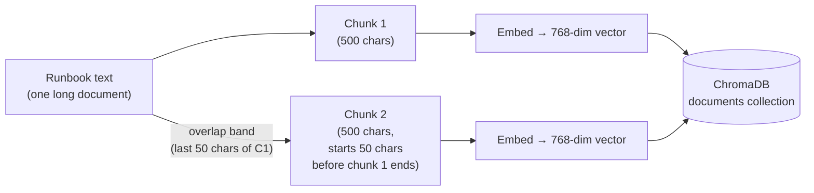

# Deep Dive: RAG Parameters Under the Hood

The lab wired ChromaDB and a Streamlit app together, ingested Acme's runbooks, and watched
Learning Mode show a question retrieve the right chunk and generate a grounded answer. It never
asked why `chunk_size=500`, `k=3`, or `nomic-embed-text` were the right choices — they were just
the values already in `app/main.py`. This page opens those knobs: what moving each one actually
does to retrieval quality, what distance metric ChromaDB is silently using under `add_documents`,
how to size a context-window budget instead of guessing at `top-k`, and how to tell a retrieval
miss from a generation miss when the app answers wrong. It closes by re-ingesting the same corpus
under two different chunking strategies and comparing what each one actually retrieves.

:::info[Where this picks up]

You need the m5 stack up — ChromaDB and `genai-app` from the lab. This works whether the stack
is currently running or was torn down after the lab; `up.sh` is idempotent, so re-running it is
safe.

```bash
cd labs/m5
bash up.sh
```

**Expected output**

```text
m5 ready: chromadb + genai-app healthy.
```

:::

---

## 1 — Chunk size and overlap: cutting the document without losing the sentence

The lab's splitter runs with `chunk_size=500, chunk_overlap=50` — 500 characters per chunk, the
last 50 characters of each chunk repeated at the start of the next. Nobody explained why those
two numbers, or what changing them buys or costs you.

**Analogy:** think of chunking as cutting a long runbook into index cards for a study deck. Cut
the cards too small and a card can end mid-sentence — the fact "restart the payments service"
lands on one card and the actual command lands on the next, so anyone reading a single card gets
half an idea. Cut the cards too large and each card tries to hold four unrelated procedures at
once; when you ask the librarian for "the payments card," she hands you a card whose *average*
meaning is a blur of four topics, and the embedding for that card is a mediocre match for
anything in particular. Overlap is photocopying the last couple of lines from each card onto the
front of the next one, so a fact that happens to fall right on a cut boundary is never orphaned
on one card with no context.

Concretely, `RecursiveCharacterTextSplitter` tries to cut on paragraph and line boundaries first
(its separator list is `["\n\n", "\n", " ", ""]` — paragraphs, then lines, then words, then a
hard character cut as the last resort), so it avoids slicing through a word or a mid-sentence
run wherever a paragraph break gives it a cleaner place to cut. At 500 characters, the whole
~1,000-character Acme corpus is small enough that the splitter packs roughly **two of the four
runbook sections into each chunk** — which is exactly why the lab's ingest reported **2 chunks**
for the whole document. That's small enough that overlap barely matters here; overlap earns its
keep on longer documents where a procedure genuinely spans a chunk boundary.



*Overlap means the tail of chunk 1 and the head of chunk 2 share text — a fact sitting on that
boundary appears whole in at least one chunk instead of being split with no context on either
side.*

**Too small** (say `chunk_size=100`): chunks approach single-sentence granularity. Embeddings get
*more* precise about what each chunk means, but each retrieved chunk carries less surrounding
context — the model gets the command but not the caveat two sentences later ("the payments
service depends on the Postgres primary"). You also multiply the chunk count, which raises
storage and search cost for no retrieval-quality gain once chunks are smaller than a single
coherent idea.

**Too large** (say `chunk_size=2000` on this corpus): a chunk this big would swallow two or three
of Acme's runbook sections into one embedding. The embedding model has to compress "payments
restart," "database backup," and "checkout 503" into a single 768-number average — noise
dilution. A query about payments now has to compete with unrelated content baked into the same
vector, and worse, retrieving that chunk burns your context-window budget (§4) on paragraphs the
question never asked about.

There is no universal right answer — it depends on how self-contained a "fact" is in your
corpus. A FAQ where every Q&A pair is already a natural unit wants small chunks close to that
unit's size. A long runbook where a single procedure spans several paragraphs wants larger
chunks or overlap generous enough to keep a straddling step intact.

---

## 2 — top-k: how many cards you hand the model

The lab retrieves with `search_kwargs={"k": 3}` — the three most similar chunks, every query,
regardless of how many chunks actually exist or how relevant the third-nearest one is.

More is not automatically better. Every chunk you retrieve is text the model has to read before
it can answer, and it competes for two scarce things: your context-window budget (§4) and the
model's attention. A `k` too small can miss the answer entirely if the right chunk lands 4th on
the similarity ranking and never gets retrieved. A `k` too large hands the model near-duplicate
or off-topic chunks alongside the real answer — on a small corpus like Acme's four runbook
sections, `k=3` out of only 2 total chunks (the lab's ingest count) means you're already
retrieving *everything indexed*, so `k` isn't filtering at all here. On a larger corpus, a `k`
that's too generous makes the model do the filtering work retrieval was supposed to do for it,
and a plausible-sounding but wrong nearby chunk sitting in the context is exactly what produces
a confidently wrong answer (§5).

The right `k` is corpus-shaped: a narrow FAQ where one chunk fully answers most questions wants
`k=1`–`2`. A runbook where the answer commonly spans two related sections (the command *and* the
prerequisite two sentences later) wants `k=3`–`5`. Above that, you're usually diluting more than
you're helping — this is the point at which naive top-k retrieval gives way to re-ranking (§5),
which this module's naive RAG doesn't have.

---

## 3 — Similarity metric and embedding model: what "similar" even means

The lab's `Chroma(...)` constructor in `init_vectorstore()` passes no `collection_metadata`
argument — no `hnsw:space` override anywhere in `app/main.py`, `rag_roundtrip.py`, or the
`checks.json` collection-creation call. That means the `documents` collection runs on ChromaDB's
default index space: **squared L2 (Euclidean) distance**, not cosine similarity. Every "Found N
relevant chunks" line Learning Mode prints in the lab is ChromaDB returning the N chunks with the
*smallest* L2 distance to the query vector — a distance, not a similarity score, which is why
smaller numbers mean "more relevant" if you ever query the metric directly (§6).

This matters in one specific way: for `nomic-embed-text`, whose embeddings are close to unit-norm
by construction, L2 distance and cosine similarity produce **the same nearest-neighbour ranking**
— L2² between two unit vectors is a monotonic function of their cosine similarity
(`‖a-b‖² = 2 - 2·cos(a,b)` when `‖a‖=‖b‖=1`). So the metric choice is largely academic for this
specific embedding model. It stops being academic the moment you swap in an embedding model that
does *not* normalize its output vectors — L2 distance then starts rewarding vector *magnitude*
alongside direction, which cosine similarity ignores entirely. If you ever change embedding
models, check whether the new model's vectors are normalized before assuming the ranking behaves
the same way.

**Why the embedder — not the LLM — defines retrieval quality.** The LLM (`qwen2.5:1.5b`) never
sees your documents until after retrieval hands it a slice of text. Every retrieval decision —
which chunk counts as "similar" — is made entirely by `nomic-embed-text`'s 768-dimensional
representation of meaning. If the embedding model doesn't distinguish "restart" from "backup" in
its vector space, no amount of LLM quality downstream fixes a bad retrieval. This is also why you
cannot swap embedding models without re-embedding the whole corpus: two different models place
the same sentence at different, incomparable coordinates — `nomic-embed-text`'s vector for
"restart the payments service" and a hypothetical second model's vector for the same sentence are
not points in the same space, so comparing across them (or storing embeddings from one and
querying with the other) produces nonsense distances. `nomic-embed-text` was chosen for this
course because it is small enough to run natively on Ollama alongside `qwen2.5:1.5b` within the
6 GB budget and produces reasonable general-purpose retrieval quality without a GPU. A larger
domain-tuned embedder (e.g. a code- or legal-specific embedding model) would out-retrieve it on
that domain — at a proportionally larger memory and latency cost.

---

## 4 — Context-window budget: what actually has to fit

`init_llm()` sets `num_ctx=4096` on the Ollama LLM — that is the real ceiling every prompt this
app builds has to fit inside, independent of `qwen2.5:1.5b`'s much larger native training context.
The augmented prompt the app sends to the model (`main.py`, the `augmented_prompt` f-string) has
four parts, and every one of them eats into that 4096-token budget:

```text
Based on the following context, answer the question.

Context:
{context}                    <- retrieved chunks, joined with "\n\n"

Question: {prompt}           <- the user's question

Answer:
```

Work the arithmetic for this lab's actual numbers. As a rough rule of thumb, 500 characters of
English prose is roughly 100–130 tokens (about 4 characters per token). With `chunk_size=500` and
`k=3`:

| Budget line | Rough size |
|---|---|
| Template scaffolding ("Based on the following context...", "Question:", "Answer:") | ~20 tokens |
| Retrieved context: 3 chunks × ~500 chars | ~300–390 tokens |
| User question | ~15–30 tokens |
| **Prompt total** | **~350–450 tokens** |
| Headroom for the answer inside `num_ctx=4096` | **~3,650–3,700 tokens** |

At this lab's scale the prompt uses under 15% of the 4096-token ceiling — there's no pressure on
this corpus. The arithmetic starts to matter the moment you scale either axis: raise `k` to 10 on
a corpus with `chunk_size=1500`, and 10 × 1500 chars ≈ 3,750 tokens of context alone — that
crowds out the answer entirely inside a 4096 window, and Ollama silently truncates the prompt once
it exceeds `num_ctx`.

**Verified live, not assumed.** A deliberately oversized prompt (~40K raw tokens: a unique marker
sentence, a large filler block, then the real question) sent to `qwen2.5:1.5b` with `num_ctx=4096`
produced `prompt_eval_count: 2050` — Ollama cut the prompt down to roughly half the context
window, not the full 4096, leaving headroom for the answer. The underlying `llama-server`'s debug
log shows exactly how:

```text
level=WARN msg="truncating input prompt" limit=2050 prompt=33742 keep=4 new=2050
```

It keeps a tiny fixed prefix (`n_keep=4` tokens — effectively nothing) and then discards everything
else *except* the most recent `limit` tokens — the truncation keeps the **tail** of the prompt, not
the head. Sending the model the marker-at-the-front / question-at-the-back prompt confirmed this
directly: the model answered using the *back* marker, and had lost the *front* marker entirely —
proof the front of an over-budget prompt is what gets dropped, and the tail survives. On this
app's prompt shape (`Context:\n{context}\n\nQuestion: {prompt}\n\nAnswer:` — retrieved chunks
first, the question last), that means an over-budget prompt loses your **earliest retrieved
chunks** first while the question itself, sitting at the very end, is the last thing to go. Sizing
`top-k × chunk_size` against your actual `num_ctx` before scaling either knob up is the check that
catches this before it becomes a silent, hard-to-diagnose "the model ignored my context" bug —
watch for the `"truncating input prompt"` warning in Ollama's server log as the tell.

---

## 5 — Failure modes: retrieval miss vs. generation miss

When a naive-RAG app answers wrong, there are two structurally different causes, and confusing
them wastes debugging time:

- **Retrieval miss** — the wrong chunk (or no useful chunk) was retrieved. The model then
  answered correctly *given what it was handed* — it just wasn't handed the right thing. This is
  an embedding/chunking/top-k problem (§1–§3), not a model problem.
- **Generation miss** — the right chunk was retrieved (you can confirm this by reading "View
  Source Chunks" in the lab's UI or querying ChromaDB directly, §6), but the model still answered
  incorrectly, ignored part of the context, or hallucinated something the context didn't say.
  This is a prompting or model-capability problem.

Naive RAG makes retrieval misses more likely than they need to be because there is **no
re-ranking step**. The pipeline retrieves once by raw vector distance and hands whatever comes
back straight to the LLM — it never asks "is chunk #2, which scored slightly worse on embedding
distance but is obviously more topically relevant, actually the better answer?" A production RAG
system commonly adds a re-ranker (a smaller, more precise model that re-scores the top-N
candidates from the vector search before choosing what to hand the LLM) specifically to catch
cases where embedding similarity and true relevance diverge — two runbook sections can be
semantically adjacent in embedding space (both are "ops procedures") while only one actually
answers the question. This module's naive RAG has no such step; that gap is exactly what M6's
agentic approach adds back.

---

## 6 — Querying ChromaDB directly: seeing what Learning Mode summarizes

The Streamlit UI's Learning Mode panel already shows retrieved chunks, but it summarizes them —
truncated previews, no raw distances. ChromaDB's own HTTP API gives you the unfiltered picture:
the exact stored chunk text and the exact distance score behind every "Found N relevant chunks"
line.

List what's actually in the collection the lab's app writes to:

```bash
curl -s http://localhost:${M5_CHROMA_PORT:-8000}/api/v1/collections | python3 -m json.tool
```

**Expected output**

```text
[
    {
        "id": "9212c584-0f8e-4bb0-a261-995553f28640",
        "name": "documents",
        "configuration_json": {
            "hnsw_configuration": {
                "space": "l2",
                "ef_construction": 100,
                "ef_search": 10,
                "num_threads": 5,
                "M": 16,
                "resize_factor": 1.2,
                "batch_size": 100,
                "sync_threshold": 1000,
                "_type": "HNSWConfigurationInternal"
            },
            "_type": "CollectionConfigurationInternal"
        },
        "metadata": null,
        "dimension": 768,
        "tenant": "default_tenant",
        "database": "default_database",
        "version": 0,
        "log_position": 0
    }
]
```

`"space": "l2"` in `hnsw_configuration` is ChromaDB confirming, straight from its own API, the
default index metric claimed above — no override was ever set, so the collection came up on L2.
`"dimension": 768` confirms `nomic-embed-text`'s embedding size.

Query it directly for a question, using the same embedding model the app uses, and see the raw
distances behind the ranking (this one-liner runs inside the `genai-app` container, where
`langchain-chroma` and the Ollama client are already installed):

```bash
docker exec genai-app python3 -c "
import chromadb, os
from langchain_ollama import OllamaEmbeddings
from langchain_chroma import Chroma
emb = OllamaEmbeddings(model='nomic-embed-text', base_url=os.environ['OLLAMA_BASE_URL'])
client = chromadb.HttpClient(host=os.environ['CHROMA_HOST'], port=int(os.environ['CHROMA_PORT']))
vs = Chroma(client=client, collection_name='documents', embedding_function=emb)
for doc, score in vs.similarity_search_with_score('How do I restart the payments service?', k=3):
    print(f'{score:.4f}', doc.page_content[:80].replace(chr(10), ' '))
"
```

**Expected output**

```text
0.6956 Acme Platform Runbooks  Payments service  To restart the Acme payments service,
1.0968 Checkout 503 errors  If the checkout page returns HTTP 503, the web tier is satu
```

Only two lines print even though `k=3` was requested — this collection has exactly 2 chunks
(§1), so ChromaDB hands back everything it has and stops; there is no third chunk to return.
`similarity_search_with_score` returns raw L2 distance (§3) — **lower is better**, the opposite
of a similarity percentage. This is the exact number ChromaDB's index is ranking on when the
Streamlit app decides which chunks to hand the LLM; the UI never shows you this figure, only
the resulting text.

**Embedding norm — verifying the L2≈cosine claim from §3.** The claim above (`nomic-embed-text`
produces close-to-unit-norm vectors, so L2 and cosine rank chunks identically) is only true if it
holds through *this app's exact code path* — `langchain-ollama`'s `OllamaEmbeddings`, not just
the raw Ollama API. Verify it directly:

```bash
docker exec genai-app python3 -c "
import os, math
from langchain_ollama import OllamaEmbeddings
emb = OllamaEmbeddings(model='nomic-embed-text', base_url=os.environ['OLLAMA_BASE_URL'])
vecs = emb.embed_documents([
    'How do I restart the payments service?',
    'Checkout 503 errors are caused by web tier saturation.',
    'Database backups are retained for 30 days.',
])
for i, v in enumerate(vecs):
    norm = math.sqrt(sum(x*x for x in v))
    print(f'vector {i}: dim={len(v)} L2norm={norm:.6f}')
"
```

**Expected output**

```text
vector 0: dim=768 L2norm=1.000000
vector 1: dim=768 L2norm=1.000001
vector 2: dim=768 L2norm=1.000000
```

Confirmed, not assumed: three arbitrary sentences through `langchain-ollama`'s `OllamaEmbeddings`
all land at L2 norm ≈ 1.000000 (the 1.000001 on vector 1 is float rounding noise, not a real
deviation). The L2≈cosine claim in §3 holds for this exact app code path — not a general Ollama
guarantee, but true here, measured.

---

## 7 — Experiment: re-ingesting the corpus under different chunking strategies

Compare the lab's baseline chunking against two variants, without touching the running app or
its `documents` collection — every variant gets its **own** ChromaDB collection name, so this
runs against the same containers already up, no extra process or memory cost.

This experiment runs *inside* the `genai-app` container (that's where `langchain-chroma` and the
Ollama client are already installed), but the corpus file only exists on your **host**, at
`labs/m5/docs/acme-runbooks.md` — the image was built from `app/` alone (see `compose.yaml`'s
`build.context: ./app`), so the container never received the `docs/` folder that sits next to
`app/` in the lab directory. Copy it in explicitly first:

```bash
CORPUS="$(pwd)/docs/acme-runbooks.md"
mkdir -p ~/rag-deepdive-lab && cd ~/rag-deepdive-lab
docker exec genai-app mkdir -p /tmp/deepdive-docs
docker cp "$CORPUS" genai-app:/tmp/deepdive-docs/acme-runbooks.md
docker exec genai-app ls -la /tmp/deepdive-docs/
```

**Expected output**

```text
total 12
drwxr-xr-x 2 root root    4096 Jul 22 17:26 .
drwxrwxrwt 1 root root    4096 Jul 22 17:24 ..
-rw-r--r-- 1  501 dialout  823 Jul 22 06:29 acme-runbooks.md
```

Write the ingest-and-compare script. The question set is embedded directly in the script (not a
separate host file — the script only ever runs inside the container, so a file written next to it
on the host would not be visible there). It re-ingests the corpus under three chunking
configurations — the lab's own baseline (`chunk_size=500, overlap=50`), a smaller-chunks/no-overlap
variant, and a larger-chunks/generous-overlap variant — each into its own named collection, and
prints every result to stdout so the host can capture it without reaching back into the container's
filesystem:

```bash
cat > compare_chunking.py << 'PYEOF'
import os
import chromadb
from langchain_ollama import OllamaEmbeddings, OllamaLLM
from langchain_chroma import Chroma
from langchain.text_splitter import RecursiveCharacterTextSplitter
from langchain_community.document_loaders import UnstructuredMarkdownLoader

OLLAMA = os.getenv("OLLAMA_BASE_URL", "http://localhost:11434")
CHROMA_HOST = os.getenv("CHROMA_HOST", "localhost")
CHROMA_PORT = int(os.getenv("CHROMA_PORT", "8000"))
DOCS = os.getenv("DOCS_PATH", "/tmp/deepdive-docs/acme-runbooks.md")

QUESTIONS = [
    "How do I restart the payments service?",
    "What happens if checkout is overloaded?",
    "How long are database backups retained?",
    "Who do I page for an unacknowledged incident?",
]

VARIANTS = {
    "baseline":  {"chunk_size": 500,  "chunk_overlap": 50},   # the lab's own values
    "variant-a": {"chunk_size": 150,  "chunk_overlap": 0},    # smaller, no overlap
    "variant-b": {"chunk_size": 1200, "chunk_overlap": 200},  # larger, generous overlap
}

# temperature=0 here (vs. the app's temperature=0.7) is deliberate: this experiment compares
# retrieval across chunking strategies, so we want the *generation* step as deterministic as
# possible. The live Streamlit app keeps 0.7 for more natural answers — expect its UI answers to
# vary more, run to run, than what this script prints.
emb = OllamaEmbeddings(model="nomic-embed-text", base_url=OLLAMA)
llm = OllamaLLM(model="qwen2.5:1.5b", base_url=OLLAMA, temperature=0, num_ctx=4096)
client = chromadb.HttpClient(host=CHROMA_HOST, port=CHROMA_PORT)

for name, params in VARIANTS.items():
    collection = f"deepdive-{name}"
    docs = UnstructuredMarkdownLoader(DOCS).load()
    splitter = RecursiveCharacterTextSplitter(length_function=len, **params)
    chunks = splitter.split_documents(docs)
    vs = Chroma(client=client, collection_name=collection, embedding_function=emb)
    vs.add_documents(chunks)
    print(f"COLLECTION: {collection}")
    print(f"=== {name} (chunk_size={params['chunk_size']}, overlap={params['chunk_overlap']}) -> {len(chunks)} chunks ===")

    for q in QUESTIONS:
        hits = vs.similarity_search_with_score(q, k=3)
        top_doc, top_score = hits[0]
        context = "\n\n".join(d.page_content for d, _ in hits)
        prompt = f"Based on the following context, answer the question.\n\nContext:\n{context}\n\nQuestion: {q}\n\nAnswer:"
        answer = llm.invoke(prompt)
        print(f"  Q: {q}")
        print(f"    top distance: {top_score:.4f}  chunk: {top_doc.page_content[:70].strip()!r}")
        print(f"    answer: {answer.strip()[:120]}")
PYEOF
docker exec -i genai-app python3 - < compare_chunking.py | tee ~/rag-deepdive-lab/variant-collections.txt
```

The `-i` on `docker exec` is required — without it, `docker exec` never attaches its stdin to the
container process, so piping the script in (`< compare_chunking.py`) silently sends nothing and
the script exits immediately with no output. `tee` writes everything the container printed —
collection names and per-question results — to both your terminal and the host file
`~/rag-deepdive-lab/variant-collections.txt`, which is what turns the container's stdout into a
real artifact you can grep, diff, or fold into the table below.

**Expected output**

```text
COLLECTION: deepdive-baseline
=== baseline (chunk_size=500, overlap=50) -> 2 chunks ===
  Q: How do I restart the payments service?
    top distance: 0.6956  chunk: 'Acme Platform Runbooks\n\nPayments service\n\nTo restart the Acme payments'
    answer: To restart the Acme payments service, run:

```bash
kubectl rollout restart deploy/payments -n prod
```

This command wi
  Q: What happens if checkout is overloaded?
    top distance: 0.7755  chunk: 'Checkout 503 errors\n\nIf the checkout page returns HTTP 503, the web ti'
    answer: If the checkout page returns HTTP 503, it indicates that the web tier is saturated. To scale up and address this issue,
  Q: How long are database backups retained?
    top distance: 0.7746  chunk: 'Acme Platform Runbooks\n\nPayments service\n\nTo restart the Acme payments'
    answer: The database backups are retained for 30 days.
  Q: Who do I page for an unacknowledged incident?
    top distance: 0.9238  chunk: 'Checkout 503 errors\n\nIf the checkout page returns HTTP 503, the web ti'
    answer: The on-call engineer is paged for an unacknowledged incident.
COLLECTION: deepdive-variant-a
=== variant-a (chunk_size=150, overlap=0) -> 11 chunks ===
  Q: How do I restart the payments service?
    top distance: 0.5146  chunk: 'To restart the Acme payments service, run: kubectl rollout restart dep'
    answer: To restart the Payments service, you should run the following command:

```bash
kubectl rollout restart deploy/payments
  Q: What happens if checkout is overloaded?
    top distance: 0.7244  chunk: 'If the checkout page returns HTTP 503, the web tier is saturated. Scal'
    answer: If the checkout page returns HTTP 503, it indicates that the web tier is saturated and needs to be scaled up. The comman
  Q: How long are database backups retained?
    top distance: 0.3700  chunk: 'Database backups'
    answer: The database backups are retained for 30 days.
  Q: Who do I page for an unacknowledged incident?
    top distance: 0.7124  chunk: 'Page the on-call engineer via the #acme-oncall Slack channel. If unack'
    answer: The on-call engineer via the #acme-oncall Slack channel. If unacknowledged for 15 minutes, the incident auto-escalates t
COLLECTION: deepdive-variant-b
=== variant-b (chunk_size=1200, overlap=200) -> 1 chunks ===
  Q: How do I restart the payments service?
    top distance: 0.7515  chunk: 'Acme Platform Runbooks\n\nPayments service\n\nTo restart the Acme payments'
    answer: To restart the Acme payments service, run:

```bash
kubectl rollout restart deploy/payments -n prod
```

This command wi
  Q: What happens if checkout is overloaded?
    top distance: 0.9773  chunk: 'Acme Platform Runbooks\n\nPayments service\n\nTo restart the Acme payments'
    answer: If the checkout page returns HTTP 503 (Service Unavailable), it indicates that the web tier is saturated and needs scali
  Q: How long are database backups retained?
    top distance: 0.8759  chunk: 'Acme Platform Runbooks\n\nPayments service\n\nTo restart the Acme payments'
    answer: The database backups are retained for 30 days.
  Q: Who do I page for an unacknowledged incident?
    top distance: 1.0830  chunk: 'Acme Platform Runbooks\n\nPayments service\n\nTo restart the Acme payments'
    answer: The on-call engineer is paged for an unacknowledged incident via the #acme-oncall Slack channel. If unacknowledged for 1
```

Fold the three variants' results into a comparison table (variant, chunk count, retrieved-chunk
snippet, whether the retrieved context actually contained the answer, model's answer):

| Variant | Chunk size / overlap | Chunk count | Retrieved top chunk (payments Q) | Contains the answer? | Model's answer |
|---|---|---|---|---|---|
| baseline | 500 / 50 | 2 | dist 0.6956 — `"Acme Platform Runbooks\n\nPayments service\n\nTo restart the Acme payments…"` | Yes | "To restart the Acme payments service, run: `kubectl rollout restart deploy/payments -n prod`…" |
| variant-a | 150 / 0 | 11 | dist 0.5146 — `"To restart the Acme payments service, run: kubectl rollout restart dep…"` | Yes | "To restart the Payments service, you should run the following command: `kubectl rollout restart deploy/payments`…" |
| variant-b | 1200 / 200 | 1 | dist 0.7515 — `"Acme Platform Runbooks\n\nPayments service\n\nTo restart the Acme payments…"` (the whole corpus is one chunk) | Yes | "To restart the Acme payments service, run: `kubectl rollout restart deploy/payments -n prod`…" |

The three variants tell three different stories about the *same* corpus. **variant-a** (150 chars,
no overlap) produces the tightest, lowest-distance match on the payments question (0.5146, the
best of all three) because its 11 tiny chunks let one chunk be *purely* about the restart command
— nothing else diluting the vector. It also isolates "Database backups" into its own chunk,
dropping that question's distance to 0.3700, the single best match across the whole experiment.
**baseline** (500/50) sits in the middle — 2 chunks, each covering roughly two runbook sections,
distances in the 0.69–0.92 range. **variant-b** (1200/200) collapses the entire ~823-byte corpus
into a **single chunk** — at this chunk size on this small a corpus, there's nothing left to
retrieve *from*; every question, regardless of topic, returns the same one chunk, and the highest
distances in the table (0.75–1.08) show the vector working harder to match a chunk that's an
average of four unrelated procedures. All three variants still produced grounded, correct answers
here — this corpus is small enough that even variant-b's single do-everything chunk contains the
whole answer space. On a larger corpus, variant-b's collapse-everything failure mode would start
returning topically wrong chunks instead of just imprecise ones.

Judge the deterministic side of this table strictly — chunk counts and distance scores are exact,
reproducible facts about this corpus and these parameters. Judge the model's prose answers by
shape only (did it contain the right command, did it stay grounded in the retrieved text) — exact
wording varies run to run even at `temperature=0` on a small local model.

**Teardown for this section only** — drop the three variant collections created above; this does
**not** touch the `documents` collection the running lab app depends on:

```bash
docker exec -i genai-app python3 -c "
import chromadb, os
client = chromadb.HttpClient(host=os.environ['CHROMA_HOST'], port=int(os.environ['CHROMA_PORT']))
for name in open('/dev/stdin').read().split():
    try:
        client.delete_collection(name)
        print('deleted', name)
    except Exception as e:
        print('skip', name, e)
" <<< "deepdive-baseline deepdive-variant-a deepdive-variant-b"
```

The teardown heredoc needs `-i` for the same reason as the ingest step above: `<<<` feeds the
container's `/dev/stdin` inside the `-c` script, and without `-i` that stdin is never attached, so
`open('/dev/stdin').read()` blocks or returns empty and no collection actually gets dropped.

**Expected output**

```text
deleted deepdive-baseline
deleted deepdive-variant-a
deleted deepdive-variant-b
```

---

## Teardown

Page-scoped only. The three `deepdive-*` collections were already dropped in §7. Remove the local
working directory this page created:

```bash
rm -rf ~/rag-deepdive-lab
```

Leave the m5 stack and the `documents` collection exactly as the lab left them — this page never
touched `docker compose down`, and the lab's own teardown is unaffected by anything run here.

:::tip[Where you will use this]

- **Chunk size and overlap trade context completeness against embedding precision.** **Use it
  when:** you're tuning a real corpus — a short FAQ wants small, near-atomic chunks; a runbook
  where procedures span paragraphs wants larger chunks or overlap generous enough that a fact
  never lands split with no context on either side.
- **top-k is a context-budget decision, not a "more retrieval is safer" dial.** **Use it when:**
  you're deciding how many chunks to retrieve for a new corpus — size it to how often the answer
  genuinely spans multiple chunks, not to a default that happens to work on someone else's docs.
- **ChromaDB's default index metric is L2 distance, not cosine similarity — verify, don't
  assume.** **Use it when:** you swap embedding models and retrieval quality drops; check whether
  the new model's vectors are normalized before blaming the model, since unnormalized vectors
  behave differently under L2 than under cosine.
- **The embedding model — not the LLM — determines what gets retrieved, and embeddings from
  different models are not comparable.** **Use it when:** you're planning an embedding-model
  upgrade — budget for a full re-ingest of the corpus, not a drop-in swap; old and new vectors in
  the same collection produce meaningless distances against each other.
- **"RAG answered wrong" splits into retrieval miss vs. generation miss, and they need different
  fixes.** **Use it when:** diagnosing a bad answer in production — check the actually-retrieved
  chunks (via the raw API, not the UI summary) before touching the prompt or the model; a
  retrieval miss needs a chunking/top-k/embedding fix, a generation miss needs a prompting fix.
- **Naive RAG has no re-ranking step, so a semantically-adjacent-but-wrong chunk can outrank the
  actually relevant one.** **Use it when:** you're deciding whether a corpus has outgrown naive
  RAG — if wrong-topic retrievals are common despite good chunking, that's the signal to add a
  re-ranking stage or move to an agentic retrieval loop (M6), not to keep tuning `top-k`.

:::
