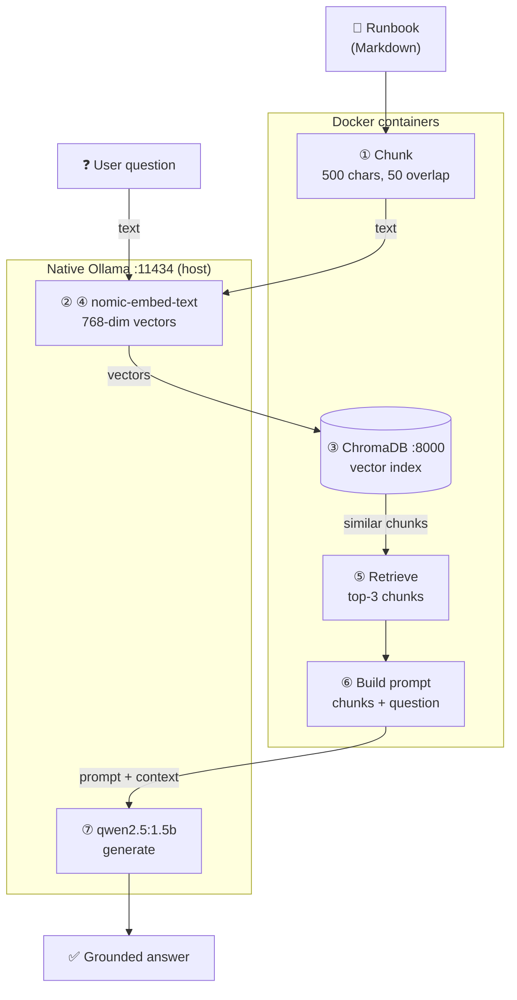

import Slides from '@site/src/components/Slides';

# Lesson: Docs Assistant — Naive RAG

> **Module goal:** Build a real GenAI application — a Docs Assistant that answers questions grounded in Acme's runbooks — by wiring an LLM endpoint, an embedding model, a vector database, and a Streamlit UI together into a naive-RAG pipeline. Understand where naive RAG breaks so Module 6's agentic approach makes sense.

---

## Module slides

Walk this short whiteboard deck for the big picture before the hands-on lab — or open it fullscreen.

<Slides src="decks/05-naive-rag.html" title="Module 5 — Docs Assistant, Naive RAG" />

## 1. The problem: ungrounded answers

In Modules 2 and 3 you served a model and fired prompts at it. A raw LLM is powerful but unreliable for factual questions about *your* systems: it answers confidently from its training data, which predates your runbooks and knows nothing about Acme's Kubernetes namespaces. Ask it "How do I restart the payments service?" and it produces a plausible-sounding command — not the correct one.

**Retrieval-Augmented Generation (RAG)** solves this by giving the model a cheat sheet at query time: you pull the relevant text from your own documents and paste it into the prompt. The model generates *from that context*, not from its weights. No fine-tuning, no retraining — just wiring.

This module is the first of the **Use Case A: Docs Assistant** arc. By the end you will have a containerised app that retrieves the right Acme runbook chunk and generates a grounded answer with the exact kubectl command.

---

## 2. Anatomy of a GenAI application

Every production GenAI application has four parts:

| Component | Role | M5 concrete |
|---|---|---|
| **LLM endpoint** | Text generation | `qwen2.5:1.5b` via native Ollama :11434 |
| **Embedding model** | Convert text ↔ vectors | `nomic-embed-text` (768-dim) via Ollama |
| **Vector database** | Store and search by semantic similarity | ChromaDB 0.5.20 in a container |
| **Application** | Orchestrate, serve the UI, handle state | Streamlit app in a container |

You already have the first two from Modules 2 and 3. This module adds the vector database and the application layer. The `compose.yaml` grows by two services.

---

## 3. The librarian analogy

Before diving into vectors, here is the right mental model for a vector database:

**A traditional database is a filing cabinet labelled by title.** Ask for "Payments Runbook" and you get the exact file — provided you know the exact name. Ask "what do I do if payments falls over?" and it returns nothing: there is no file by that name.

**A vector database is a librarian who shelves books by meaning, not title.** She has read every document, distilled each passage into a set of coordinates that encode its *meaning* (a vector), and filed everything in that meaning-space. When you ask "How do I restart the payments service?", she converts your question into the same coordinate system and walks to the nearest shelf — even if the runbook never uses the word "restart" and is filed under "SRE ops, payments tier, graceful bounce." Semantic proximity beats exact text matching.

The coordinates are called **embeddings**: dense numerical vectors (768 numbers in `nomic-embed-text`'s case) produced by an embedding model trained to put semantically similar text close together in the vector space. Two passages about the same topic land near each other; unrelated passages are far apart. Similarity search finds the nearest neighbours.

---

## 4. The naive-RAG pipeline

The pipeline has two phases that share the same embedding step:

**Ingest phase** (run once, or whenever your docs change):

1. **Load** — read the source document (Markdown, PDF, plain text)
2. **Chunk** — split into overlapping segments (500 chars, 50-char overlap)
3. **Embed** — convert each chunk to a 768-dim vector via the embedding model
4. **Store** — write vectors + original text into ChromaDB

**Query phase** (every user question):

5. **Embed query** — convert the question to a vector using the *same* embedding model
6. **Retrieve** — ask ChromaDB for the top-k most similar chunks (k = 3)
7. **Augment** — paste the retrieved chunks into the prompt as context
8. **Generate** — call the LLM with the augmented prompt; it answers grounded in that context

Here is the full pipeline with the container boundary marked:

*Ingest and query share the same embedding step (② / ④). The embedding model and the LLM both live in native Ollama — only the vector store and the application UI run as Docker containers. Containers reach Ollama at `host.docker.internal:11434`.*

The Apple-Silicon pattern you established in M2 continues: model servers run native for Metal acceleration; everything else is containerised and talks to the host over the Docker-managed `host.docker.internal` bridge.

---

## 5. ChromaDB: the lightest vector store

M5 uses **ChromaDB** as the vector database because it is the lowest-friction choice for a laptop-sized course:

- **Zero-config:** one Docker service, no cluster, no configuration files
- **Python-native:** `langchain-chroma` integrates in fewer than 10 lines
- **Persistent:** a Docker volume keeps your vectors across restarts
- **Memory-efficient:** the stack runs within 2 GB total (768 MB for ChromaDB, 1 GB for the app)

ChromaDB is pinned to version `0.5.20` in the `compose.yaml`. This matters: `langchain-chroma` ships a client that targets the `0.5.x` HTTP API. If you run ChromaDB `0.6.x`, the client version handshake fails. Pinning removes ambiguity.

**When to scale up:**

| Scenario | Better choice |
|---|---|
| Multi-tenant, millions of vectors | **Qdrant** — purpose-built HNSW, filtering, payload indexes |
| Already on PostgreSQL | **pgvector** — add a vector column, no new service |
| Managed cloud | Pinecone, Weaviate Cloud |

The API you learn here (`add_documents`, `similarity_search`) is almost identical across every alternative. Swap the `Chroma(...)` constructor and the rest of your LangChain code is unchanged.

---

## 6. Learning Mode: watching the pipeline run

The Streamlit app ships a **Learning Mode** panel (shown by default) that surfaces each pipeline step in real time as you type a question:

- **Step 1 — Query embedding:** confirms the question was converted to a 768-dim vector and shows how many milliseconds that took
- **Step 2 — Similarity search:** shows how many chunks were searched and how many were retrieved (top-3)
- **Step 3 — Retrieved context:** displays the *actual text chunks* pulled from ChromaDB — the exact runbook sentences the model will read
- **Step 4 — LLM generation:** shows generation time and which model answered

This makes the invisible parts of RAG visible. When the grounded answer appears, you can trace *which sentence in which document* produced it. In the lab you will watch Learning Mode reveal that the question "How do I restart the payments service?" retrieves the chunk containing `kubectl rollout restart deploy/payments -n prod` — and that the model's answer quotes it verbatim.

In production you would gate this view behind a developer flag. In a course it is the single most effective tool for building RAG intuition.

---

## 7. Where naive RAG breaks

Naive RAG works well when your question closely matches the phrasing in your documents. It breaks in several predictable ways:

| Failure mode | What happens | Example |
|---|---|---|
| **Query mismatch** | The question embedding is far from the answer embedding because phrasing differs | "What happens if payments falls over?" misses the "restart" runbook |
| **Wrong chunk boundary** | The relevant sentence straddles two chunks; neither retrieved chunk contains enough context | A 500-char split cuts through a multi-step procedure |
| **Single-pass retrieval** | RAG retrieves once and hands off; if the first retrieval misses, there is no retry or self-correction | A one-step retrieval cannot refine based on what the LLM finds ambiguous |
| **No query rewriting** | The user's natural-language question is sent to the vector store verbatim | Jargon, typos, and abbreviations degrade similarity scores |
| **Stale index** | The vector store is not re-ingested when runbooks change | The app answers confidently from an outdated document |

Module 6 introduces **agentic RAG**: an agent that can rewrite queries, run multiple retrieval passes, decide when retrieved evidence is sufficient, and invoke external tools — addressing every row in this table. Understanding where naive RAG fails is the prerequisite for understanding why the agentic approach is worth the added complexity.

---

## Summary

| Concept | The short version |
|---|---|
| Why RAG | Ground LLM answers in your own documents — no hallucinated commands |
| 4 parts of a GenAI app | LLM endpoint + embedding model + vector DB + application |
| Vector DB analogy | A librarian who shelves by meaning, not title |
| Naive-RAG pipeline | Ingest (load → chunk → embed → store) then Query (embed → retrieve → augment → generate) |
| ChromaDB | Lightest vector store; upgrade to Qdrant or pgvector when you outgrow it |
| Container boundary | Ollama runs native (Mac/Metal); ChromaDB + app run as Docker containers, reach Ollama via `host.docker.internal` |
| Learning Mode | The app surfaces each pipeline step — embedding time, retrieved chunks, generation time — live |
| Where naive RAG breaks | Query mismatch, wrong chunks, no follow-up, no query rewriting, stale index → M6 addresses all of these |

---

In the lab you will hand-author the `compose.yaml` service by service, start the stack, ingest Acme's runbooks, and ask "How do I restart the payments service?" — watching Learning Mode reveal which runbook chunk was retrieved and seeing the model generate a grounded, correct answer.
