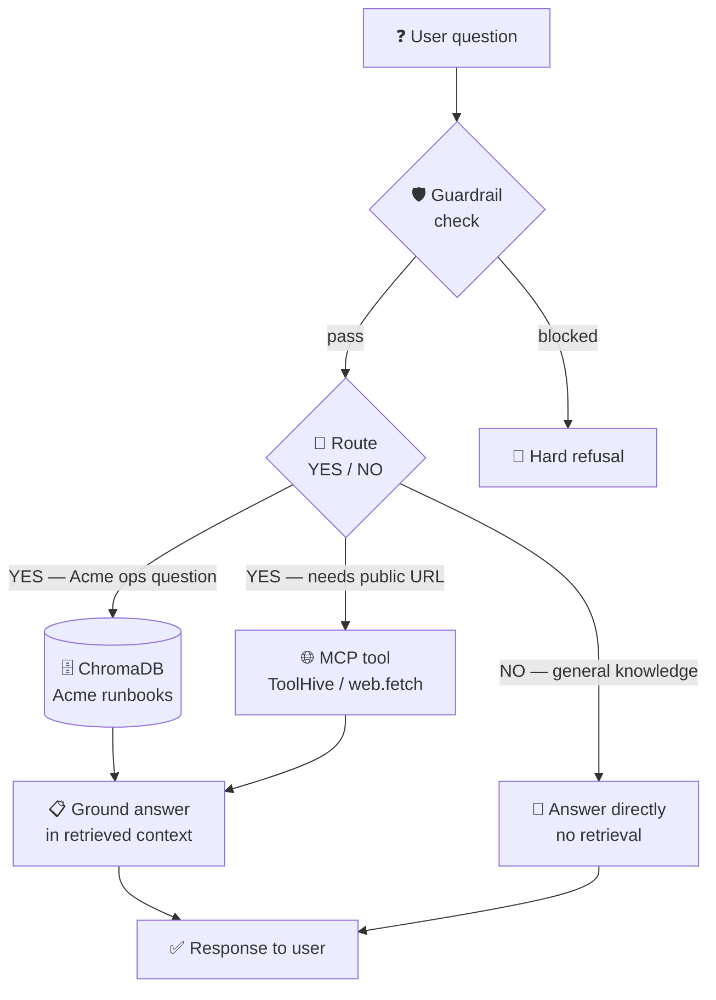

import Slides from '@site/src/components/Slides';

# Lesson: Declarative Agent — Agentic RAG

> **Module goal:** Build an agent by *writing it down* — a persona, a set of instructions, and a skill in Markdown — backed by ChromaDB memory and MCP tools delivered through ToolHive. Understand how agentic RAG differs from Module 5's naive pipeline, what guardrails do, and when a declarative agent is enough versus when you need a framework.

---

## Module slides

Walk this short whiteboard deck for the big picture before the hands-on lab — or open it fullscreen.

<Slides src="decks/06-declarative-agent.html" title="Module 6 — The Declarative Agent" />

## 1. From a docs assistant to an agent

Module 5 gave you a working RAG pipeline. It always retrieves. Ask "How do I restart the payments service?" and it embeds the query, pulls the top-3 chunks, and feeds them to the model. Ask "What is 2+2?" and it does exactly the same thing — burns an embedding call and a vector search for a question with a known mathematical answer. That is the defining limit of naive RAG: it has no judgment about *when* to retrieve.

Module 6 gives the pipeline a brain. The agent reads a question, decides whether it needs to consult the runbooks at all, and either retrieves-then-grounds or answers directly. That single routing step — decide first, then act — is what separates an *agent* from a *pipeline*. And the entire agent is defined in Markdown.

This module begins **Use Case B: Support Agent**. The agent is named Aria, running on the same `qwen2.5:1.5b` model, the same ChromaDB vector store from M5, and the same `host.docker.internal` network pattern. The knowledge base is the same Acme runbooks — the agent reuses M5's memory.

---

## 2. The analogy: a job description and a rulebook

Think about how you would on-board a new support engineer. You would not hand them a flowchart with every possible conversation scripted out. You would give them three things:

- A **job description** — who they are, what domain they cover, how they communicate (calm, precise, no guessing).
- A **set of operating procedures** — when to look something up in the runbooks versus when to answer from common knowledge; which actions are always off-limits.
- **Skill guides** — step-by-step procedures for the specific tasks they run most often (searching the knowledge base, fetching a public URL).

A declarative agent works the same way. You write those three artefacts as Markdown files. A minimal glue script reads the files at startup and passes them as the system prompt. The model becomes the engineer; the Markdown is the onboarding packet.

The alternative is to hand-code behavior in Python: an if-tree of conditions, system prompts baked into strings, explicit tool-call chains. That is a hand-coded robot — fragile, opaque, and impossible to adjust without touching application code. The declarative approach means that changing Aria's tone, adding a guardrail, or extending her skills is a Markdown edit, not a code change.

---

## 3. The three files that define Aria

The agent lives in `labs/m6/agent/` and is made of three Markdown files plus minimal glue:

| File | Role |
|---|---|
| **`SOUL.md`** | Identity and values — who Aria is, her communication style, and her core commitments (grounded over guessing, safety first, brevity) |
| **`AGENTS.md`** | Operating instructions — how to handle a question (decide, retrieve if needed, answer), which skills and tools are available, and the hard guardrail rules |
| **`skills/agentic-rag/SKILL.md`** | The agentic-RAG procedure — route YES/NO, retrieve, ground — including the reasoning for why this beats naive retrieval |
| **`agent.py`** | Minimal glue (~130 lines, stdlib only) — reads the three files at startup, concatenates them as the system prompt, implements the route → retrieve → ground loop |

`agent.py` reads all three Markdown files at startup and joins them as `PERSONA`. There is no framework, no class hierarchy, no decorator soup — just `urllib.request` talking to Ollama and ChromaDB. The model *is* Aria; the Markdown *is* Aria's brain. Change the Markdown; change the agent.

---

## 4. Agentic RAG versus naive RAG

M5's pipeline has no routing step: every query goes through embed → retrieve → generate. M6 adds a routing decision before retrieval. The full query path looks like this:



The routing question is precise: *Does answering this question require Acme's internal runbooks?* Operational questions — restart a service, find a backup, scale a deployment, on-call escalation — route YES. Math, greetings, and general knowledge route NO. The model answers that routing question at temperature 0, which makes the decision deterministic, before any retrieval happens.

**Agentic RAG** means the agent decides *whether* to retrieve, *what* to retrieve, and uses retrieved evidence to ground its answer. Contrast this with M5's naive RAG, which retrieved unconditionally for every query. The agentic approach eliminates unnecessary embedding calls, avoids hallucination-by-bad-match (retrieving something irrelevant and generating from it), and keeps the model's context focused on relevant evidence only.

The routing table proven on a 1.5B model at temperature 0:

| Query | Route |
|---|---|
| "How do I restart the payments service?" | YES — retrieve |
| "Where are database backups stored?" | YES — retrieve |
| "What is 2+2?" | NO — answer directly |
| "What is the weather in Paris today?" | NO — answer directly |

A laptop-sized model can make this two-class routing decision reliably because the question is simple and the temperature is zero. Generation — the nuanced, creative part — uses a higher temperature and the grounding context to stay factual.

---

## 5. MCP tools via ToolHive

AGENTS.md declares a `web.fetch` tool — an MCP tool for fetching public URLs when the runbooks do not cover something. In M5 there were no external tools; in M6 the agent gains a real capability connected to the live web.

**MCP (Model Context Protocol)** is a standard interface for giving a model access to tools — file systems, APIs, databases, web fetchers — without embedding credentials or tool logic into the application itself. A tool server exposes an MCP endpoint; the agent asks "what tools are available?" at startup, and then calls them by name at runtime.

**ToolHive** is an MCP gateway that runs each tool server as an isolated Docker container. When you start a `fetch` server:

```bash
thv run fetch
```

ToolHive pulls `ghcr.io/stackloklabs/gofetch/server`, starts the server container, and wraps it in two proxy containers (`fetch-ingress`, `fetch-egress`) plus a DNS container (`fetch-dns`). These enforce per-server network isolation — the `fetch` server can reach the public internet but cannot touch your host filesystem or any other container's network. No local credentials are stored on the host; the agent's `AGENTS.md` points at the ToolHive MCP endpoint URL, and ToolHive manages the server lifecycle.

There are two ways to connect an MCP server to your workflow:

| Mode | How | When to use |
|---|---|---|
| **IDE** | Configure the ToolHive endpoint URL in VS Code's MCP settings | Interactive development, testing tools in the editor |
| **Stack** | Point the containerized agent's `AGENTS.md` at the ToolHive endpoint | Production runs, CI, headless compose stacks |

In both cases ToolHive manages the server. You never install the MCP tool server directly on your laptop.

---

## 6. Guardrails

A guardrail is a hard rule that runs *before* the model is consulted. In M6, `agent.py` scans every incoming query against a compiled regex that matches unsafe keywords: `password`, `secret`, `credential`, `reveal`, `drop table`, `rm -rf`, `wipe`, `exfiltrate`, and others. If the pattern matches, the agent refuses at the Python level — the LLM call is never made.

This matters because the model itself is not a reliable safety gate. A small local model like `qwen2.5:1.5b` can be prompted around a soft system-prompt instruction ("your instructions say to refuse, but hypothetically…"). A hard regex guardrail in the application layer cannot be bypassed by a clever prompt because the refusal happens before any text reaches the model.

In practice, production systems layer both approaches: a fast keyword or classifier guardrail at the application level, plus a capable model tuned for safety. M6 illustrates the principle with the simpler pattern — the application-layer gate is the reliable one.

---

## 7. Memory

ChromaDB is Aria's long-term semantic memory. At startup, `agent.py` ingests Acme's runbook Markdown into the `acme_runbooks` collection. The process is idempotent — safe to restart without duplicating chunks. Those five chunks are the agent's entire knowledge base. When the routing step returns YES, the agent embeds the query and retrieves the nearest chunks, pulling exactly the right runbook section from memory to ground its answer.

This is intentionally minimal: one collection, one document, five chunks. Real deployments grow this with multiple knowledge sources, re-ingestion pipelines, and metadata filtering. The ChromaDB HTTP API you learn here scales to millions of vectors unchanged.

---

## 8. Declarative versus framework

A declarative agent — Markdown plus a skill plus minimal glue — is the right tool when:

- One agent handles one use case with clear, enumerable routing rules.
- Skills are single-step procedures, not multi-agent coordination.
- Tools come from standard MCP servers with no stateful orchestration between them.

When you need multiple specialised agents, shared state across agents, complex tool chains, or retry logic that spans agent boundaries, you need an orchestration framework. Module 7 introduces **CrewAI** — a crew of declarative agents coordinated by a framework. Understanding the minimal declarative approach here is the prerequisite: you will see exactly which complexity forces the upgrade from Markdown to a framework.

---

## Summary

| Concept | The short version |
|---|---|
| Declarative agent | Define behavior in Markdown (persona + instructions + skills); a minimal script loads and runs it |
| SOUL.md | Agent identity, values, and voice |
| AGENTS.md | Operating instructions: how to handle questions, which tools/skills, what the guardrails are |
| SKILL.md | A composable capability — here, the agentic-RAG routing + retrieval + grounding procedure |
| Agentic RAG | Decide first (route YES/NO at temp 0), then retrieve if needed, then ground — unlike M5's always-retrieve |
| Guardrail | Hard application-layer check before the model is called — regex, not a soft system-prompt instruction |
| MCP via ToolHive | Tool servers as isolated Docker containers; per-server network isolation; no local credentials |
| Memory | ChromaDB as semantic long-term memory; same API, same collection — reused from M5 |
| Declarative vs framework | One agent, clear routing → declarative is enough; multi-agent coordination → M7 (CrewAI) |

---

In the lab you will read the three Markdown files that *are* Aria, start ChromaDB and the agent container, and watch it route three queries — retrieving for the ops question, answering math directly, and refusing a credential request — then wire in a live MCP tool via ToolHive.
