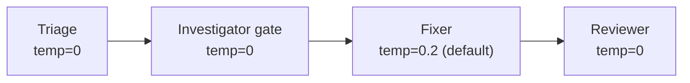
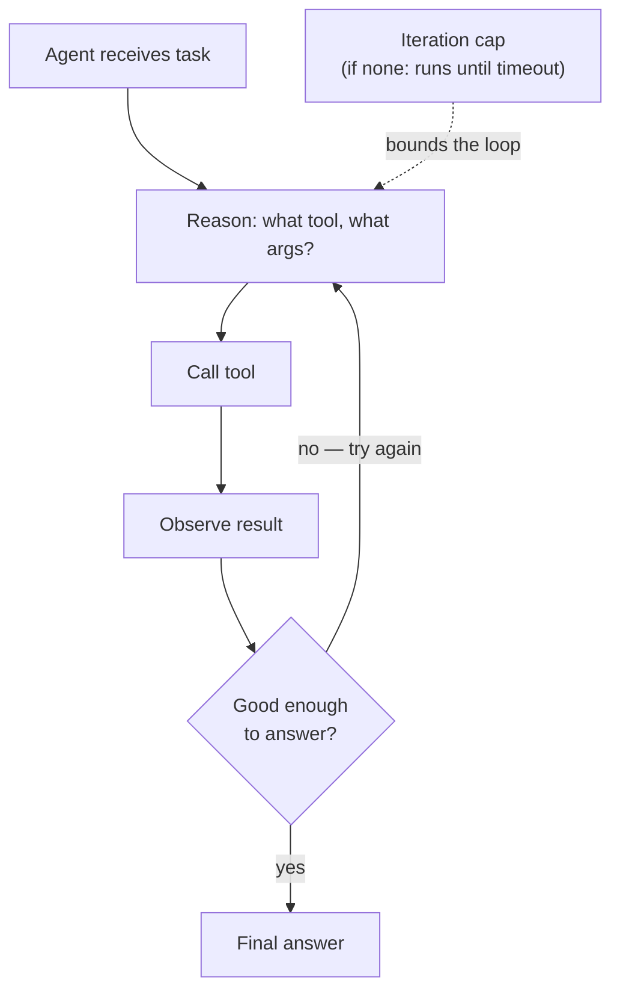
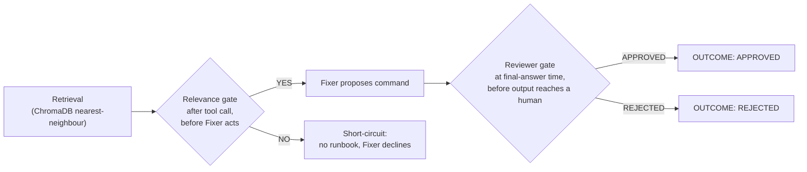

# Deep Dive: Agent Knobs Under the Hood

The lab ran the Incident Crew end to end and watched it produce two outcomes: APPROVED for a
runbook-backed fix, REJECTED/escalate when the relevance gate found nothing to work with. It
never asked why each of the four agents runs at the temperature it runs at, why the pipeline is
one pass through four functions instead of a loop that can retry, or why the gates that decide
APPROVED vs REJECTED live in Python string checks instead of another LLM call asking "is this
okay?" This page opens `crew.py` itself: the exact temperature each agent gets and why, why this
crew has no iteration cap because it was never built to loop, how a finding moves from one agent
to the next as a plain string, where the code-level gates actually sit, and what happens when you
turn one off. It closes with a same-prompt, sequential comparison across three knob variants.

:::info[Where this picks up]

You need the m7 stack up — ChromaDB and the built `crew` image. This works whether the stack is
currently running or was torn down after the lab; `up.sh` is idempotent, so re-running it is
safe.

```bash
cd labs/m7
bash up.sh
```

**Expected output**

```text
m7 ready: chromadb healthy, crew image built.
```

:::

---

## 1 — Temperature, per agent, not per crew

The lab treated `qwen2.5:1.5b` as one model behind four roles. It is — but each role calls that
model with a different `temperature`, and that difference is deliberate, not incidental.

**Analogy:** think of temperature as how much a musician improvises around a melody. At low
temperature the musician plays the melody exactly as written, every time — reliable, boring,
correct. At high temperature the musician takes liberties: more expressive, sometimes brilliant,
sometimes off-key. You want the string section reading sheet music at low temperature during a
recording take. You want the jazz soloist's improvised break at higher temperature — that's where
the interesting ideas live. An incident-response crew is almost entirely string section: the
moments where a wrong note is expensive far outnumber the moments where creativity helps.

Reading `crew.py`'s four `llm()` call sites directly, the actual values are:

| Agent | Call site | Temperature | Why |
|---|---|---|---|
| Triage | `llm(f"Incident: {incident}", profile("triage"), temperature=0)` | **0** | Classification — one correct `AREA / SEV` label exists per incident; no benefit to variety |
| Investigator (relevance gate) | `llm(..., profile("investigator"), temperature=0).upper().startswith("YES")` | **0** | A yes/no safety-relevant decision gets fed straight into an `if` — variety here means flaky gating |
| Fixer | `llm(f"Incident: {incident}\nRunbook passage:\n{runbook}\n\n...", profile("fixer"))` | **0.2 (default)** | No explicit `temperature=` argument — falls through to `llm()`'s default parameter. Some room to phrase the recommendation naturally, but still low: the command itself has to come verbatim from the runbook |
| Reviewer | `llm(f"Incident: {incident}\nProposed fix:\n{fix}\n\nReview it.", profile("reviewer"), temperature=0)` | **0** | Safety gate — APPROVED/REJECTED is a binary decision the code branches on; it cannot be allowed to drift |

Three of four agents run at `temperature=0`. The one exception — the Fixer — doesn't even set
the argument explicitly; it inherits `llm()`'s function default of `0.2` (see the signature,
`def llm(prompt, system, temperature=0.2):`). That's not an oversight to fix — it's the right
default for the one call in the pipeline that generates prose around a fact (the command) rather
than deciding a fact. Nothing in this crew calls `llm()` above `0.2`. This crew has no
brainstorming role; every agent's job is to be right, not interesting, which is why the whole
pipeline clusters at the low end of the temperature range.



*Three of the four calls pin `temperature=0` explicitly. The Fixer is the only one that leaves
room for phrasing — and even that room is small.*

Raising a classification or gating agent's temperature does not make it "more creative" in a
useful sense — it makes its *correctness* less repeatable. §6 measures this directly rather than
asserting it: the same incident, run three times at `temperature=0` vs `temperature=0.9` on the
Triage call, to see what actually moves and what doesn't on a model this size.

---

## 2 — Iteration control: why this crew has no loop to bound

The lesson's Mermaid diagram showed a straight pipeline: Triage → Investigator → Fixer →
Reviewer. Reading `crew.py`'s `run()` function confirms it literally is that — four sequential
calls, no `while`, no retry, no "try again with a different approach" branch anywhere in the
file. This section is about why that absence is a design decision worth naming, not an
accident.

**Analogy:** picture someone who doesn't find the right answer on their first web search, so they
re-google the same question with slightly different wording — and keeps doing that, tweaking a
word each time, hoping the next search nails it. Nothing stops them; there's no rule saying "you
get three tries." An agent given a tool and no iteration cap can do exactly this: call the tool,
look at the result, decide it's not good enough, call the tool again with slightly different
arguments, and repeat — burning time and cost with no guarantee the next call is any better than
the last, and no built-in stopping point except a wall-clock timeout somewhere upstream.

That failure mode belongs to a different shape of agent than this crew: a **ReAct-style loop**,
where a single agent reasons, calls a tool, observes the result, and decides whether to answer or
retry — potentially many times per task.



*A ReAct-style loop reasons → calls → observes → decides, and can cycle back to "reason" again.
Without an explicit iteration cap, that cycle only stops when something outside the loop
(a timeout, an API error) forces it to.*

The Incident Crew has none of this. `retrieve()` is called **exactly once** by the Investigator
— there is no "the first result looked weak, try a different query" branch. If ChromaDB's
nearest-neighbour search returns a bad match, the relevance gate (§4) catches it by saying NO to
that one candidate; the code does not respond by retrying the query with different phrasing. Each
of the four agents gets exactly one shot: one `llm()` call each (the Investigator's relevance
gate is a second, separate `llm()` call, not a retry of the first — it's checking the retrieved
candidate, not re-querying).

This is a bounded-latency, bounded-cost design choice, not a limitation the crew happens to have.
A single incident report costs exactly 5 model calls, always: 1 Triage + 1 retrieval-embedding +
1 relevance-gate + (0 or 1) Fixer + (0 or 1) Reviewer. You can predict the p99 latency and the p99
cost of running this crew because there is no code path where it runs 10 times instead of 1. An
unbounded ReAct loop trades that predictability for the ability to self-correct — worth it when
a task genuinely benefits from "try again, smarter," expensive when a bug or a bad prompt sends
the loop searching for an answer that was never going to be found, burning tokens and wall-clock
time until something external kills it. In production this shows up as a very concrete SLO
question: an on-call responder wants a crew that answers in a bounded, known time, every time —
even if the answer is sometimes "REJECTED, escalate" — over a crew that might occasionally find a
better answer after ten retries but might just as easily spin for two minutes on an incident it
was never going to solve.

---

## 3 — Delegation: what actually moves between agents

The lesson called this a "sequential pipeline." Reading `run()` line by line shows exactly what
crosses each hop, and it's worth being precise about it, because the shape of that handoff is
what makes small-model multi-agent work reliably at all.

Trace the actual variables `run()` passes forward:

```text
incident (the raw string argument)
  -> Triage:        llm(incident) -> triage            (printed, but NOT passed to Investigator)
  -> Investigator:   retrieve(cid, incident) -> candidate  (queries with the ORIGINAL incident text, not triage's output)
                      llm(candidate, incident) -> relevant (bool)
                      candidate or "" -> runbook
  -> Fixer:          llm(incident, runbook) -> fix
  -> Reviewer:        llm(incident, fix) -> verdict
```

The detail worth catching: **`retrieve()` queries ChromaDB with the raw `incident` string, not
with Triage's output.** Triage's `AREA: ... | SEV: ... | ...` line is printed to the console for
the human reading the transcript, but `run()` never feeds it into the Investigator's retrieval
call or its prompt. Triage's actual job in this pipeline is display and (implicitly) an early
opportunity to notice a garbled incident report — it does not narrow what the Investigator
searches for. If you wanted Triage's classification to *steer* retrieval (e.g. filter ChromaDB by
`AREA`), that's a real extension, but it isn't what this crew does today.

Every other handoff is a **plain Python string**, passed as an f-string argument into the next
`llm()` call — no structured object, no JSON schema, no message history the receiving agent can
inspect beyond what's interpolated into its prompt. This is "structured" only in the loose sense
that each string has a known shape by convention (the Reviewer's prompt is built assuming `fix`
looks like the Fixer's profile says it will) — nothing in the code validates that shape before
using it. Compare this to a framework like CrewAI, where delegation can be **dynamic**: an agent
can decide at runtime to hand a sub-task to a different agent, or a manager agent can route work
based on the content of a request, rather than a human-authored `run()` function hard-coding the
order. This crew's declarative pipeline is the opposite of dynamic delegation — the order
Triage → Investigator → Fixer → Reviewer is fixed in the Python source, not decided by any agent
at runtime.

That fixed order is a strength for this task, not a missing feature. Two dynamic-delegation
failure modes it sidesteps entirely:

- **Context dilution.** Each agent's prompt here is exactly the fields it needs — the Fixer never
  sees the Triage output, the Reviewer never sees the raw retrieval candidate that got rejected.
  In a framework where every agent shares a growing conversation history, later agents can end up
  reasoning over context that has nothing to do with their actual job, and a small model's limited
  attention gets spent parsing irrelevant history instead of doing its one task.
- **Error cascade.** Because each hop passes forward only what the previous stage decided to
  output, a mistake at one stage is visible and inspectable at the next — the Reviewer sees the
  Fixer's exact `fix` string, not a summarized or re-interpreted version of it. In a framework
  where a manager agent re-phrases or re-summarizes what a sub-agent found before passing it on,
  an early misunderstanding can get "smoothed over" in the rephrasing and become invisible to
  everything downstream — the later agent inherits the error without ever seeing the original
  evidence that would have let it catch it.

The cost of delegation depth is the same in both designs: **every hop is another LLM call**, and
every LLM call is latency and, if you're paying for tokens, cost. This crew already pays for four
hops on every run (five, counting the relevance-gate's separate call). A framework that adds
dynamic re-routing — "let me ask a different agent to double-check this" — adds hops on top of
that, and each added hop is a further chance for the crew to drift off the original incident.

---

## 4 — Guardrail placement: where the code actually gates, not the prompt

The lesson called the relevance gate "not optional" and the Reviewer "the crew's most important
member." This section is about *where in the pipeline* those checks physically sit in the code,
and why that placement — not just their existence — is what makes them trustworthy.

Both gates in this crew are **Python string checks on an LLM's output**, not a second LLM call
asked to police the first LLM call's own answer:

```python
relevant = llm(..., profile("investigator"), temperature=0).upper().startswith("YES")
```

```python
verdict.upper().startswith('APPROVED')
```

Neither gate trusts the model's output as-is. Each one takes a string the model produced and
runs it through an unambiguous, deterministic Python check — `.startswith("YES")`,
`.startswith('APPROVED')` — before that answer is allowed to change what happens next. A model
that responds `"Yes, I believe this passage is relevant because..."` still passes the gate
(`.upper().startswith("YES")` matches the leading `YES`); a model that hedges with `"Possibly,
but I'm not certain"` fails it, correctly, because the code isn't parsing intent — it's checking
a prefix. This is why a code-level gate beats asking the model "and are you sure that's safe?" in
a follow-up prompt: a follow-up prompt is still just another probabilistic text generation that
can itself say the wrong thing. A string check on a constrained output format cannot be talked
out of its answer.

Mapped onto the pipeline, the two gates sit at two different points:



*Gate 1 sits **after a tool call, before the Fixer acts** — it validates a retrieval result
before anything downstream trusts it. Gate 2 sits at **final-answer time, before a human sees
it** — it validates the Fixer's proposed action before it reaches the person who might run it.*

Neither gate sits at the third possible point: **before a tool call**, validating arguments going
in. This crew doesn't need one there, because its one tool call (`retrieve()`) takes the
unmodified incident text as input — there's no LLM-constructed query string or LLM-chosen
argument that could be malformed before the call happens. That third gate type earns its keep in
agents that let the model choose *what* to call and *with what arguments* — validate the
arguments before the tool executes, not just the result after. This crew's Investigator has no
such freedom: it always calls the same retrieval function the same way.

This module's gates are about **behavior** — tuning what a specific agent does on a specific
input, verified by running it. That's a different concern from **governance** — auditing,
logging, and policy enforcement across a whole fleet of agent deployments, which is M8's
territory. A useful way to keep the two apart: this page asks "does this one gate correctly
reject a bad Kafka retrieval right now," M8 asks "can I prove, after the fact, that every
deployed crew has a gate like this one at all, and that nobody quietly removed it." Where you'd
add a third layer beyond this crew's two: **input validation** (reject a malformed or empty
incident string before Triage ever runs), and an explicit **output schema** for the Reviewer's
verdict (today, `verdict.upper().startswith('APPROVED')` trusts the model to put `APPROVED` or
`REJECTED` at the very start of its response — a model that instead opens with an explanation
before the verdict would silently fail the gate and read as REJECTED by default, which is a safe
failure direction here, but worth knowing about before you change the Reviewer's profile).

---

## 5 — Observing what each agent actually receives

There's no debug flag or verbose environment variable in `crew.py` — grep confirms it (no
`DEBUG`, no `--verbose`, no log-level env var anywhere in the file). The observation tooling this
crew has is **`docker compose run` output plus the structured stage markers already in the code**
— `[TRIAGE]`, `[INVESTIGATOR]`, `[FIXER]`, `[REVIEWER]`, `OUTCOME:` — every one of which is a
plain `print()` in `run()`, not a logging framework. That's sufficient here because every stage's
input and output is fully visible in that transcript already; there's no hidden internal
reasoning step the prints don't surface.

What the prints do *not* show is the exact prompt text sent to the model — `triage`,
`candidate`, `fix`, and `verdict` are the *outputs* of each `llm()` call, not the full prompt
that produced them. To see the actual prompt an agent receives, read the profile file it's built
from directly — that plus the f-string in `run()` (§3, "what actually moves") is the complete
prompt, since nothing else gets concatenated in:

```bash
cat labs/m7/crew/profiles/investigator.md
```

**Expected output**

```text
# Investigator

**Role:** Incident investigator. Given a triaged incident, you use the **Acme runbook knowledge base**
(agentic RAG) to find the relevant runbook. Report the single most relevant runbook passage verbatim.
If no runbook covers it, say `NO RUNBOOK FOUND`. Do not invent procedures. Do not run commands — you
only gather the relevant runbook for the Fixer.
```

That's the entire `system` argument the Investigator's `llm()` calls receive — the `prompt`
argument is the f-string built in `run()` (the incident text, plus the candidate passage and the
relevance question on the gate call). Between the profile file and `run()`'s f-strings, you can
reconstruct the exact prompt any agent saw for any run without needing a debug flag the code
doesn't have.

---

## 6 — Experiment: knob variants, one at a time, sequential

Everything below runs **sequentially, one variant at a time** — never two `docker compose run`
crew invocations in parallel. This machine budgets one crew container (~50 MB) plus the shared
ChromaDB container (~200 MB) at a time; running variants back to back keeps the stack at or under
2 GB total. It also matters for a second reason: on `qwen2.5:1.5b`, small-model output varies run
to run even at the *same* temperature, so overlapping variants would make it impossible to tell
whether a difference in output came from the knob you changed or from ordinary small-model noise.

:::note[Small-model variance — read before judging the results]

`qwen2.5:1.5b`-class models respond to temperature and prompt changes less predictably than
larger models. The comparisons below are illustrative of the **mechanism** — what changing a
knob does to a pipeline's stability — not a universal recipe for what temperature to pick.
Judge the deterministic side of every result strictly: the `OUTCOME:` marker and which stages
ran or short-circuited are exact, reproducible facts about this run. Judge the prose — the
Triage summary sentence, the Reviewer's stated reason — by shape only: whether it stayed on
topic and matched the expected disposition, not its exact wording. If you swap in a larger model
(`qwen2.5:3b` or bigger) later, expect the *outcome markers* to stay just as stable at low
temperature, but expect the *prose* to vary less at a given temperature than it does here — a
bigger model needs less determinism-by-temperature to stay on-message.

:::

### Baseline: the lab's own run, as printed

This is Step 4 from the lab, unmodified — included here so the variants below have something
concrete to diff against without flipping back to the lab page.

```bash
cd labs/m7
docker compose run --rm crew "The checkout page is returning HTTP 503 errors for all users."
```

**Expected output**

```text
[crew] Acme Incident Crew: Triage -> Investigator -> Fixer -> Reviewer (4 profiles, one shared model: qwen2.5:1.5b)

======================================================================
INCIDENT: The checkout page is returning HTTP 503 errors for all users.
======================================================================

[TRIAGE]      AREA: web/checkout | SEV: SEV3 | Checkout service is down or misconfigured.

[INVESTIGATOR] ## Checkout 503 errors
If the checkout page returns HTTP 503, the web tier is saturated. Scale it up:
`kubectl scale deploy/web --replicas=5 -n prod`. Then check the load balancer
health in the Acme dashboard.

[FIXER]       Scale up the deployment of the web application to 5 replicas: `kubectl scale deploy/web --replicas=5 -n prod`. Then verify the health of the load balancer in the Acme dashboard.

[REVIEWER]    APPROVED: The proposed command is a non-destructive, runbook-backed remediation that involves scaling up the deployment and verifying the health of the load balancer. This should resolve the HTTP 503 errors for all users without causing any harm to the system or data.

======================================================================
OUTCOME: APPROVED — ready for a human to apply
```

On a small model, exact wording varies run to run — judge by the stage markers and the
`OUTCOME:` line, the same guidance the lab itself gives.

### Variant A: Triage temperature raised (0 → 0.9), 3 repeats

`crew.py` has no environment-variable override for temperature — it's a literal
`temperature=0` in the Triage call site. To change it without editing the tracked source, copy
`crew.py`, patch the copy, and rebuild the image from a scratch build context that swaps in the
patched file. This keeps the original file in the repo untouched and gives you a one-line revert
(delete the copy, rebuild from the unmodified source).

```bash
mkdir -p ~/crew-deepdive-lab && cd ~/crew-deepdive-lab
cp /Users/gshah/work/apps/learning/303-containerai/labs/m7/crew/crew.py ./crew-hot-triage.py
sed -i.bak 's/llm(f"Incident: {incident}", profile("triage"), temperature=0)/llm(f"Incident: {incident}", profile("triage"), temperature=0.9)/' ./crew-hot-triage.py
diff /Users/gshah/work/apps/learning/303-containerai/labs/m7/crew/crew.py ./crew-hot-triage.py
```

**Expected output**

```text
65c65
<     triage = llm(f"Incident: {incident}", profile("triage"), temperature=0)
---
>     triage = llm(f"Incident: {incident}", profile("triage"), temperature=0.9)
```

(`diff` exits non-zero when it finds a difference — that non-zero exit is the expected, correct
result here, not a failure.)

Build a one-off image from this patched copy, reusing the lab's own build context so the profiles
and Dockerfile don't have to be duplicated:

```bash
cd /Users/gshah/work/apps/learning/303-containerai/labs/m7
cp ~/crew-deepdive-lab/crew-hot-triage.py crew/crew.py.deepdive-hot-triage
docker build -t acme-incident-crew:hot-triage \
  --build-arg CREW_FILE=crew.py.deepdive-hot-triage \
  -f - . << 'EOF'
FROM python:3.12-slim
WORKDIR /app
COPY crew/ ./crew/
COPY docs/ ./docs/
ARG CREW_FILE=crew.py
RUN cp crew/${CREW_FILE} crew/crew.py
ENTRYPOINT ["python", "crew/crew.py"]
EOF
rm crew/crew.py.deepdive-hot-triage
```

**Expected output**

```text
#10 naming to docker.io/library/acme-incident-crew:hot-triage done
#10 unpacking to docker.io/library/acme-incident-crew:hot-triage 0.0s done
#10 DONE 0.1s
```

Run it 3 times against the same incident, sequentially, logging each transcript:

```bash
cd /Users/gshah/work/apps/learning/303-containerai/labs/m7
for i in 1 2 3; do
  docker run --rm --network m7_default \
    -e OLLAMA_BASE_URL=http://host.docker.internal:11434 \
    -e CHROMA_HOST=chromadb -e CHROMA_PORT=8000 \
    -e LLM_MODEL=qwen2.5:1.5b -e EMBEDDING_MODEL=nomic-embed-text \
    acme-incident-crew:hot-triage \
    "The checkout page is returning HTTP 503 errors for all users." \
    | tee ~/crew-deepdive-lab/variant-a-run${i}.log
done
```

**Expected output**

`````text
=== run 1 ===
[crew] Acme Incident Crew: Triage -> Investigator -> Fixer -> Reviewer (4 profiles, one shared model: qwen2.5:1.5b)

======================================================================
INCIDENT: The checkout page is returning HTTP 503 errors for all users.
======================================================================

[TRIAGE]      AREA: Checkout | SEV: SEV3 | Server overloaded with transactions. Users are seeing intermittent 503s.

[INVESTIGATOR] ## Checkout 503 errors
If the checkout page returns HTTP 503, the web tier is saturated. Scale it up:
`kubectl scale deploy/web --replicas=5 -n prod`. Then check the load balancer
health in the Acme dashboard.

[FIXER]       Scale up the deployment of the web application to 5 replicas: `kubectl scale deploy/web --replicas=5 -n prod`. Then verify the health of the load balancer in the Acme dashboard.

[REVIEWER]    APPROVED: The proposed command is a non-destructive, runbook-backed remediation that involves scaling up the deployment and verifying the health of the load balancer. This should resolve the HTTP 503 errors for all users without causing any harm to the system or data.

======================================================================
OUTCOME: APPROVED — ready for a human to apply

=== run 2 ===
[crew] Acme Incident Crew: Triage -> Investigator -> Fixer -> Reviewer (4 profiles, one shared model: qwen2.5:1.5b)

======================================================================
INCIDENT: The checkout page is returning HTTP 503 errors for all users.
======================================================================

[TRIAGE]      AREA: Web/Checkout | SEV: Major | Checkout service experiencing unexpected downtime. All users are encountering intermittent timeouts while accessing the checkout section of the website. Please investigate immediately to prevent further disruptions and ensure the resolution process is fully documented for future reference.

[INVESTIGATOR] ## Checkout 503 errors
If the checkout page returns HTTP 503, the web tier is saturated. Scale it up:
`kubectl scale deploy/web --replicas=5 -n prod`. Then check the load balancer
health in the Acme dashboard.

[FIXER]       Scale up the deployment of the web application to 5 replicas: `kubectl scale deploy/web --replicas=5 -n prod`. Then verify the health of the load balancer in the Acme dashboard.

[REVIEWER]    APPROVED: The proposed command is a non-destructive, runbook-backed remediation that involves scaling up the deployment and verifying the health of the load balancer. This should resolve the HTTP 503 errors for all users without causing any harm to the system or data.

======================================================================
OUTCOME: APPROVED — ready for a human to apply

=== run 3 ===
[crew] Acme Incident Crew: Triage -> Investigator -> Fixer -> Reviewer (4 profiles, one shared model: qwen2.5:1.5b)

======================================================================
INCIDENT: The checkout page is returning HTTP 503 errors for all users.
======================================================================

[TRIAGE]      AREA: Checkout | SEV: SEV2 | Users experience intermittent timeouts on checkout pages, with no consistent pattern of failures.

### Explanation:
- **CHECKOUT:** The issue primarily affects the checkout functionality.
- **SEV2:** There are both critical and major aspects to consider due to the temporary nature and impact on users' experiences. The symptoms indicate a possible performance or configuration-related problem, which could be indicative of various issues like network latency, load balancing problems, or caching inconsistencies.

### Investigation and Fix Consideration:
1. **Network Latency Check:** Investigate if there are any external network latency issues.
2. **Load Balancing & Configuration Review:** Verify the health of the backend servers and their configurations to ensure they are not overloaded.
3. **Cache Validation:** Ensure that web caches like Cloudflare or NGINX, used by the checkout page, are not causing errors in responding times.

Given the critical impact on users' experience and the temporary nature of this issue (HTTP 503), it's advisable to prioritize immediate investigation and address accordingly without delay.

[INVESTIGATOR] ## Checkout 503 errors
If the checkout page returns HTTP 503, the web tier is saturated. Scale it up:
`kubectl scale deploy/web --replicas=5 -n prod`. Then check the load balancer
health in the Acme dashboard.

[FIXER]       Scale up the deployment of the web application to 5 replicas:

```sh
kubectl scale deploy/web --replicas=5 -n prod
```

Check the load balancer health in the Acme dashboard:

[REVIEWER]    APPROVED: The proposed command is a non-destructive, runbook-backed remediation that scales up the deployment of the web application to 5 replicas. This should resolve the HTTP 503 errors by increasing the availability and capacity of the service.

======================================================================
OUTCOME: APPROVED — ready for a human to apply
`````

All three runs landed on `OUTCOME: APPROVED` — the structural decision held steady across a
0 → 0.9 temperature jump. The prose did not hold steady: run 1 stayed within the Triage profile's
"Be terse" instruction, run 2 drifted into a run-on sentence, and run 3 broke the profile's format
entirely — it added an unrequested `### Explanation:` / `### Investigation and Fix Consideration:`
section with a numbered troubleshooting list, none of which the Triage profile asked for. This is
the small-model-variance note above made concrete: `AREA:`/`SEV:` labels loosely survived (`SEV3`,
`Major`, `SEV2` — three different severity vocabularies for what should be one consistent scale),
but the crew's overall behavior — retrieve the checkout runbook, propose the scale command, get it
APPROVED — never wavered, because Investigator, Fixer, and Reviewer all stayed at their original
low/zero temperatures. Raising just the Triage temperature made Triage noisier without making the
crew's final decision any less reliable — evidence for why temperature is a per-role knob, not a
per-crew one (§1).

### Variant B: guardrail-off — bypass the relevance gate

Patch a second copy so the relevance gate always passes, regardless of what the model says —
this simulates a guardrail that got silently disabled (a real production failure mode: a feature
flag left in a bypass state, a refactor that accidentally always sets `relevant = True`). The
gate's whole decision collapses to one unambiguous suffix, `.startswith("YES")` — replacing just
that suffix with `or True` is a one-line, unambiguous patch that doesn't depend on matching the
multi-line f-string above it:

```bash
cd ~/crew-deepdive-lab
cp /Users/gshah/work/apps/learning/303-containerai/labs/m7/crew/crew.py ./crew-no-gate.py
python3 -c "
import pathlib
p = pathlib.Path('crew-no-gate.py')
src = p.read_text()
needle = '.upper().startswith(\"YES\")'
assert src.count(needle) == 1, f'expected exactly 1 match, found {src.count(needle)}'
p.write_text(src.replace(needle, '.upper().startswith(\"YES\") or True  # DEEP-DIVE: gate bypassed on purpose'))
"
diff /Users/gshah/work/apps/learning/303-containerai/labs/m7/crew/crew.py ./crew-no-gate.py
```

**Expected output**

```text
73c73
<                    profile("investigator"), temperature=0).upper().startswith("YES")
---
>                    profile("investigator"), temperature=0).upper().startswith("YES") or True  # DEEP-DIVE: gate bypassed on purpose
```

Build and run it against the Kafka incident — the one the baseline crew correctly escalates
because no runbook covers it:

```bash
cd /Users/gshah/work/apps/learning/303-containerai/labs/m7
cp ~/crew-deepdive-lab/crew-no-gate.py crew/crew.py.deepdive-no-gate
docker build -t acme-incident-crew:no-gate \
  --build-arg CREW_FILE=crew.py.deepdive-no-gate \
  -f - . << 'EOF'
FROM python:3.12-slim
WORKDIR /app
COPY crew/ ./crew/
COPY docs/ ./docs/
ARG CREW_FILE=crew.py
RUN cp crew/${CREW_FILE} crew/crew.py
ENTRYPOINT ["python", "crew/crew.py"]
EOF
rm crew/crew.py.deepdive-no-gate
docker run --rm --network m7_default \
  -e OLLAMA_BASE_URL=http://host.docker.internal:11434 \
  -e CHROMA_HOST=chromadb -e CHROMA_PORT=8000 \
  -e LLM_MODEL=qwen2.5:1.5b -e EMBEDDING_MODEL=nomic-embed-text \
  acme-incident-crew:no-gate \
  "The Kafka event streaming cluster has stopped processing messages." \
  | tee ~/crew-deepdive-lab/variant-b-kafka-no-gate.log
```

**Expected output**

`````text
[crew] Acme Incident Crew: Triage -> Investigator -> Fixer -> Reviewer (4 profiles, one shared model: qwen2.5:1.5b)

======================================================================
INCIDENT: The Kafka event streaming cluster has stopped processing messages.
======================================================================

[TRIAGE]      Kafka | SEV3 | Cluster shutdown due to network connectivity issues.

[INVESTIGATOR] ## Payments service
To restart the Acme payments service, run:
`kubectl rollout restart deploy/payments -n prod`.
The payments service depends on the Postgres primary in the `prod` namespace.

[FIXER]       One short sentence of intent: "Restart the Kafka event streaming cluster."

Command to run:

```sh
kubectl rollout restart deployment kafka-event-streaming -n prod
```

[REVIEWER]    APPROVED: This command is non-destructive and can be backed by a runbook, so it matches the requirements. Restarting the deployment should resolve the issue with Kafka event streaming cluster processing messages.

======================================================================
OUTCOME: APPROVED — ready for a human to apply
`````

With the gate bypassed, `runbook` is whatever ChromaDB's nearest-neighbour search returned for
the Kafka query — the **payments** runbook chunk, retrieved and printed by `[INVESTIGATOR]` above
with total confidence and no hint that it's the wrong section. The baseline crew (§ Baseline
above, and the lab's own Step 5) correctly says `NO RUNBOOK FOUND` for this exact incident,
because the relevance gate answers NO when asked whether the payments passage addresses a Kafka
failure. With the gate always returning `True`, the Fixer treats the mismatched passage as
confirmed-relevant — and this run shows the compounding failure the gate exists to prevent: the
Fixer didn't even quote the payments runbook's real command faithfully, it invented a *plausible-sounding*
command (`kubectl rollout restart deployment kafka-event-streaming -n prod`) that appears nowhere
in `acme-runbooks.md`. The Reviewer then approved it, describing it as "backed by a runbook" —
false, but the Reviewer has no way to check that claim; it only checks whether the *proposed
command text* looks non-destructive, not whether the referenced runbook passage actually
supports it. This is the unsafe/unclassified output the gate exists to stop: not a destructive
command, but a **fabricated one, laundered through two agents and rubber-stamped APPROVED.**

The tracked `crew.py` itself was never touched — only the temporary `crew.py.deepdive-*` copies
inside the build contexts (removed by the `rm crew/crew.py.deepdive-*` line right after each
build) and the two extra local images (removed together in the section teardown below). Confirm
the source tree is clean:

```bash
git -C /Users/gshah/work/apps/learning/303-containerai status --short labs/m7/crew/crew.py
```

**Expected output**

```text
(no output — a clean `git status --short` on this path prints nothing)
```

### Comparison table

| Variant | Knob changed | Wall time | Tool/model calls | OUTCOME marker | Consistency vs. baseline |
|---|---|---|---|---|---|
| Baseline | none (Triage=0, gate=0, Fixer=0.2, Reviewer=0) | ~4.2s | 5 (fixed, per §2) | APPROVED | — |
| A (×3 repeats) | Triage temperature 0 → 0.9 | ~3.5s per run | 5 per run | APPROVED, all 3 runs | Structural outcome stable; Triage prose drifted from terse (run 1) to a run-on sentence (run 2) to an unrequested multi-section troubleshooting writeup (run 3) — the profile's "Be terse" instruction eroded as temperature-driven variance compounded |
| B | Relevance gate bypassed (`relevant = True`, always) | ~3.4s | 5 (same count — gate bypass changes the *decision*, not the call count) | APPROVED — on the Kafka incident the baseline correctly REJECTED | Not "instability" — a clean, reproducible failure: the crew retrieved the wrong runbook, the Fixer fabricated a command absent from any runbook, and the Reviewer approved it anyway |

Judge the deterministic side of this table strictly: the `OUTCOME:` line and which stages ran are
exact, reproducible facts about each run (per the small-model-variance note above). Judge the
Triage/Fixer/Reviewer prose by shape — did it stay on-topic, did it reach the same disposition —
not by exact wording, which will vary between the three Variant A repeats even though nothing
else changed between them. Wall times above are single-machine, single-run measurements on this
laptop, included to show the same order of magnitude across variants (temperature and a gate
bypass do not change the crew's call count, so wall time stays roughly flat) — not a timing
benchmark to reproduce exactly.

**Teardown for this section only** — remove the two deep-dive-only images; this does not touch
the tracked `acme-incident-crew:latest` image the lab itself built:

```bash
PATH="$HOME/.rd/bin:$PATH" docker rmi acme-incident-crew:hot-triage acme-incident-crew:no-gate 2>/dev/null || true
```

**Expected output**

```text
Untagged: acme-incident-crew:hot-triage
Deleted: sha256:f362088a779db9dce3e9c8422a14eb808adeef8b3341575d2e231f644a620977
Untagged: acme-incident-crew:no-gate
Deleted: sha256:28af760d5b1695928ca255208675ee59a6cb68ca7024dd6bca708ca542f4528b
```

---

## Teardown

Page-scoped only. Remove the local working directory this page created:

```bash
rm -rf ~/crew-deepdive-lab
```

Leave the m7 stack as the lab's own teardown (`labs/m7/down.sh`) expects to find it — this page
never ran `docker compose down` itself, and the two extra images it built (`hot-triage`,
`no-gate`) are already removed above. If you're done with the module entirely, run the lab's own
teardown:

```bash
cd labs/m7 && bash down.sh
```

**Expected output**

```text
 Container chromadb Stopping
 Container chromadb Stopped
 Container chromadb Removing
 Container chromadb Removed
 Network m7_default Removing
 Network m7_default Removed
```

:::tip[Where you will use this]

- **Temperature is a per-agent-role decision, not a per-crew setting.** **Use it when:** you're
  tuning a real multi-agent pipeline — pin classification and safety-gate calls at `0`, leave
  headroom (`0.2`–`0.4`) only on the one or two calls that generate prose around an
  already-determined fact, the way this crew's Fixer does.
- **A sequential, single-pass pipeline trades self-correction for predictable cost and latency —
  that's a deliberate choice, not a missing feature.** **Use it when:** you're bounding an
  agent's cost/latency for an SLO — a fixed-hop pipeline like this crew gives you an exact
  worst-case call count; an unbounded ReAct loop needs an explicit iteration cap before it's safe
  to put in front of the same SLO.
- **Delegation between agents is only as safe as what actually crosses each hop — check what's
  really being passed, not what the diagram implies.** **Use it when:** debugging a multi-agent
  pipeline that "isn't using" information you thought it had — as this crew shows, Triage's
  classification is displayed but never fed into the Investigator's query; the same gap can
  exist silently in a framework crew.
- **A code-level gate (`.startswith("YES")`, `.startswith("APPROVED")`) beats a prompt-level ask
  because it can't be talked out of its answer.** **Use it when:** you're deciding where to add a
  safety check in a new pipeline — put it after the tool call that produced risky input, and
  again at final-answer time before a human sees the result; a follow-up prompt asking the model
  to double-check itself is not a substitute for either.
- **On a small model, low temperature stabilizes the outcome marker faster than it stabilizes the
  prose.** **Use it when:** you're evaluating whether a crew's output is reliable enough to trust
  — check the structural decision (approved/rejected, which branch ran) across repeated runs
  before worrying about exact wording drift; the marker is the thing downstream code and humans
  actually act on.

:::
