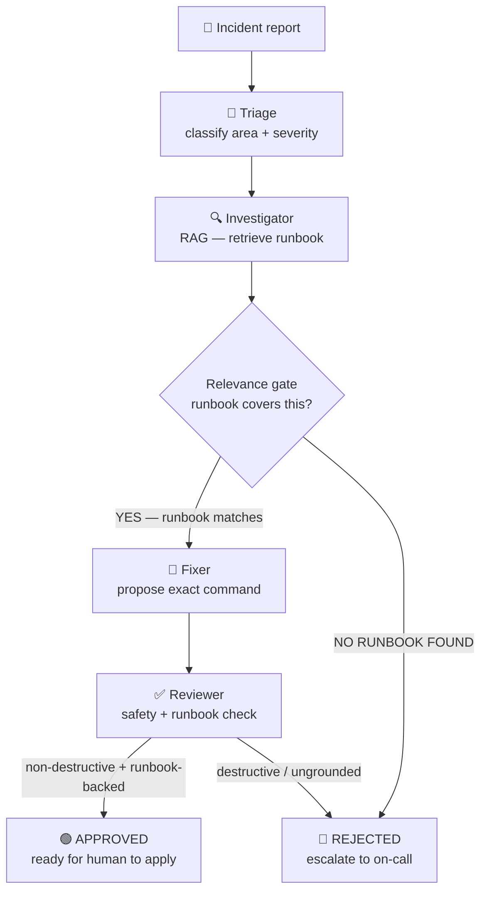

import Slides from '@site/src/components/Slides';

# Lesson: Multi-Agent Incident Crew

> **Module goal:** Grow the single declarative agent from M6 into a crew of four specialised agents — Triage, Investigator, Fixer, Reviewer — all sharing one native model endpoint. Understand *why* multi-agent, *when* a single agent is enough, and the two paths to go multi-agent: declarative (what you build) and framework (CrewAI / LangGraph).

---

## Module slides

Walk this short whiteboard deck for the big picture before the hands-on lab — or open it fullscreen.

<Slides src="decks/07-multi-agent.html" title="Module 7 — Multi-Agent Incident Crew" />

## 1. The analogy: a hospital, not a superhero

A single powerful agent is tempting — one prompt, one response, done. But think about what happens when you check into a hospital with a serious complaint.

A single doctor does *not* receive you at the door, diagnose you, write the prescription, and then countersign their own order. Instead the hospital runs you through a crew: a **triage nurse** classifies your urgency and routes you to the right department; a **diagnosing doctor** investigates your symptoms and consults the patient record; a **pharmacist** translates the diagnosis into an exact remedy; and an **attending physician** reviews the prescription before it reaches you — and refuses to sign anything that looks wrong.

Each role has exactly one job. Each one has a clear lane, a defined input, and a defined output. No single person makes every decision. The review step exists precisely because the diagnosing doctor and the pharmacist can each make errors that the attending catches.

Your incident crew works the same way. Triage classifies the incident. The Investigator looks up the runbook (the patient record). The Fixer proposes the exact remediation command. The Reviewer checks the proposed fix against the runbook and approves or rejects. One shared model serves all four — just as four hospital staff share one electronic health record system.

---

## 2. Why multi-agent?

The hospital analogy reveals three properties that a single-agent approach cannot replicate.

**Specialisation.** A triage agent runs at temperature 0 and outputs one line. An investigator agent queries a vector store and reports verbatim. A fixer agent proposes one exact command. A reviewer agent checks safety. Each prompt is tight, the context is small, and a 1.5B laptop model handles each task reliably. Asking one agent to do all four in sequence — or worse, in a single prompt — overloads the context, blurs the roles, and makes the output harder to audit.

**Separation of concerns.** Each agent sees only what it needs. The Triage agent never sees the runbook. The Fixer never evaluates safety. This is not just cleaner design — it directly reduces the chance of a small model hallucinating across a task boundary it was not designed for.

**Review loops.** The Reviewer is the crew's most important member. It is the human-in-the-loop's proxy: a dedicated role that exists solely to check the Fixer's output against the runbook and refuse anything destructive or ungrounded. Without a review loop, a confident-sounding fix that is actually wrong ships to production. With it, a human receives an APPROVED recommendation or a clear REJECTED/escalate signal and makes the final call.

### When is a single agent enough?

Multi-agent adds real overhead: more prompts, more latency, more moving parts. Do not reach for it by default.

A single declarative agent — the M6 pattern — is the right tool when:
- One agent handles one use case end-to-end (question → answer, or query → retrieve → ground).
- There is no need for a separate safety review on the output.
- The task does not produce an action (a command, a deployment, an API call) that requires a countersign.

Reach for a crew when the task produces a consequential action, when review of that action is a distinct responsibility, or when specialisation meaningfully improves reliability on a small model.

---

## 3. The incident crew's pipeline

The crew runs as a sequential pipeline. Each stage hands its output to the next; the pipeline short-circuits if no runbook is found.

The **relevance gate** between the Investigator and the Fixer is not optional. Naive vector retrieval always returns a nearest neighbour — even when the nearest neighbour is irrelevant. During validation the crew confidently proposed the *payments* runbook for a *Kafka* outage, because the Kafka query had no better match and the model never questioned the result. The gate asks the model a single yes/no question: *does this passage actually address this incident?* If the answer is NO, the Fixer declines to act and the Reviewer rejects. A catastrophically wrong fix never reaches the output.

---

## 4. Two paths to multi-agent

### Declarative (the default)

In M6 you defined one agent as a Markdown profile plus a glue script. The crew extends this pattern: four Markdown profiles, one Python pipeline, all sharing one Ollama endpoint. No framework, no dependency beyond the standard library. Each agent is a Python function that reads its profile, calls the model once, and returns a string.

This is the right default for most crews: predictable sequential flow, no state machine, no retry logic across agent boundaries. The declarative approach means changing an agent's behavior is a Markdown edit, not a code change — the same principle as M6, now applied to four collaborating agents.

### Framework: CrewAI and LangGraph

Two frameworks add structure when the declarative approach is not enough.

**CrewAI** provides role-based orchestration: agents are defined in `agents.yaml`, tasks in `tasks.yaml`, and CrewAI handles the message routing, delegation, and retry logic between them. It is the right choice when your crew needs dynamic task assignment or when agents need to collaborate in non-sequential patterns.

**LangGraph** represents the crew as an explicit directed graph with checkpointing. Every edge is a conditional branch; every node is a function. You can pause execution at any node, inspect state, and resume. LangGraph is the right choice when you need deterministic, auditable control over a complex workflow — when "what happened between step 3 and step 4?" must have a verifiable answer.

### The standards converge

Both frameworks work with the same building blocks you already know: MCP for tools, ChromaDB for memory, Ollama for the model. The orchestrator changes; the tools and the model do not. You can swap CrewAI for LangGraph (or for the declarative approach) without changing how agents call tools or how they reach the knowledge base. This is the same principle as the OpenAI-compatible endpoint in earlier modules: build against the standard, swap the implementation.

---

## 5. One model, four agents

The resource budget is worth making explicit. On a 16 GB laptop running `qwen2.5:1.5b`:

| Component | Resource |
|---|---|
| The model | ~1 GB VRAM / GPU memory |
| ChromaDB | ~200 MB RAM |
| One crew container (4 agents) | ~50 MB RAM |
| **Total** | **~1.3 GB** |

Agents are cheap. A "crew" is four Python functions with four system prompts. The model is the expensive part — and it is shared. Running four separate model instances (one per agent) would require four times the memory for no gain; all four agents call the same Ollama endpoint sequentially. This is the same principle you applied in M6: the model serves natively on the host, containers connect over `host.docker.internal`, and the crew container costs almost nothing to run.

A framework crew (CrewAI) using `gemma3:4B` requires ~4 GB. The declarative 1.5B crew is the laptop-friendly default. Reach for a bigger model when the framework's more complex orchestration demands it.

---

## 6. The Reviewer as human-in-the-loop proxy

The Reviewer's role is subtle but critical. It does not decide *whether* to fix the incident — the Fixer does. It decides *whether the proposed fix is safe to present to a human*.

Its rules are simple: APPROVE if the command is non-destructive and comes verbatim from the runbook; REJECT if the command destroys data, touches secrets, or was not in the runbook. When in doubt, REJECT.

This is a proxy for the human review that would happen in a real incident-response workflow. The crew does not apply fixes automatically — it produces a vetted recommendation and a clear disposition (APPROVED or REJECTED/escalate) that a human engineer receives and acts on. The automation earns its place by doing the triage, retrieval, and initial safety check; the human retains final authority.

---

## Summary

| Concept | The short version |
|---|---|
| Multi-agent crew | Multiple specialised agents in a pipeline, each with one job, sharing one model |
| Why multi-agent | Specialisation, separation of concerns, review loops — especially for consequential actions |
| When one agent is enough | One use case, no safety review needed, no consequential action |
| Declarative crew | Four Markdown profiles + one Python pipeline; change behavior with Markdown edits |
| Framework (CrewAI) | Role-based orchestration (`agents.yaml`/`tasks.yaml`); reach for it when you need dynamic delegation |
| Framework (LangGraph) | Explicit graph + checkpointing; reach for it when you need auditable, deterministic control |
| One shared model | Agents are cheap Python calls; the model is shared — no per-agent model instance |
| Relevance gate | Explicitly confirm the retrieved runbook matches the incident before the Fixer acts |
| Reviewer | Human-in-the-loop proxy: APPROVE or REJECT/escalate; humans retain final authority |
| Standards converge | MCP + ChromaDB + Ollama are the same across declarative and framework crews |

---

In the lab you will read the four agent profiles, run the crew against a 503 incident (APPROVED) and a Kafka incident (REJECTED/escalate), and see what happens at the relevance gate when no runbook matches.
