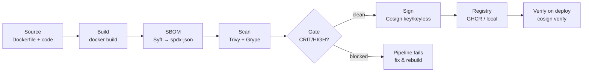

import Slides from '@site/src/components/Slides';

# Lesson: Securing & Governing AI Workloads

> **Module goal:** Harden and ship the M7 crew with open tools: a software bill of materials, vulnerability scanning, image signing, sandboxed code execution, input/output guardrails, lightweight evaluation, and a GitHub Actions pipeline that gates on security before signing.

---

## Module slides

Walk this short whiteboard deck for the big picture before the hands-on lab — or open it fullscreen.

<Slides src="decks/08-security.html" title="Module 8 — Securing & Governing AI" />

## 1. The analogy: ingredients label, health inspection, tamper seal

Imagine you are a food manufacturer shipping a new product — say, a ready-meal that goes to thousands of supermarkets. Before it leaves your factory, three things happen as a matter of law and trust:

1. **An ingredients label** is printed on every pack, listing every substance inside. Consumers can check for allergens; regulators can audit for compliance.
2. **A health inspection** is performed by an independent body that checks for contaminants and rejects any batch that fails the threshold.
3. **A tamper-evident seal** is applied to the lid. Any retailer or consumer who receives a broken seal knows the product may have been compromised in transit.

Now consider shipping an AI workload — a container image carrying a Python agent, its dependencies, and the framework code that drives it — with none of these. No one knows what packages are inside. No one has checked whether those packages have known vulnerabilities. No one can tell, after the image travels through a registry and reaches a production host, whether it has been swapped for something else.

That is the gap this module closes. The **SBOM** (Software Bill of Materials) is the ingredients label. The **vulnerability scan** is the health inspection. The **image signature** is the tamper-evident seal. Together they form a supply chain that makes the image trustworthy, auditable, and verifiable at every hop — from your laptop to the registry to the production host.

---

## 2. The supply chain pipeline

Every image that carries an agent, a model, or generated code should pass through this pipeline before it is deployed.



The gate is the critical addition. A pipeline that builds, signs, and pushes without a scan gate is a pipeline that ships vulnerabilities with a signature of authority. The scan must happen *before* the sign, and the sign must *not* happen if the scan fails.

---

## 3. The SBOM: ingredients label for your image

**Syft** (by Anchore) introspects a container image and catalogs every package it finds — Debian debs, Python wheels, Go binaries, npm modules — into a standard format. The most portable output is **SPDX-JSON**, an open standard that any security tool can ingest.

```bash
syft acme-support-agent:latest -o spdx-json > sbom.spdx.json
# -> 96 packages, SPDX-2.3  (Debian debs + Python + binaries)
```

The SBOM serves two immediate purposes: it is the input to vulnerability scanners (no SBOM step required — scanners can generate it themselves from the image — but exporting it separately means you can store it alongside the image in the registry), and it is the audit artifact that answers the regulator's question *"what is in that image, exactly?"*

---

## 4. Vulnerability scanning: two scanners disagree — that is a feature

Running two scanners on the same image produces two different result sets. That is not a failure of either tool; it is an accurate reflection of the state of CVE databases and matching heuristics. **Trivy** (Aqua Security) and **Grype** (Anchore) each maintain their own advisory feeds, and the same package version may be listed in one but not the other.

The lesson from the lab evidence is blunt: **run more than one scanner and triage by fixable + severity**. A Critical finding that has a fixed version available in the base image's repository is an actionable remediation. A High finding with no upstream fix yet is worth logging and tracking, but it should not block a deployment indefinitely if the mitigating controls are in place.

The triage heuristic:
- **Critical/High with a fix available** — rebuild on the patched base, bump the package, re-scan.
- **Critical/High with no fix** — mitigate via network policy or sandboxing; document the accepted risk.
- **Medium and below** — log in the SBOM; re-scan on a cadence; do not block CI.

The scan gate in the GitHub Actions pipeline (`exit-code: '1'`) fails on Critical/High. Once your base image is clean of fixable highs, the pipeline flows.

---

## 5. Signing: the tamper-evident seal

**Cosign** (by Sigstore) attaches a cryptographic signature to a container image in the registry. Any downstream consumer — a Kubernetes admission controller, a deploy script, a human reviewer — can verify that the image they are about to run is the exact artifact that passed the supply chain, signed by the expected key.

Two signing modes exist:

| Mode | When | How |
|---|---|---|
| **Key-based** | Local dev, air-gapped, offline lab | `cosign generate-key-pair` → `cosign sign --key cosign.key` |
| **Keyless (OIDC)** | GitHub Actions / CI with OIDC | `cosign sign --yes` — identity from the workflow's OIDC token; no private key stored in the repo |

In CI, keyless is the right default. The workflow's GitHub Actions identity (the `id-token: write` permission) is bound to the signature via Sigstore's Fulcio CA. No key management, no rotation, no risk of a leaked private key. In the lab you use key-based for transparency — you can see the key files and understand what is happening before the CI automation hides the mechanics.

Verification is the step that closes the loop:

```bash
cosign verify --key cosign.pub <registry>/acme-support-agent:1.0.0
# -> "The signatures were verified against the specified public key"
```

At deploy time, a policy engine (OPA Gatekeeper, Kyverno, or a simple pre-deploy script) can run this verify step and refuse to pull any image that does not carry a valid signature from the expected key.

---

## 6. Sandboxing agent, tool, and generated code

The crew's Fixer proposes commands. In an automated pipeline, those commands might be executed. In a more agentic system, a code-generation agent might produce Python to analyze logs or transform data. Neither should run on the host with the agent's full privileges.

The pattern is an **ephemeral, locked-down container**: a throwaway execution environment with no network, a read-only filesystem, all Linux capabilities dropped, a PID limit, and a memory cap.

```bash
docker run --rm \
  --network none \
  --read-only \
  --cap-drop ALL \
  --security-opt no-new-privileges \
  --pids-limit 64 \
  --memory 256m \
  --cpus 1 \
  python:3.12-slim python -c "print('sandboxed result:', sum(range(10)))"
# -> sandboxed result: 45
```

The isolation is real and verifiable. A network request from inside the sandbox fails with `URLError: network unreachable`. Any attempt to escalate privileges fails silently. The container is discarded after one use — it cannot accumulate state or persist a compromise.

For deeper isolation, two tools extend this pattern:

- **gVisor** replaces the Linux kernel syscall surface with a user-space interception layer. Even if the sandboxed code exploits a kernel vulnerability, it hits gVisor's interceptor, not the host kernel.
- **ToolHive** manages MCP tool servers as isolated containers. Each tool server — web search, code interpreter, file system — runs in its own container with per-server network and filesystem policy. The agent never executes tools in its own process; it calls ToolHive, which runs the tool in isolation and returns the result.

---

## 7. Hardening the container image

The sandbox is for untrusted code. The agent image itself also needs to be hardened — it is the environment that *calls* the LLM, *reads* credentials, and *routes* between tools.

The hardening checklist:

| Control | How |
|---|---|
| **Least privilege** | Run as a non-root user (`USER appuser`) |
| **Read-only rootfs** | `--read-only` flag or `ReadOnlyRootFilesystem: true` in the pod spec |
| **Drop capabilities** | `--cap-drop ALL` — add back only what is strictly needed |
| **No privilege escalation** | `--security-opt no-new-privileges` |
| **Resource caps** | `--memory`, `--pids-limit`, `--cpus` |
| **Secrets** | Never in the image; mount via Docker secrets, environment variables from a secret store, or Kubernetes secrets |
| **Health checks** | `HEALTHCHECK` in the Dockerfile; liveness/readiness probes in Kubernetes |

These controls are additive. A container with a read-only rootfs and no capabilities has a dramatically smaller attack surface even if a vulnerability in a Python dependency is exploited.

---

## 8. Guardrails and evaluation

Security at the container and supply-chain level protects the infrastructure. Guardrails protect the model boundary — the inputs going in and the outputs coming out.

**Input guardrails** screen user queries for prompt injection, jailbreak attempts, and out-of-scope requests before the query reaches the model. The M6 guardrail pattern — a small classification call at the start of the pipeline — is the right default. It adds one extra inference call (cheap on a small model) and prevents the most common abuse vectors.

**Output guardrails** screen the model's response before it reaches the user or triggers downstream actions. For the incident crew, the Reviewer already acts as an output guardrail — it blocks destructive commands. For a customer-facing agent, an output guardrail would additionally check for PII leakage, hallucinated URLs, and off-brand content.

**Evaluation** is how you know the guardrails and the agent are working. A **lightweight eval** runs a small set of labeled test cases through the full pipeline and checks:
- Does the agent refuse prompt-injection attempts? (safety)
- Does it answer in-scope questions correctly? (quality)
- Does it decline out-of-scope questions with a graceful fallback? (scope control)

Three cases per dimension, run in CI on every push, is enough to catch regressions before they reach production.

---

## 9. Governance without a vendor

"Governance" sounds like a vendor product. It does not have to be. Governance for an agent workload is the documented, enforced answer to four questions:

1. **What may the agent reach?** — Network egress rules (Kubernetes NetworkPolicy, container `--network` flags, no-network sandboxes).
2. **What credentials may it use?** — Scoped service accounts; secrets manager; never in the image.
3. **Which MCP tools are enabled?** — ToolHive's per-server isolation policy; explicit tool allowlist.
4. **Who approved this deployment?** — The signed image; the CI pipeline that ran the scan gate; the Git commit that triggered it.

Answer those four questions in a YAML policy file, enforce them with open tools (OPA, Kyverno, ToolHive), and you have governance. The pipeline from this module — SBOM → scan → sign — is the evidence trail that makes the fourth answer auditable.

---

## Summary

| Concept | The short version |
|---|---|
| SBOM (Syft) | Ingredients label — catalog every package in the image; input to scanners; audit artifact |
| Vulnerability scan (Trivy + Grype) | Health inspection — two scanners catch more; triage by fixable + severity |
| Image signing (Cosign) | Tamper-evident seal — key-based locally, keyless OIDC in CI |
| Scan gate | The scan must happen before the sign; the sign must not happen if the scan fails |
| Sandbox | Ephemeral, locked-down container for untrusted/generated code — `--network none --read-only --cap-drop ALL` |
| gVisor / ToolHive | Deeper isolation: kernel-level (gVisor) and per-MCP-tool (ToolHive) |
| Image hardening | Non-root, read-only rootfs, drop caps, no-new-privs, resource caps, external secrets |
| Guardrails | Input + output screens at the model boundary — reuse M6's pattern |
| Lightweight eval | 3-case CI eval catches regressions in safety, quality, and scope control |
| Governance | Four documented, enforced answers: what can the agent reach, use, call, and who approved it |

---

In the lab you will run Syft, Trivy, Grype, and Cosign against the M6 agent image; prove network isolation with the sandbox; wire a guardrail + eval; and inspect the GitHub Actions pipeline that automates all of it.
